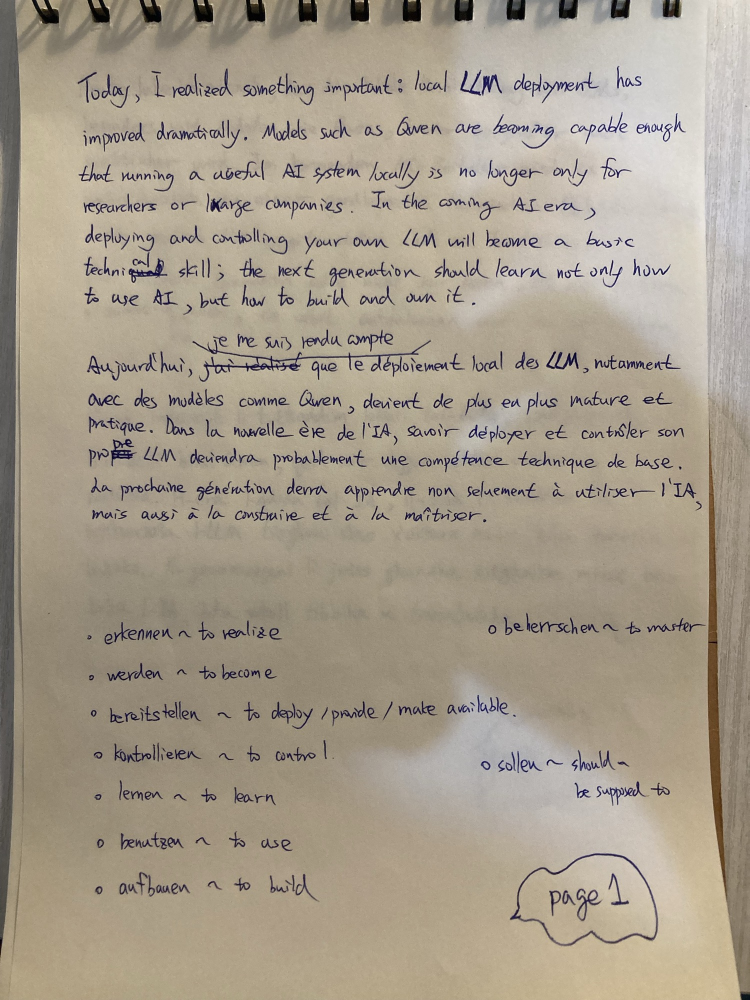
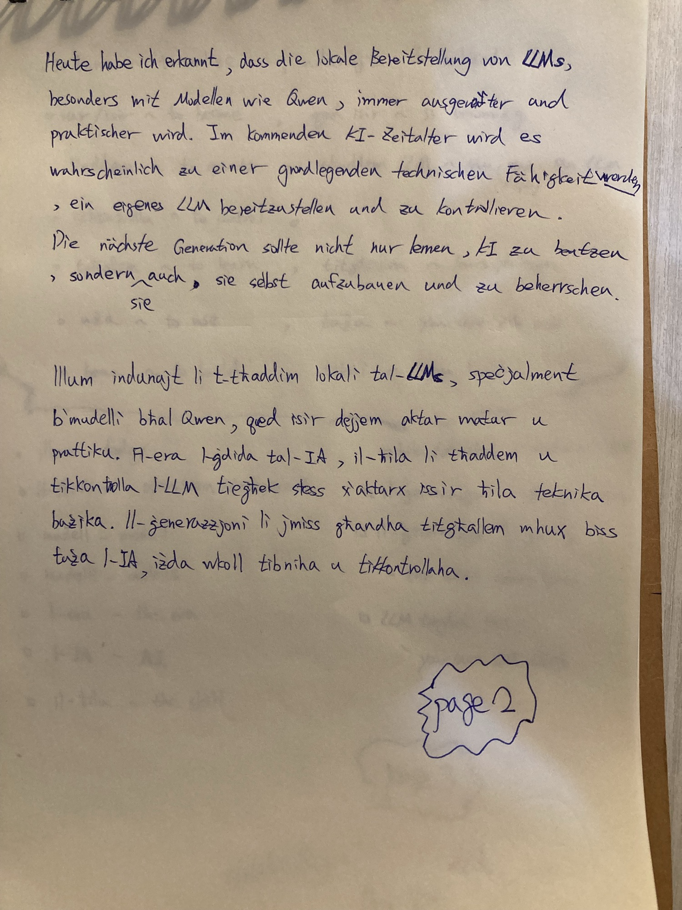
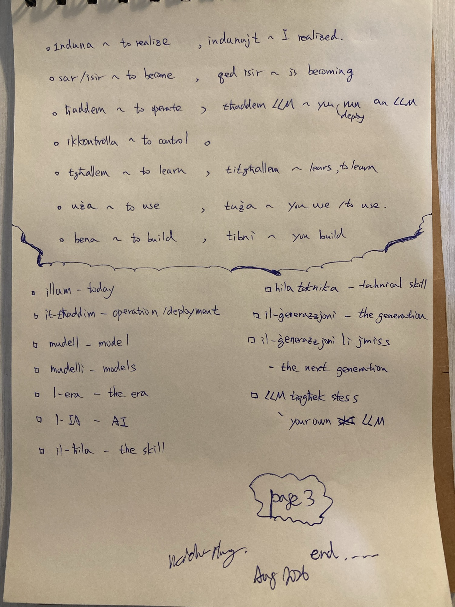

# Owning Your Own Model

Today, I realized something important: local LLM deployment has improved dramatically.
Models such as Qwen are becoming capable enough that running a useful AI system locally is
no longer only for researchers or large companies. In the coming AI era, deploying and
controlling your own LLM will become a basic technical skill; the next generation should
learn not only how to use AI, but how to build and own it.

## Pages

Three pages — the note in four languages, plus German and Maltese vocabulary

## Français

Aujourd'hui, je me suis rendu compte que le déploiement local des LLM, notamment avec des
modèles comme Qwen, devient de plus en plus mature et pratique. Dans la nouvelle ère de
l'IA, savoir déployer et contrôler son propre LLM deviendra probablement une compétence
technique de base. La prochaine génération devra apprendre non seulement à utiliser l'IA,
mais aussi à la construire et à la maîtriser.

## Deutsch

Heute habe ich erkannt, dass die lokale Bereitstellung von LLMs, besonders mit Modellen wie
Qwen, immer ausgereifter und praktischer wird. Im kommenden KI-Zeitalter wird es
wahrscheinlich zu einer grundlegenden technischen Fähigkeit werden, ein eigenes LLM
bereitzustellen und zu kontrollieren. Die nächste Generation sollte nicht nur lernen, KI zu
benutzen, sondern sie auch selbst aufzubauen und zu beherrschen.

### Verben

| Verb | Meaning |
|---|---|
| erkennen | to realize |
| werden | to become |
| bereitstellen | to deploy / provide / make available |
| kontrollieren | to control |
| lernen | to learn |
| benutzen | to use |
| aufbauen | to build |
| beherrschen | to master |
| sollen | should / be supposed to |

## Malti

Illum indunajt li t-tħaddim lokali tal-LLMs, speċjalment b'mudelli bħal Qwen, qed isir
dejjem aktar matur u prattiku. Fl-era l-ġdida tal-IA, il-ħila li tħaddem u tikkontrolla
l-LLM tiegħek stess x'aktarx issir ħila teknika bażika. Il-ġenerazzjoni li jmiss għandha
titgħallem mhux biss tuża l-IA, iżda wkoll tibniha u tikkontrollaha.

### Verbi

| Verb | Meaning | Inflected form used |
|---|---|---|
| induna | to realize | indunajt — I realized |
| sar / isir | to become | qed isir — is becoming |
| tħaddem | to operate | tħaddem LLM — you run (deploy) an LLM |
| ikkontrolla | to control | — |
| tgħallem | to learn | titgħallem — learns, to learn |
| uża | to use | tuża — you use / to use |
| bena | to build | tibni — you build |

### Nomi u frażijiet

| Maltese | Meaning |
|---|---|
| illum | today |
| it-tħaddim | operation / deployment |
| mudell | model |
| mudelli | models |
| l-era | the era |
| l-IA | AI |
| il-ħila | the skill |
| ħila teknika | technical skill |
| il-ġenerazzjoni | the generation |
| il-ġenerazzjoni li jmiss | the next generation |
| LLM tiegħek stess | your own LLM |

## Key Terms

| English | Français | Deutsch | Malti |
|---|---|---|---|
| to realize | se rendre compte | erkennen | induna |
| to become | devenir | werden | sar / isir |
| to deploy / provide | déployer | bereitstellen | ħaddem |
| to control | contrôler | kontrollieren | ikkontrolla |
| to learn | apprendre | lernen | tgħallem |
| to use | utiliser | benutzen | uża |
| to build | construire | aufbauen | bena |
| to master | maîtriser | beherrschen | — |
| model | modèle | Modell | mudell |
| the era | l'ère | das Zeitalter | l-era |
| AI | l'IA | die KI | l-IA |
| technical skill | compétence technique | technische Fähigkeit | ħila teknika |
| the next generation | la prochaine génération | die nächste Generation | il-ġenerazzjoni li jmiss |
| your own LLM | son propre LLM | ein eigenes LLM | LLM tiegħek stess |
