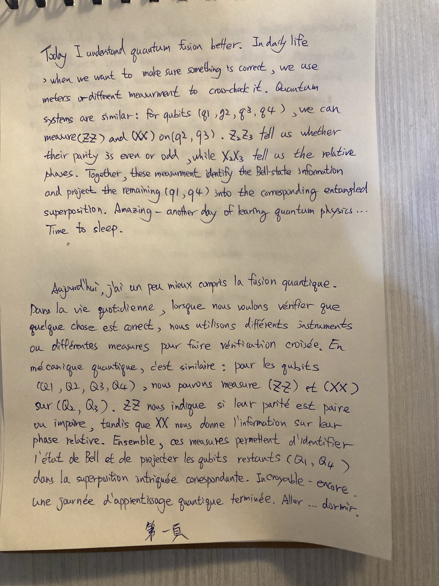
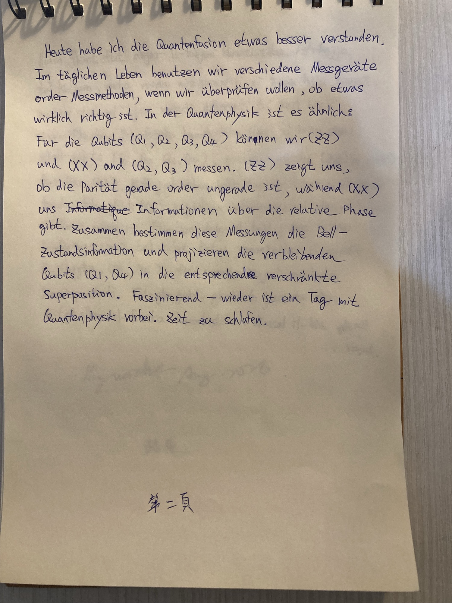
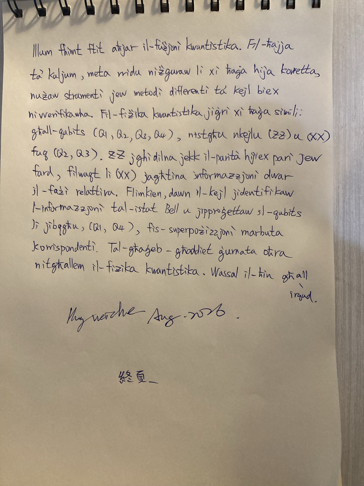

# Two Measurements, One Bell State

Today I understood quantum fusion a little better. In daily life, when we want to make sure
something is correct, we use meters or different measurements to cross-check it. Quantum
systems are similar: for qubits $q_1, q_2, q_3, q_4$, we can measure $ZZ$ and $XX$ on
$q_2, q_3$. $ZZ$ tells us whether their parity is even or odd, while $XX$ tells us the
relative phase. Together, these measurements identify the Bell-state information and project
the remaining qubits $q_1, q_4$ into the corresponding entangled superposition. Amazing —
another day of learning quantum physics is done. Time to sleep.

## Pages

Three pages — the note in four languages

## Français

Aujourd'hui, j'ai un peu mieux compris la fusion quantique. Dans la vie quotidienne, lorsque
nous voulons vérifier que quelque chose est correct, nous utilisons différents instruments ou
différentes mesures pour faire une vérification croisée. En mécanique quantique, c'est
similaire : pour les qubits $q_1, q_2, q_3, q_4$, nous pouvons mesurer $ZZ$ et $XX$ sur
$q_2, q_3$. $ZZ$ nous indique si leur parité est paire ou impaire, tandis que $XX$ nous donne
l'information sur leur phase relative. Ensemble, ces mesures permettent d'identifier l'état
de Bell et de projeter les qubits restants $q_1, q_4$ dans la superposition intriquée
correspondante. Incroyable — encore une journée d'apprentissage quantique terminée. Il est
temps de dormir.

## Deutsch

Heute habe ich die Quantenfusion etwas besser verstanden. Im täglichen Leben benutzen wir
verschiedene Messgeräte oder Messmethoden, wenn wir überprüfen wollen, ob etwas wirklich
richtig ist. In der Quantenphysik ist es ähnlich: Für die Qubits $q_1, q_2, q_3, q_4$ können
wir $ZZ$ und $XX$ an $q_2, q_3$ messen. $ZZ$ zeigt uns, ob die Parität gerade oder ungerade
ist, während $XX$ uns Informationen über die relative Phase gibt. Zusammen bestimmen diese
Messungen die Bell-Zustandsinformation und projizieren die verbleibenden Qubits $q_1, q_4$ in
die entsprechende verschränkte Superposition. Faszinierend — wieder ist ein Tag mit
Quantenphysik vorbei. Zeit zu schlafen.

### Verben

| Verb | Meaning |
|---|---|
| verstehen | to understand |
| benutzen | to use |
| überprüfen | to check / verify |
| messen | to measure |
| zeigen | to show |
| geben | to give |
| bestimmen | to determine |
| projizieren | to project |
| schlafen | to sleep |

## Malti

Illum fhimt ftit aħjar il-fużjoni kwantistika. Fil-ħajja ta' kuljum, meta rridu niżguraw li
xi ħaġa hija korretta, nużaw strumenti jew metodi differenti ta' kejl biex nivverifikawha.
Fil-fiżika kwantistika jiġri xi ħaġa simili: għall-qubits $q_1, q_2, q_3, q_4$, nistgħu
nkejlu $ZZ$ u $XX$ fuq $q_2, q_3$. $ZZ$ jgħidilna jekk il-parità hijiex pari jew fard,
filwaqt li $XX$ jagħtina informazzjoni dwar il-fażi relattiva. Flimkien, dawn il-kejl
jidentifikaw l-informazzjoni tal-istat Bell u jipproġettaw il-qubits li jibqgħu,
$q_1, q_4$, fis-superpożizzjoni marbuta korrispondenti. Tal-għaġeb — għaddiet ġurnata oħra
nitgħallem il-fiżika kwantistika. Wasal il-ħin għall-irqad.

### Verbi

| Verb | Meaning | Inflected form used |
|---|---|---|
| fehem | to understand | fhimt — I understood |
| ried | to want | rridu — we want |
| żgura | to ensure | niżguraw — we make sure |
| uża | to use | nużaw — we use |
| kejjel | to measure | nkejlu — we measure |
| ivverifika | to verify | nivverifikawha — we verify it |
| qal | to say / tell | jgħidilna — it tells us |
| ta | to give | jagħtina — it gives us |
| identifika | to identify | jidentifikaw — they identify |
| ipproġetta | to project | jipproġettaw — they project |
| baqa' | to remain | li jibqgħu — the ones that remain |
| tgħallem | to learn | nitgħallem — I learn |
| għadda | to pass | għaddiet — has passed |

### Nomi u frażijiet

| Maltese | Meaning |
|---|---|
| il-fużjoni kwantistika | quantum fusion |
| il-fiżika kwantistika | quantum physics |
| il-ħajja ta' kuljum | daily life |
| strumenti | instruments |
| metodi ta' kejl | measurement methods |
| il-parità | the parity |
| pari / fard | even / odd |
| il-fażi relattiva | the relative phase |
| l-istat Bell | the Bell state |
| is-superpożizzjoni | the superposition |
| marbuta | entangled / bound |
| flimkien | together |
| ġurnata oħra | another day |
| tal-għaġeb | amazing |
| il-ħin għall-irqad | time for sleep |

## Key Terms

| English | Français | Deutsch | Malti |
|---|---|---|---|
| quantum fusion | la fusion quantique | die Quantenfusion | il-fużjoni kwantistika |
| quantum physics | la mécanique quantique | die Quantenphysik | il-fiżika kwantistika |
| to understand | comprendre | verstehen | fehem |
| daily life | la vie quotidienne | das tägliche Leben | il-ħajja ta' kuljum |
| instrument / meter | l'instrument | das Messgerät | strument |
| measurement | la mesure | die Messung | il-kejl |
| to measure | mesurer | messen | kejjel |
| to cross-check / verify | faire une vérification croisée | überprüfen | ivverifika |
| qubit | le qubit | das Qubit | il-qubit |
| parity | la parité | die Parität | il-parità |
| even / odd | paire / impaire | gerade / ungerade | pari / fard |
| relative phase | la phase relative | die relative Phase | il-fażi relattiva |
| Bell state | l'état de Bell | der Bell-Zustand | l-istat Bell |
| to project | projeter | projizieren | ipproġetta |
| entangled | intriqué | verschränkt | marbut |
| superposition | la superposition | die Superposition | is-superpożizzjoni |
| the remaining qubits | les qubits restants | die verbleibenden Qubits | il-qubits li jibqgħu |
| together | ensemble | zusammen | flimkien |
| time to sleep | il est temps de dormir | Zeit zu schlafen | il-ħin għall-irqad |
