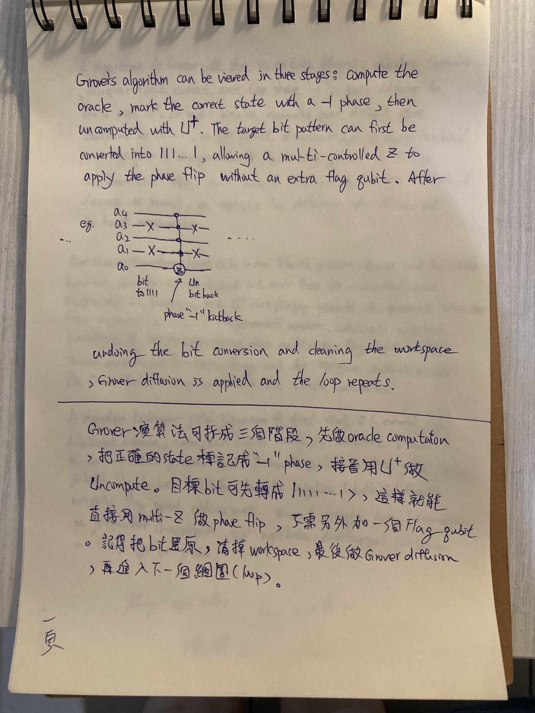
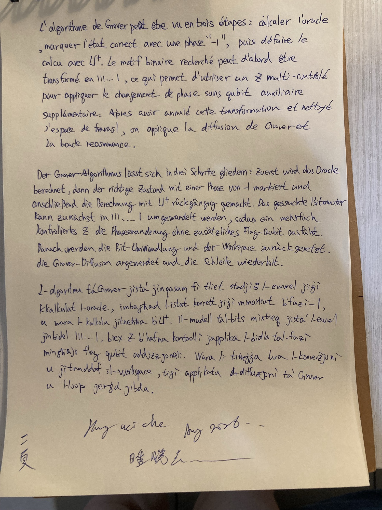

# Oracle, Phase Flip and Grover Diffusion

Grover's algorithm can be viewed in three stages: compute the oracle, mark the correct state
with a $-1$ phase, then uncompute with $U^\dagger$. The target bit pattern can first be
converted into $111\ldots1$, allowing a multi-controlled $Z$ to apply the phase flip without
an extra flag qubit. After undoing the bit conversion and cleaning the workspace, Grover
diffusion is applied and the loop repeats.

## Pages

Two pages — the note in five languages

## 中文

Grover 演算法可以分成三個階段：先執行 oracle computation，將正確的 state 標記成 $-1$ phase，接著使用
$U^\dagger$ 進行 uncompute。目標 bit pattern 可以先轉換成 $111\ldots1$，這樣就能直接使用
multi-controlled $Z$ 做 phase flip，而不需要額外的 flag qubit。之後再把 bit conversion 還原、清除
workspace，最後套用 Grover diffusion，然後重複下一輪。

## Français

L'algorithme de Grover peut être vu en trois étapes : calculer l'oracle, marquer l'état
correct avec une phase $-1$, puis défaire le calcul avec $U^\dagger$. Le motif binaire
recherché peut d'abord être transformé en $111\ldots1$, ce qui permet d'utiliser un $Z$
multi-contrôlé pour appliquer le changement de phase sans qubit auxiliaire supplémentaire.
Après avoir annulé cette transformation et nettoyé l'espace de travail, on applique la
diffusion de Grover et la boucle recommence.

## Deutsch

Der Grover-Algorithmus lässt sich in drei Schritte gliedern: Zuerst wird das Oracle
berechnet, dann der richtige Zustand mit einer Phase von $-1$ markiert und anschließend die
Berechnung mit $U^\dagger$ rückgängig gemacht. Das gesuchte Bitmuster kann zunächst in
$111\ldots1$ umgewandelt werden, sodass ein mehrfach kontrolliertes $Z$ die Phasenänderung
ohne zusätzliches Flag-Qubit ausführt. Danach werden die Bit-Umwandlung und der Workspace
zurückgesetzt, die Grover-Diffusion angewendet und die Schleife wiederholt.

### Verben

| Verb | Meaning |
|---|---|
| gliedern (sich … lassen) | to be divided into |
| berechnen | to compute |
| markieren | to mark |
| rückgängig machen | to undo, to uncompute |
| umwandeln | to convert |
| ausführen | to carry out, to execute |
| zurücksetzen | to reset |
| anwenden | to apply |
| wiederholen | to repeat |

## Malti

L-algoritmu ta' Grover jista' jinqasam fi tliet stadji: l-ewwel jiġi kkalkulat l-oracle,
imbagħad l-istat korrett jiġi mmarkat b'fażi $-1$, u wara l-kalkolu jitneħħa b'$U^\dagger$.
Il-mudell tal-bits mixtieq jista' l-ewwel jinbidel għal $111\ldots1$, biex $Z$ b'ħafna
kontrolli japplika l-bidla tal-fażi mingħajr flag qubit addizzjonali. Wara li titreġġa' lura
l-konverżjoni u jitnaddaf il-workspace, tiġi applikata d-diffużjoni ta' Grover u l-loop
jerġa' jibda.

### Verbi

| Verb | Meaning |
|---|---|
| jinqasam | to be divided |
| jiġi kkalkulat | to be computed |
| jiġi mmarkat | to be marked |
| jitneħħa | to be removed, to be undone |
| jista' | can, to be able to |
| jinbidel | to change, to be converted |
| japplika | to apply |
| titreġġa' lura | to be reversed |
| jitnaddaf | to be cleaned |
| tiġi applikata | to be applied |
| jerġa' jibda | to start again |

### Nomi u frażijiet

| Term | Meaning |
|---|---|
| l-algoritmu | the algorithm |
| tliet stadji | three stages |
| l-oracle | the oracle |
| l-istat korrett | the correct state |
| il-fażi | the phase |
| il-mudell tal-bits | the bit pattern |
| b'ħafna kontrolli | multi-controlled |
| il-bidla tal-fażi | the phase change |
| mingħajr | without |
| flag qubit addizzjonali | additional flag qubit |
| il-konverżjoni | the conversion |
| il-workspace | the workspace |
| id-diffużjoni | the diffusion |
| il-loop | the loop |

## Key Terms

| English | 中文 | Français | Deutsch | Malti |
|---|---|---|---|---|
| Grover's algorithm | Grover 演算法 | l'algorithme de Grover | der Grover-Algorithmus | l-algoritmu ta' Grover |
| oracle | oracle（預言機） | l'oracle | das Oracle | l-oracle |
| stage, step | 階段 | l'étape | der Schritt | l-istadju |
| to compute | 計算 | calculer | berechnen | jiġi kkalkulat |
| to uncompute | 反計算 | défaire le calcul | rückgängig machen | jitneħħa l-kalkolu |
| state | 狀態 | l'état | der Zustand | l-istat |
| to mark | 標記 | marquer | markieren | jimmarka |
| phase | 相位 | la phase | die Phase | il-fażi |
| phase flip | 相位翻轉 | le changement de phase | die Phasenänderung | il-bidla tal-fażi |
| bit pattern | 位元樣式 | le motif binaire | das Bitmuster | il-mudell tal-bits |
| to convert | 轉換 | transformer | umwandeln | jinbidel |
| multi-controlled Z | 多重控制 Z | Z multi-contrôlé | mehrfach kontrolliertes Z | Z b'ħafna kontrolli |
| flag qubit | 標記量子位元 | le qubit auxiliaire | das Flag-Qubit | il-flag qubit |
| qubit | 量子位元 | le qubit | das Qubit | il-qubit |
| workspace | 工作區 | l'espace de travail | der Workspace | il-workspace |
| to clean, to reset | 清除 | nettoyer | zurücksetzen | jitnaddaf |
| Grover diffusion | Grover 擴散 | la diffusion de Grover | die Grover-Diffusion | id-diffużjoni ta' Grover |
| loop | 迴圈 | la boucle | die Schleife | il-loop |
| to repeat | 重複 | recommencer | wiederholen | jerġa' jibda |
| target | 目標 | la cible | das Ziel | il-mira |
| additional, extra | 額外的 | supplémentaire | zusätzlich | addizzjonali |
