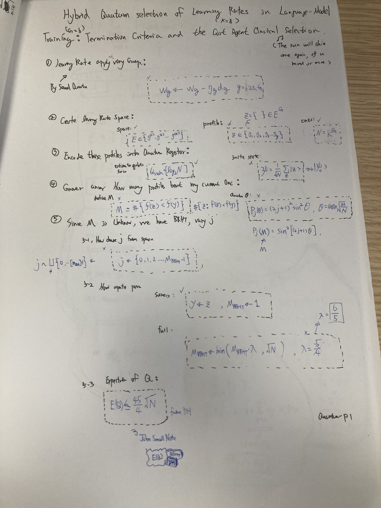
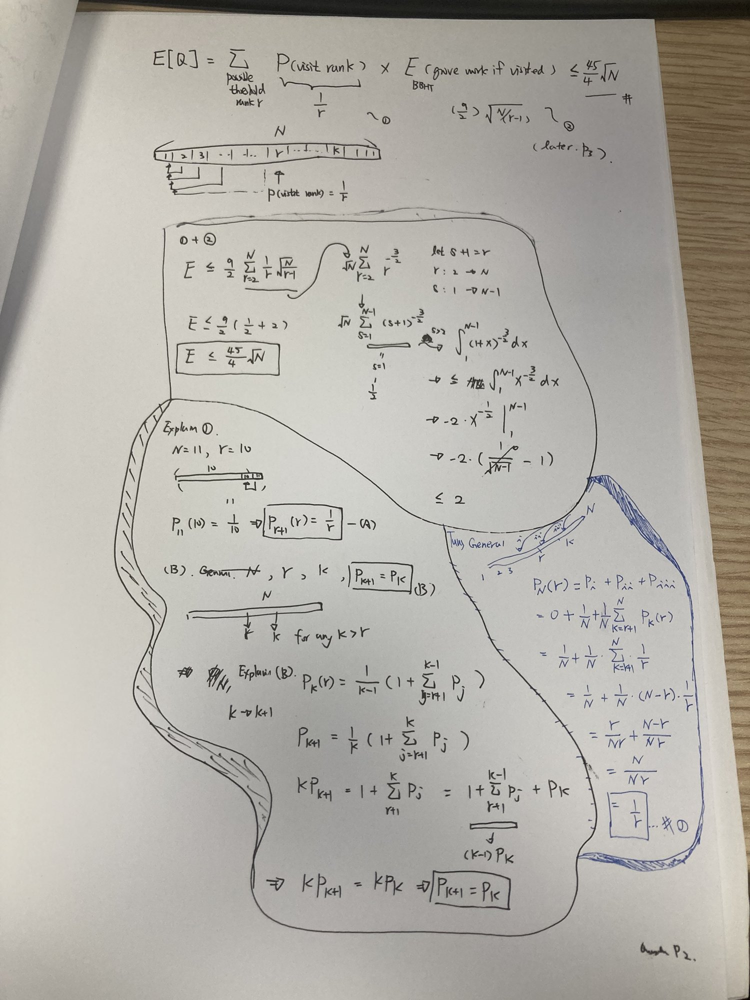

# HandWriteGuide — Hybrid Quantum Selection of Learning Rates in Language-Model Training

*Hybrid Quantum Selection of Learning Rates in Language-Model Training: Termination
Criteria and the Cost Against Classical Selection* — Wei-Che Hung, preprint (2026).

This guide re-derives the paper by hand, one page at a time. Each page is kept as
the photographed original at the top of its file, followed by a typed version with
the paper's symbols. The paper PDF itself is not in this folder yet.

The pages so far

| Page | Handwritten | Typed explanation | Question |
|---|---|---|---|
| P1 |  | [The general concept](concept.md) | From per-group learning rates to a quantum search over $N = K^G$ profiles, and why BBHT varies the number of iterations |
| P2 |  | [Why E(Q) ≤ 45/4 √N](expected-query-bound.md) | Why the expected number of Grover iterations of Dürr–Høyer minimum finding is at most $\frac{45}{4}\sqrt{N}$ |
| P3 | to come | — | The BBHT factor $\frac{9}{2}\sqrt{N/(r-1)}$ used on P2 |

## Reading path

1. [P1 — The general concept](concept.md): learning rates per layer group, the
   profile space, the search register, one Grover question, the BBHT schedule.
2. [P2 — Why E(Q) ≤ 45/4 √N](expected-query-bound.md): the expected cost as a
   sum over threshold ranks, the visiting probability $1/r$, and the sum that gives
   the constant.

The bound on page 2 is also written up as a stand-alone topic, with a numeric check
and summaries in five languages:
[Dürr–Høyer expected query bound](../../../topics/quantum-computing/durr-hoyer-expected-query-bound/content.md).
