# Dürr–Høyer Runtime Accounting Formula



## What happens

1. The runtime of Dürr–Høyer minimum finding is written as three products, each a count of events times the cost of one event: search iterations, state preparations, and measured candidates.
2. The search term. Dürr–Høyer runs repeated BBHT rounds (Boyer, Brassard, Høyer and Tapp). In round $r$ a Grover depth $j_r$ is drawn at random and $j_r$ Grover iterations are executed before the register is measured. The depths do not vanish from the accounting; they are summed: with $j = [1, 3, 2, 4]$ the search count is $1 + 3 + 2 + 4 = 10$ iterations, each costing $t_{\mathrm{iter}}$.
3. The setup term. Before every round the search register is prepared in the uniform superposition over all $N$ indices. The number of such preparations is $Q_{\mathrm{setup}}$, each costing $t_{\mathrm{setup}}$.
4. The measurement term. Every round ends with a measurement that returns a candidate index $z'$, and every candidate is scored classically and compared with the current threshold, whether or not it turns out better. In the sequence F, F, F, S, F, S there are six measured candidates but only two threshold improvements, so $n_{\mathrm{meas}} = 6$ while $n_{\mathrm{thr}} = 2$. The classical checks cost $n_{\mathrm{meas}} \, t_{\mathrm{score}}$.
5. All together. One run is the loop setup, $G^{j_1}$, measure and check, setup, $G^{j_2}$, measure and check, and so on; each visual event lands on exactly one of the three terms.

## Concept

```math
T_{\mathrm{DH}} = \underbrace{Q_{\mathrm{search}}\, t_{\mathrm{iter}}}_{\text{Grover/search work}} + \underbrace{Q_{\mathrm{setup}}\, t_{\mathrm{setup}}}_{\text{state preparation}} + \underbrace{n_{\mathrm{meas}}\, t_{\mathrm{score}}}_{\text{classical candidate checks}}
```

```math
Q_{\mathrm{search}} = \sum_{r} j_r, \qquad Q_{\mathrm{setup}} = \#\{\text{state preparations}\}, \qquad n_{\mathrm{meas}} = \#\{\text{measured candidates}\}
```

The counts are properties of the algorithm's run; the per-event costs $t_{\mathrm{iter}}$, $t_{\mathrm{setup}}$ and $t_{\mathrm{score}}$ are properties of the hardware and of the scoring procedure, so the same formula prices the same run on any machine. Under the standard BBHT loop one preparation is followed by one measurement, so $Q_{\mathrm{setup}}$ tracks $n_{\mathrm{meas}}$ closely; the two stay separate terms because their unit costs differ, and $n_{\mathrm{meas}}$ must not be confused with $n_{\mathrm{thr}}$, the smaller number of rounds that actually lowered the threshold. Related: [Grover iteration as a $2\theta$ rotation](../grover-iteration-2theta-rotation/content.md).

## Summary

Dürr–Høyer's running time is a sum of three count-times-cost products: the Grover iterations summed over all BBHT rounds, the state preparations that open each round, and the measured candidates that each need one classical score against the current threshold. Keeping the three separate is what lets a single run be priced honestly on different hardware, and it keeps the number of measurements distinct from the smaller number of successful threshold updates.

### 繁體中文

Dürr–Høyer 的執行時間是三個「次數 × 單價」乘積之和：所有 BBHT 回合中累加的 Grover 迭代次數、每回合開頭的量子態製備次數、以及每個都需要一次古典評分並與當前門檻比較的量測候選數。把三項分開，才能在不同硬體上誠實地為同一次執行計價，也讓量測次數與較少的成功門檻更新次數區分開來。

### Français

Le temps d'exécution de Dürr–Høyer est la somme de trois produits nombre × coût : les itérations de Grover cumulées sur tous les tours BBHT, les préparations d'état qui ouvrent chaque tour, et les candidats mesurés qui exigent chacun un score classique comparé au seuil courant. Garder les trois termes séparés permet de chiffrer honnêtement une même exécution sur des matériels différents, et distingue le nombre de mesures du nombre, plus petit, de mises à jour réussies du seuil.

### Deutsch

Die Laufzeit von Dürr–Høyer ist die Summe dreier Produkte aus Anzahl mal Kosten: die über alle BBHT-Runden summierten Grover-Iterationen, die Zustandspräparationen, mit denen jede Runde beginnt, und die gemessenen Kandidaten, die jeweils eine klassische Bewertung gegen die aktuelle Schwelle brauchen. Die drei Terme getrennt zu halten erlaubt es, denselben Lauf auf verschiedener Hardware ehrlich zu bepreisen, und hält die Zahl der Messungen von der kleineren Zahl erfolgreicher Schwellenupdates getrennt.

### Русский

Время работы алгоритма Дюрра–Хойера есть сумма трёх произведений «число событий × стоимость события»: итерации Гровера, накопленные по всем раундам BBHT, подготовки состояния, открывающие каждый раунд, и измеренные кандидаты, каждому из которых нужна одна классическая оценка и сравнение с текущим порогом. Раздельный учёт трёх слагаемых позволяет честно оценить один и тот же запуск на разном оборудовании и не смешивать число измерений с меньшим числом успешных обновлений порога.
