# Dürr–Høyer Minimum Finding, Part 1 — The Ladder, the Clock and the One-Climb Budget



## What happens

1. One quantum search round. Among $N = 64$ rows a threshold row $y$ is held, and the $M$ rows whose value lies below the threshold form the marked set. A depth $j$ is drawn, $j$ Grover iterations rotate the state by $(2j+1)\theta$, one row $z$ is measured, and a single classical comparison, $L_z \lt L_y$, decides success or failure. That comparison is the only classical read in the round.
2. The BBHT ladder (Boyer, Brassard, Høyer and Tapp). Each failure multiplies the range $m$ by $\lambda = 6/5$ and the depth is drawn uniformly below $m$; the range is capped at $\sqrt{N}$. A success resets $m$ to 1 and moves the threshold to the measured row.
3. The descent and the silent minimum. On the worked run the threshold drops from rank 8 to rank 6, 3 and 1 in three successes; about $H_N - 1$ updates are expected in general. Once the threshold is the minimum, $M = 0$ and $\theta = 0$, so every round fails, and a failure is indistinguishable from bad luck. The search count therefore splits into the improvement work and the stopping work, and a stopping rule has to decide where the second part ends.
4. Rule A, the global clock. Every Grover iteration and every state preparation is charged to one clock. When the clock passes $22.5\sqrt{N} + 1.4\lg^2 N$, the run is interrupted and the current threshold is returned; Dürr and Høyer show that this returns the minimum with probability at least one half.
5. The price of one climb. A round at range $m$ costs fewer than $m/2$ iterations on average, so the climb from $m = 1$ to the critical range $m_0$ costs less than half a geometric sum, which is at most $\tfrac{1}{2} \tfrac{\lambda}{\lambda-1} m_0$. For $\lambda = 6/5$ that is $3m_0$: the constant is a property of the ladder, not a choice.
6. Rule B, the one-climb budget. Inside one threshold visit the iterations are summed; when the sum reaches $\tfrac{1}{2} \tfrac{\lambda}{\lambda-1} \sqrt{N}$, the cost of one full climb to the cap, the search stops and the threshold is returned. On the worked run the budget is 24 and the final visit crosses it at 27.

## Concept

One round succeeds with the Grover probability, where $M$ counts the rows better than the threshold:

```math
\sin\theta = \sqrt{\frac{M}{N}}, \qquad P_{\mathrm{succ}}(j) = \sin^2\big((2j+1) \theta\big)
```

The BBHT loop draws the depth from a growing range and resets it on success:

```math
j \sim \mathcal{U}\{0, \dots, \lceil m \rceil - 1\}, \qquad \text{fail: } m \to \min(\lambda m, \sqrt{N}), \qquad \text{success: } y \to z, m \to 1
```

Rule A watches the whole run against one cap:

```math
\text{clock} = \sum j + \lg N \cdot (1 + u) \ge 22.5\sqrt{N} + 1.4\lg^2 N
```

Rule B watches one visit against the cost of one climb. The bound on that cost comes from the proof of Theorem 3 in the BBHT paper: a round at range $m$ costs fewer than $m/2$ iterations on average, and the ranges form a geometric sequence,

```math
\text{climb to } m_0 \lt \tfrac{1}{2} \sum_{s=1}^{S} \lambda^{s-1} \lt \tfrac{1}{2} \frac{\lambda}{\lambda-1} m_0 = 3 m_0 \quad (\lambda = 6/5)
```

```math
\text{spent} = \sum_{\text{visit}} j \ge \tfrac{1}{2} \frac{\lambda}{\lambda-1} \sqrt{N}
```

The two rules differ in what they watch and in what they promise. Rule A charges everything to one clock and inherits a theorem for its cap; rule B is much cheaper, because it charges only the current visit and gives the ladder exactly one climb to the cap before it stops, but the rule itself says nothing about how often it stops one round too early. The next part builds stopping rules that state that number. Related: [Dürr–Høyer runtime accounting](../durr-hoyer-runtime-three-terms/content.md), [Grover's iteration as a $2\theta$ rotation](../grover-iteration-2theta-rotation/content.md), and [harmonic growth](../harmonic-growth-euler-mascheroni-gamma/content.md) for the $H_N - 1$ expected updates.

## Summary

Once the threshold has reached the minimum, every quantum search round fails and looks exactly like bad luck, so a stopping rule must decide when to return the threshold. Rule A charges the whole run to one clock and cuts at 22.5 √N + 1.4 lg² N; rule B stops a threshold visit after one full climb of the BBHT ladder, ½ · λ/(λ−1) · √N iterations, where the constant 3 for λ = 6/5 comes from BBHT's own bound on the cost of the climb.

### 繁體中文

當門檻值到達最小值後，每一回合量子搜尋都會失敗，而且看起來與運氣不佳無異，因此需要一條停止規則來決定何時交回門檻。規則 A 把整次執行記在同一個時鐘上，在 22.5 √N + 1.4 lg² N 時截斷；規則 B 在 BBHT 階梯完整爬升一次後，即 ½ · λ/(λ−1) · √N 次迭代，結束該門檻的搜尋，其中 λ = 6/5 時的常數 3 來自 BBHT 對爬升成本的上界。

### Français

Une fois que le seuil a atteint le minimum, chaque tour de recherche quantique échoue et ressemble exactement à de la malchance ; une règle d'arrêt doit donc décider quand rendre le seuil. La règle A impute toute l'exécution à une seule horloge et coupe à 22.5 √N + 1.4 lg² N ; la règle B arrête une visite de seuil après une montée complète de l'échelle BBHT, soit ½ · λ/(λ−1) · √N itérations, où la constante 3 pour λ = 6/5 provient de la borne de BBHT sur le coût de la montée.

### Deutsch

Sobald die Schwelle das Minimum erreicht hat, scheitert jede Runde der Quantensuche und sieht genau wie Pech aus; eine Stoppregel muss daher entscheiden, wann die Schwelle zurückgegeben wird. Regel A belastet den ganzen Lauf mit einer einzigen Uhr und bricht bei 22.5 √N + 1.4 lg² N ab; Regel B beendet einen Schwellenbesuch nach einem vollständigen Aufstieg der BBHT-Leiter, also ½ · λ/(λ−1) · √N Iterationen, wobei die Konstante 3 für λ = 6/5 aus BBHTs eigener Schranke für die Aufstiegskosten stammt.

### Русский

Как только порог достиг минимума, каждый раунд квантового поиска терпит неудачу и выглядит в точности как невезение, поэтому правило остановки должно решить, когда вернуть порог. Правило A относит весь запуск на одни часы и обрывает его при 22.5 √N + 1.4 lg² N; правило B завершает визит порога после одного полного подъёма по лестнице BBHT, то есть ½ · λ/(λ−1) · √N итераций, где константа 3 при λ = 6/5 следует из собственной оценки BBHT для стоимости подъёма.
