# Grover's iteration: the 2θ rotation

The figure above is an animated SVG; GitHub plays it inline (SMIL timeline, loops
automatically).

## What the animation shows

The two-dimensional picture of Grover's algorithm keeps only the plane spanned by
the uniform superposition of the unmarked states, $|\text{bad}\rangle$ (x-axis), and the
uniform superposition of the marked states, $|\text{good}\rangle$ (y-axis). The ten-second
loop replays one Grover iteration:

1. **Initial state (0–2 s).** The state vector $|\psi\rangle$ sits at a small angle $\theta$
   above the $|\text{bad}\rangle$ axis. The dashed grey line records that starting direction.
2. **Oracle (2–5 s).** The phase oracle flips the sign of the marked component only, so the
   vector is reflected across the $|\text{bad}\rangle$ axis: $\theta \rightarrow -\theta$.
3. **Diffusion (5–9 s).** Inversion about the mean is a reflection across the dashed
   initial line $|\psi\rangle$. The reflected vector lands at $+3\theta$: the net effect of the
   two reflections is one rotation by $2\theta$ toward $|\text{good}\rangle$.
4. **Reset (9–10 s).** The vector returns to $\theta$ and the loop repeats.

## Concept

With $M$ marked items among $N$, the initial angle is fixed by the problem size,

$$
\sin\theta = \sqrt{\frac{M}{N}}, \qquad
|\psi\rangle = \cos\theta\,|\text{bad}\rangle + \sin\theta\,|\text{good}\rangle .
$$

The oracle $O$ and the diffusion operator $D$ are both reflections in this plane, and the
product of two reflections whose mirror lines meet at angle $\theta$ is a rotation by $2\theta$:

$$
G = D\,O, \qquad
G^{k}|\psi\rangle = \cos\big((2k+1)\theta\big)\,|\text{bad}\rangle + \sin\big((2k+1)\theta\big)\,|\text{good}\rangle .
$$

Each iteration therefore adds a fixed $2\theta$, and the success probability
$\sin^{2}\big((2k+1)\theta\big)$ peaks when $(2k+1)\theta \approx \pi/2$, giving the
iteration count

$$
k \approx \frac{\pi}{4}\sqrt{\frac{N}{M}} .
$$

Over-rotating past $\pi/2$ lowers the success probability again, which is why the number of
iterations is fixed in advance rather than chosen by taste. The subset-sum worked example in
[Grover search for a subset-sum problem](../../quantum-computing/grover-search-for-subset-sum/content.md)
uses this rule ($N=64$, $M=1$, six iterations); its fourth handwritten page sketches the same
$2\theta$ fan that this animation plays out.

$$
\boxed{|\psi\rangle \text{ at } \theta \rightarrow \text{oracle reflection} \rightarrow -\theta \rightarrow \text{diffusion reflection} \rightarrow 3\theta}
$$

## Go / plan

Use this figure as the geometric anchor whenever an amplitude-amplification step appears in a
later note: the only quantities that matter are $\theta$ (set by $M/N$) and the iteration count.

## Short working statement

One Grover iteration is two reflections in the bad–good plane, and two reflections compose
into a single rotation by $2\theta$ toward the marked subspace.

## Summary

The animation replaces the algebra of phase flips and inversion about the mean with one
visible motion: reflect across $|\text{bad}\rangle$, reflect across the initial line, and the
state has turned by $2\theta$. Repeating that turn about $\tfrac{\pi}{4}\sqrt{N/M}$ times
brings it close to $|\text{good}\rangle$, which is the whole of Grover's quadratic speedup.
