# Harmonic Growth and the Euler–Mascheroni Constant

## What happens

1. Three objects are introduced: the harmonic number $H_N = 1 + \tfrac12 + \tfrac13 + \dots + \tfrac1N$, the natural logarithm $\ln N$, and the constant $\gamma$.
2. $H_N$ is drawn as a staircase: each step adds $1/N$, so the steps shrink but never stop.
3. $\ln N$ is drawn as a smooth curve beneath the staircase; it grows at the same slow rate.
4. The band between the two is shaded: it is the gap $H_N - \ln N$, and it stops widening almost immediately.
5. Shifting $\ln N$ upward by that gap gives $\ln N + \gamma$, which hugs the staircase: $H_N \approx \ln N + \gamma$.

## Concept

$$
H_N = \sum_{k=1}^{N} \frac{1}{k}, \qquad
\gamma = \lim_{N\to\infty}\left(H_N - \ln N\right) \approx 0.57721\ldots
$$

The sum $H_N$ is a Riemann sum of $\int_1^N \frac{dx}{x} = \ln N$, so the two grow together. Their difference is the total area of the small slivers between the staircase and the curve; each sliver is smaller than the last, and the total converges to the Euler–Mascheroni constant $\gamma$. The residual is $H_N - \ln N - \gamma \sim \tfrac{1}{2N}$.

## Summary

The harmonic series diverges, but only as slowly as $\ln N$; the offset between them settles to the fixed number $\gamma \approx 0.5772$. This is why $H_N \approx \ln N + \gamma$ is the standard estimate whenever a sum of reciprocals appears.

### 繁體中文

調和級數發散，但其增長速度僅與 $\ln N$ 相同；兩者之間的差距收斂到固定常數 $\gamma \approx 0.5772$ 。因此，每當出現倒數之和時， $H_N \approx \ln N + \gamma$ 就是標準的估計式。

### Français

La série harmonique diverge, mais seulement aussi lentement que $\ln N$ ; l'écart entre les deux converge vers le nombre fixe $\gamma \approx 0.5772$. C'est pourquoi $H_N \approx \ln N + \gamma$ est l'estimation standard dès qu'une somme d'inverses apparaît.

### Deutsch

Die harmonische Reihe divergiert, aber nur so langsam wie $\ln N$; der Abstand zwischen beiden strebt gegen die feste Zahl $\gamma \approx 0.5772$. Deshalb ist $H_N \approx \ln N + \gamma$ die Standardabschätzung, sobald eine Summe von Kehrwerten auftritt.

### Русский

Гармонический ряд расходится, но лишь так же медленно, как $\ln N$; разность между ними сходится к постоянному числу $\gamma \approx 0.5772$. Поэтому $H_N \approx \ln N + \gamma$ — стандартная оценка всякий раз, когда появляется сумма обратных величин.
