# Random Forest, Part 2 — Random Feature Subsets and Out-of-Bag Error



## What happens

1. At one split, a tree with $m = 3$ may test only three of the four columns; a tree with $m = 4$ tests all four, so the strongest column wins that split every time.
2. Two forests are grown, 100 trees each: one with $m = 3$ , one with $m = 4$ . The question is which one to trust.
3. For a single row, the 100 trees separate into the ones whose bootstrap sample contained it (about 63) and the ones that never saw it (about 37). Only the 37 vote on that row: 25 No against 12 Yes gives No, which matches the true label. For another row the 35 unseen trees vote 16 Yes against 19 No, and the forest is wrong.
4. Zooming back out to all 1000 rows, the rows the forest got wrong are counted: 176 for $m = 3$ , 210 for $m = 4$ .
5. The smaller out-of-bag error wins: $m = 3$ .

## Concept

```math
P(i \notin D_b) = \left(1 - \frac{1}{N}\right)^{N} \approx e^{-1} \approx 0.368
```

With $N = 1000$ rows and $B = 100$ trees, each row is out-of-bag for about 37 trees.

```math
\hat{y}_i = \mathrm{majority}\{\, h_b(x_i) : i \notin D_b \,\}, \qquad
\mathrm{OOB}(m) = \frac{1}{N} \sum_{i=1}^{N} \big[\, \hat{y}_i \neq y_i \,\big], \qquad
m^{*} = \arg\min_m \mathrm{OOB}(m)
```

Bootstrapping alone leaves the trees correlated when one column is much stronger than the rest, because that column wins the top split of nearly every tree. Trying only $m$ of the columns at each split breaks the habit and makes the trees differ in shape as well as in data. The out-of-bag error is the validation that bootstrapping gives away for free: every row is judged only by trees that never trained on it, so the estimate is honest, and computing it once per candidate $m$ picks the best. Related: [Part 1 — from one big tree to a voting forest](../random-forest-part1-one-big-tree-to-voting-forest/content.md).

## Summary

A random forest adds a second randomisation on top of bootstrapping: at every split each tree may test only $m$ of the columns, so the trees stop agreeing on the single strongest column and differ in shape. The out-of-bag error judges each row only by the roughly 37 of 100 trees that never trained on it, giving an honest error estimate with no held-out set; computed for each candidate $m$ , it picks the winner — here $m = 3$ at 17.6 % against 21.0 % for $m = 4$ .

### 繁體中文

隨機森林在自助抽樣之上再加一層隨機化：每次分裂時，每棵樹只能在 $m$ 個欄位中挑選，於是各棵樹不再一致地選同一個最強欄位，形狀也因此不同。袋外誤差只用從未訓練過該列的那約 37 棵樹（共 100 棵）來評判每一列，因此無需保留測試集也能得到誠實的誤差估計；對每個候選的 $m$ 各算一次，即可選出贏家 —— 此處 $m = 3$ 的 17.6 % 勝過 $m = 4$ 的 21.0 % 。

### Français

Une forêt aléatoire ajoute une seconde randomisation au bootstrap : à chaque division, chaque arbre ne peut tester que $m$ des colonnes, si bien que les arbres cessent de s'accorder sur la seule colonne la plus forte et diffèrent aussi par leur forme. L'erreur out-of-bag juge chaque ligne uniquement par les quelque 37 arbres sur 100 qui ne l'ont jamais vue à l'entraînement, ce qui donne une estimation honnête sans jeu de test ; calculée pour chaque $m$ candidat, elle désigne le gagnant — ici $m = 3$ à 17,6 % contre 21,0 % pour $m = 4$ .

### Deutsch

Ein Random Forest fügt dem Bootstrapping eine zweite Zufallsauswahl hinzu: Bei jeder Teilung darf ein Baum nur $m$ der Spalten prüfen, sodass sich die Bäume nicht mehr auf die eine stärkste Spalte einigen und sich auch in ihrer Form unterscheiden. Der Out-of-Bag-Fehler beurteilt jede Zeile nur mit den rund 37 von 100 Bäumen, die sie nie im Training gesehen haben, und liefert so eine ehrliche Fehlerschätzung ohne Testmenge; für jeden Kandidaten $m$ berechnet, bestimmt er den Gewinner — hier $m = 3$ mit 17,6 % gegen 21,0 % für $m = 4$ .

### Русский

Случайный лес добавляет к бутстрапу вторую рандомизацию: при каждом разбиении дерево может проверять лишь $m$ из столбцов, поэтому деревья перестают сходиться на одном самом сильном столбце и различаются также по форме. Out-of-bag-ошибка оценивает каждую строку только теми примерно 37 из 100 деревьев, которые её никогда не видели при обучении, давая честную оценку без отложенной выборки; вычисленная для каждого кандидата $m$ , она выбирает победителя — здесь $m = 3$ с 17,6 % против 21,0 % у $m = 4$ .
