# Random Forest, Part 3 — Missing Data in the Training Set



## What happens

1. Row 4 of the training table has two gaps, one categorical (Blocked Arteries) and one numeric (Weight). Its label is known: Heart Disease = Yes.
2. A rough first guess uses only the rows with the same label. The mode of Blocked Arteries among the other Yes rows gives Yes, and the median of their weights, 180 and 210, gives 195. The table is now complete enough to grow on.
3. A forest of 100 trees is grown on the filled-in table.
4. Rows 4 and 2 are dropped down every tree. In a tree that asks Chest Pain? and then Weight < 200? they land in the same leaf, and the count rises by one. In a tree that asks Blocked Arteries? and then Weight < 190? they land in different leaves, and the count does not move. Rows 1 and 5 part from row 4 at the first yes/no question in almost every tree; only a Weight cut can separate row 4 from rows 2 and 3. After 100 trees the pair (4, 2) shared a leaf 80 times: proximity 0.8.
5. The same count for the other pairs gives 0.1 to row 3, 0.0 to row 1 and 0.1 to row 5. Done for every pair of rows, the counts form the proximity matrix.
6. The rough guesses are discarded and recomputed with every other row weighted by its proximity to row 4. For Blocked Arteries the proximities behind Yes sum to 0.9 against 0.1 for No; the proximity-weighted average of the weights is 181.7.
7. The table has changed, so a second forest is grown on it, and its proximities differ a little: row 4 now weighs 181.7, closer to row 2, and the pair (4, 2) rises to 0.9. The re-guess gives Yes again and a weight of 181.5.
8. Fill, grow, count, re-guess: the round repeats until the values stop moving, 195, 181.7, 181.5, 181.4, 181.4.

## Concept

```math
\mathrm{prox}(i, j) = \frac{1}{B} \sum_{b=1}^{B} \big[\, \mathrm{leaf}_b(i) = \mathrm{leaf}_b(j) \,\big]
```

With $B = 100$ trees, two rows that share a leaf in 80 of them have proximity 0.8. Two rows in the same leaf were never told apart by that tree's questions, so the proximity is the forest's own measure of how alike two rows are.

```math
\hat{x}_4 = \arg\max_v \sum_{j} \mathrm{prox}(4, j) \,\big[\, x_j = v \,\big], \qquad
\hat{x}_4 = \frac{\sum_{j} \mathrm{prox}(4, j) \, x_j}{\sum_{j} \mathrm{prox}(4, j)}
```

The first form fills a categorical gap, the second a numeric one. The rough same-label guess only gives the forest something to grow on; the proximity matrix then says which rows the incomplete row resembles, as judged by the forest itself, and those rows decide the value. Because the filled value changes the forest and the forest changes the proximities, the procedure iterates, and a few rounds, usually six or seven, are enough for the values to settle. All gaps are filled in the same round from the same matrix; each gap is re-guessed by its own rule. The counts in the figure are illustrative: on a table of only five rows, rows 2, 3 and 4 would never be split apart, so the numbers stand in for a table of hundreds. This is Breiman's proximity method for missing values in the training set; a new sample with a gap needs a different route, since its label is unknown. Related: [Part 2 — random feature subsets and out-of-bag error](../random-forest-part2-random-features-and-oob-error/content.md).

## Summary

A random forest fills gaps in its own training set by proximity: a rough same-label guess makes the table complete enough to grow a forest, the forest reports how often each pair of rows shares a leaf, and that proximity weights the re-guess so that the rows the forest itself treats as similar decide the missing value. Repeating fill, forest and re-guess for a few rounds settles the table; here Blocked Arteries = Yes and Weight = 181.4.

### 繁體中文

隨機森林用鄰近度來填補自身訓練集中的缺值：先以同標籤列做粗略猜測，讓表格完整到足以長出一座森林；森林回報每對列有多常落在同一片葉子，這個鄰近度再為重新猜測加權，使森林本身視為相似的列決定缺失的值。重複「填補、長森林、重新猜測」幾輪後表格便穩定下來；此處 Blocked Arteries = Yes，Weight = 181.4。

### Français

Une forêt aléatoire comble les lacunes de son propre jeu d'entraînement par proximité : une estimation grossière à partir des lignes de même étiquette rend la table assez complète pour faire pousser une forêt, la forêt indique à quelle fréquence chaque paire de lignes partage une feuille, et cette proximité pondère la nouvelle estimation, de sorte que les lignes que la forêt elle-même juge semblables décident de la valeur manquante. Répéter remplissage, forêt et nouvelle estimation pendant quelques tours stabilise la table ; ici Blocked Arteries = Yes et Weight = 181,4.

### Deutsch

Ein Random Forest füllt Lücken in seinem eigenen Trainingsdatensatz über die Proximität: Eine grobe Schätzung aus den Zeilen mit gleichem Label macht die Tabelle vollständig genug, um einen Wald zu züchten, der Wald meldet, wie oft jedes Zeilenpaar ein Blatt teilt, und diese Proximität gewichtet die neue Schätzung, sodass die Zeilen, die der Wald selbst als ähnlich behandelt, den fehlenden Wert bestimmen. Einige Runden aus Füllen, Wald und neuer Schätzung lassen die Tabelle zur Ruhe kommen; hier Blocked Arteries = Yes und Weight = 181,4.

### Русский

Случайный лес заполняет пропуски в собственной обучающей выборке через близость: грубая оценка по строкам с той же меткой делает таблицу достаточно полной, чтобы вырастить лес, лес сообщает, как часто каждая пара строк попадает в один лист, и эта близость взвешивает повторную оценку, так что пропущенное значение определяют строки, которые сам лес считает похожими. Несколько раундов заполнения, выращивания леса и повторной оценки стабилизируют таблицу; здесь Blocked Arteries = Yes и Weight = 181,4.
