# Random Forest, Part 4 — Missing Data in a New Sample



## What happens

1. A new patient arrives with Chest Pain = Yes, Good Blood Circ. = Yes, Weight = 168, and two unknowns: Blocked Arteries, which is missing, and Heart Disease, which is what the forest is asked to predict.
2. Part 3's first step cannot run. It fills a gap from the rows with the same label, and this patient has no label yet.
3. The patient is copied twice. Copy A assumes Heart Disease = Yes, Copy B assumes Heart Disease = No.
4. Copy A is filled by Part 3's loop using only the Yes rows of the training table: proximities to rows 2, 3 and 4 of 0.6, 0.2 and 0.7 all point to Blocked Arteries = Yes.
5. Copy B is filled the same way using only the No rows: proximities to rows 1 and 5 of 0.2 and 0.8 point to Blocked Arteries = No.
6. Both completed copies are sent down the same trained forest. Nothing is retrained. Tree by tree, the votes on Copy A are Yes, Yes, No, and across all 100 trees 81 agree with A's assumption; the votes on Copy B are Yes, No, Yes, and 34 of 100 agree with B's assumption. The two copies are different patients to the forest, so the two counts need not add up to 100.
7. The copy the forest agrees with more often wins. 81 beats 34: Heart Disease = Yes, and A's filled value, Blocked Arteries = Yes, is the one kept.

## Concept

```math
A = (x_{\mathrm{new}},\, \hat{y} = \mathrm{Yes}), \qquad B = (x_{\mathrm{new}},\, \hat{y} = \mathrm{No})
```

Each copy is completed by the proximity loop of Part 3, restricted to the training rows of its assumed class, so $\hat{x}_A$ borrows only from rows with $y_j = \mathrm{Yes}$ and $\hat{x}_B$ only from rows with $y_j = \mathrm{No}$ . The trained forest then scores each copy by how many of its $B$ trees agree with the label that copy assumed:

```math
\mathrm{votes}_A = \#\{\, b : h_b(\hat{x}_A) = \mathrm{Yes} \,\}, \qquad
\mathrm{votes}_B = \#\{\, b : h_b(\hat{x}_B) = \mathrm{No} \,\}, \qquad
\hat{y} = \mathrm{Yes} \ \text{and}\ \hat{x} = \hat{x}_A \quad \text{if } \mathrm{votes}_A > \mathrm{votes}_B
```

The method turns a missing label into a hypothesis test the forest can run: each assumed label produces a complete, self-consistent patient, and the forest reports which story it finds more believable. Nothing is retrained and no new proximity matrix is needed for the training rows; only the copies are filled. As in Part 3, the counts shown are illustrative on a five-row table. Related: [Part 3 — missing data in the training set](../random-forest-part3-missing-data-in-the-training-set/content.md).

## Summary

When a new sample has a gap, a random forest cannot borrow from same-label rows because the label is the thing being predicted, so it makes two copies, assumes a different label for each, fills each copy from its own class by Part 3's proximity loop, runs both down the trained forest, and keeps the copy whose assumed label the trees agree with more often. Here 81 of 100 trees agree with the Yes copy against 34 for the No copy, so the patient is predicted Heart Disease = Yes with Blocked Arteries = Yes.

### 繁體中文

當新樣本有缺值時，隨機森林無法向同標籤列借值，因為標籤正是要預測的東西；於是它複製樣本兩份，各假設一個不同的標籤，用 Part 3 的鄰近度迴圈從各自的類別填補每一份，再把兩份都送進已訓練的森林，保留樹木較常同意其假設標籤的那一份。此處有 81 棵樹（共 100 棵）同意 Yes 那一份，34 棵同意 No 那一份，因此預測為 Heart Disease = Yes，且 Blocked Arteries = Yes。

### Français

Quand un nouvel échantillon a une lacune, une forêt aléatoire ne peut pas emprunter aux lignes de même étiquette, puisque l'étiquette est justement ce qu'il faut prédire ; elle fait donc deux copies, suppose une étiquette différente pour chacune, complète chaque copie à partir de sa propre classe par la boucle de proximité de la Partie 3, envoie les deux dans la forêt entraînée et garde la copie dont les arbres approuvent le plus souvent l'étiquette supposée. Ici 81 arbres sur 100 approuvent la copie Yes contre 34 pour la copie No, donc le patient est prédit Heart Disease = Yes avec Blocked Arteries = Yes.

### Deutsch

Hat eine neue Probe eine Lücke, kann ein Random Forest nicht bei Zeilen mit gleichem Label borgen, denn das Label ist gerade das, was vorhergesagt werden soll; er legt daher zwei Kopien an, nimmt für jede ein anderes Label an, füllt jede Kopie aus ihrer eigenen Klasse mit der Proximitätsschleife aus Teil 3, schickt beide durch den trainierten Wald und behält die Kopie, deren angenommenem Label die Bäume häufiger zustimmen. Hier stimmen 81 von 100 Bäumen der Yes-Kopie zu, 34 der No-Kopie, also lautet die Vorhersage Heart Disease = Yes mit Blocked Arteries = Yes.

### Русский

Когда у нового образца есть пропуск, случайный лес не может заимствовать значение у строк с той же меткой, ведь метка и есть то, что нужно предсказать; поэтому он делает две копии, предполагает для каждой разную метку, заполняет каждую копию из её собственного класса циклом близости из части 3, пропускает обе через обученный лес и оставляет ту копию, с предполагаемой меткой которой деревья соглашаются чаще. Здесь 81 дерево из 100 соглашается с копией Yes против 34 у копии No, поэтому пациенту предсказано Heart Disease = Yes с Blocked Arteries = Yes.
