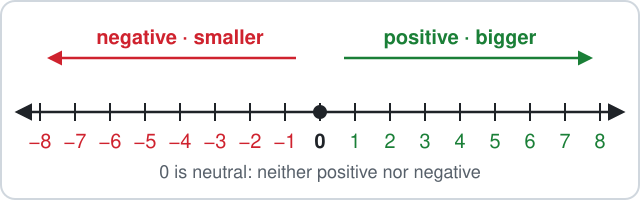

# Malta Year 8 Math Chapter 1 — Directed Numbers

**Directed numbers** have a direction:

- positive numbers (+) are above zero
- negative numbers (−) are below zero
- **0** is neutral: neither positive nor negative

**Chapter 1 has four parts:**

- 1.1 Understanding and ordering
- 1.2 Adding and subtracting
- 1.3 Multiplying and dividing
- 1.4 Word problems

**By the end of the chapter:**

- put directed numbers in order
- add and subtract them on the number line
- multiply and divide with the sign rules
- solve problems about temperature, lifts, money and depth

## 1.1 Understanding and Ordering

### 1. Bigger or smaller?

- On a number line, numbers get **bigger to the right** and **smaller to the left**.
- Every positive number is bigger than every negative number, and **0** sits between them — it is **neutral**, neither positive nor negative.

**Examples:**

- **a)** Which is bigger: $-3$ or $2$?
- **b)** Which is bigger: $-1$ or $-6$?
- **c)** Which is bigger: $0$ or $-4$?
- **d)** Which is bigger: $-10$ or $-9$?

<b>Working</b>

**a)** $2$ is right of zero, $-3$ is left of zero:

$$
\boxed{2 > -3}
$$

**b)** $-1$ is nearer zero, so it is further right:

$$
\boxed{-1 > -6}
$$

**c)** Zero is right of every negative number:

$$
\boxed{0 > -4}
$$

**d)** $-9$ is one step right of $-10$:

$$
\boxed{-9 > -10}
$$

### 2. < and > with one negative

- The **open side** of the symbol faces the **bigger** number: $>$ means *greater than*, $<$ means *smaller than*.
- Write $<$ or $>$ in the box.

**Examples:**

- **a)** $-5 \;\square\; 3$
- **b)** $6 \;\square\; -6$
- **c)** $0 \;\square\; -7$
- **d)** $-12 \;\square\; 4$

<b>Working</b>

**a)** A negative is smaller than a positive:

$$
\boxed{-5 < 3}
$$

**b)** A positive is bigger than a negative:

$$
\boxed{6 > -6}
$$

**c)** Zero is bigger than any negative:

$$
\boxed{0 > -7}
$$

**d)** A negative is smaller than a positive:

$$
\boxed{-12 < 4}
$$

### 3. < and > with two negatives

- With two negative numbers, the one **nearer zero is bigger**.
- Think of temperatures: $-2\,^\circ\text{C}$ is warmer than $-8\,^\circ\text{C}$.
- Write $<$ or $>$ in the box.

**Examples:**

- **a)** $-15 \;\square\; -51$
- **b)** $-33 \;\square\; -32$
- **c)** $-9 \;\square\; -90$
- **d)** $-250 \;\square\; -205$

<b>Working</b>

**a)** $-15$ is nearer zero than $-51$:

$$
\boxed{-15 > -51}
$$

**b)** $-32$ is one step nearer zero:

$$
\boxed{-33 < -32}
$$

**c)** $-9$ is much nearer zero:

$$
\boxed{-9 > -90}
$$

**d)** $-205$ is nearer zero than $-250$:

$$
\boxed{-250 < -205}
$$

### 4. Ascending order

- **Ascending** means smallest to biggest — left to right on the number line.
- Start with the negative that is **furthest from zero** and finish with the biggest positive.

**Examples:**

- **a)** $4,\ -2,\ 0,\ -7,\ 9$
- **b)** $-11,\ 3,\ -1,\ 12,\ -30$
- **c)** $15,\ -15,\ -5,\ 50,\ -50,\ 0$

<b>Working</b>

**a)** Negatives first ($-7$ before $-2$), then 0, then the positives:

$$
\boxed{-7,\ -2,\ 0,\ 4,\ 9}
$$

**b)** $-30$ is furthest left, $12$ furthest right:

$$
\boxed{-30,\ -11,\ -1,\ 3,\ 12}
$$

**c)** Pair them up: $-50$ first, $50$ last:

$$
\boxed{-50,\ -15,\ -5,\ 0,\ 15,\ 50}
$$

### 5. Descending order

- **Descending** means biggest to smallest — right to left on the number line.
- Biggest positive first, the negative furthest from zero last.

**Examples:**

- **a)** $-3,\ 8,\ -12,\ 0,\ 5$
- **b)** $-64,\ -46,\ 20,\ -6,\ 2$
- **c)** $101,\ -110,\ -101,\ 110,\ -1$

<b>Working</b>

**a)** Positives first, then 0, then the negatives:

$$
\boxed{8,\ 5,\ 0,\ -3,\ -12}
$$

**b)** $-6$ is nearer zero than $-46$, and $-46$ nearer than $-64$:

$$
\boxed{20,\ 2,\ -6,\ -46,\ -64}
$$

**c)** $110$ first, $-110$ last:

$$
\boxed{110,\ 101,\ -1,\ -101,\ -110}
$$

## 1.2 Adding and Subtracting

### 6. Negative + a bigger positive

- Start at the negative number and **move right**.
- When the positive part is bigger, you pass zero and the answer is **positive**: take the smaller size from the bigger one.

**Examples:**

- **a)** $-3+8$
- **b)** $-5+6$
- **c)** $-9+15$
- **d)** $-12+20$

<b>Working</b>

**a)**

$$
\begin{aligned} -3+8 &= 8 - 3 \\ &= \boxed{5} \end{aligned}
$$

**b)**

$$
\begin{aligned} -5+6 &= 6 - 5 \\ &= \boxed{1} \end{aligned}
$$

**c)**

$$
\begin{aligned} -9+15 &= 15 - 9 \\ &= \boxed{6} \end{aligned}
$$

**d)**

$$
\begin{aligned} -12+20 &= 20 - 12 \\ &= \boxed{8} \end{aligned}
$$

### 7. Negative + a smaller positive

- Move right, but not far enough to reach zero — the answer stays **negative**.
- Take the smaller size from the bigger one and keep the minus sign.

**Examples:**

- **a)** $-9+4$
- **b)** $-6+2$
- **c)** $-14+5$
- **d)** $-20+13$

<b>Working</b>

**a)**

$$
\begin{aligned} -9+4 &= -(9 - 4) \\ &= \boxed{-5} \end{aligned}
$$

**b)**

$$
\begin{aligned} -6+2 &= -(6 - 2) \\ &= \boxed{-4} \end{aligned}
$$

**c)**

$$
\begin{aligned} -14+5 &= -(14 - 5) \\ &= \boxed{-9} \end{aligned}
$$

**d)**

$$
\begin{aligned} -20+13 &= -(20 - 13) \\ &= \boxed{-7} \end{aligned}
$$

### 8. Equal sizes cancel

- A negative and a positive of the **same size** add to **0**: $-6 + 6 = 0$.
- Cancel them first, then finish.

**Examples:**

- **a)** $-13+13$
- **b)** $-4+4+3$
- **c)** $-10+10-2$
- **d)** $7-7-5$

<b>Working</b>

**a)**

$$
-13+13 = \boxed{0}
$$

**b)**

$$
\begin{aligned} -4+4+3 &= 0 + 3 \\ &= \boxed{3} \end{aligned}
$$

**c)**

$$
\begin{aligned} -10+10-2 &= 0 - 2 \\ &= \boxed{-2} \end{aligned}
$$

**d)**

$$
\begin{aligned} 7-7-5 &= 0 - 5 \\ &= \boxed{-5} \end{aligned}
$$

### 9. Taking away more than you have

- With €5, spending €9 leaves you €4 short: $5 - 9 = -4$.
- Taking away **more than you have** gives a **negative** answer: take the smaller size from the bigger one and write a minus.

**Examples:**

- **a)** $6-10$
- **b)** $15-18$
- **c)** $30-45$
- **d)** $24-50$

<b>Working</b>

**a)**

$$
\begin{aligned} 6-10 &= -(10 - 6) \\ &= \boxed{-4} \end{aligned}
$$

**b)**

$$
\begin{aligned} 15-18 &= -(18 - 15) \\ &= \boxed{-3} \end{aligned}
$$

**c)**

$$
\begin{aligned} 30-45 &= -(45 - 30) \\ &= \boxed{-15} \end{aligned}
$$

**d)**

$$
\begin{aligned} 24-50 &= -(50 - 24) \\ &= \boxed{-26} \end{aligned}
$$

### 10. Negative − positive: further left

- Starting below zero and taking away moves you **further left**.
- Add the two sizes and keep the minus: $-3 - 4 = -7$.

**Examples:**

- **a)** $-2-5$
- **b)** $-8-7$
- **c)** $-12-9$
- **d)** $-25-25$

<b>Working</b>

**a)**

$$
\begin{aligned} -2-5 &= -(2 + 5) \\ &= \boxed{-7} \end{aligned}
$$

**b)**

$$
\begin{aligned} -8-7 &= -(8 + 7) \\ &= \boxed{-15} \end{aligned}
$$

**c)**

$$
\begin{aligned} -12-9 &= -(12 + 9) \\ &= \boxed{-21} \end{aligned}
$$

**d)**

$$
\begin{aligned} -25-25 &= -(25 + 25) \\ &= \boxed{-50} \end{aligned}
$$

### 11. Chains of numbers

- Work **left to right**, one step at a time.
- Or group them: add all the minus parts, add all the plus parts, then combine the two.

**Examples:**

- **a)** $-6-2+5$
- **b)** $12-20+3$
- **c)** $-40-5+2$
- **d)** $-9+14-8-1$

<b>Working</b>

**a)**

$$
\begin{aligned} -6-2+5 &= -8 + 5 \\ &= \boxed{-3} \end{aligned}
$$

**b)**

$$
\begin{aligned} 12-20+3 &= -8 + 3 \\ &= \boxed{-5} \end{aligned}
$$

**c)**

$$
\begin{aligned} -40-5+2 &= -45 + 2 \\ &= \boxed{-43} \end{aligned}
$$

**d)**

- Minus parts: $-9 - 8 - 1 = -18$.
- Plus part: $14$.
- Combine them:

$$
\begin{aligned} -9+14-8-1 &= -18 + 14 \\ &= \boxed{-4} \end{aligned}
$$

### 12. Find the missing number

- Count how far, and which way, you move from the first number to the answer.
- Moving **left** means the missing number is **negative**; moving **right** means it is positive.

**Examples:**

- **a)** $-3 + \square = -10$
- **b)** $-8 + \square = -2$
- **c)** $-15 + \square = -20$
- **d)** $4 + \square = -3$

<b>Working</b>

**a)** From $-3$ to $-10$ is 7 steps left:

$$
-3 + (\boxed{-7}) = -10
$$

**b)** From $-8$ to $-2$ is 6 steps right:

$$
-8 + \boxed{6} = -2
$$

**c)** From $-15$ to $-20$ is 5 steps left:

$$
-15 + (\boxed{-5}) = -20
$$

**d)** From $4$ to $-3$ is 7 steps left:

$$
4 + (\boxed{-7}) = -3
$$

### 13. Missing number, sums on both sides

- Work out **each side** first.
- Then it is an ordinary missing-number question.

**Examples:**

- **a)** $-5 - 2 + \square = -3 - 6$
- **b)** $-1 - 4 + \square = -8 + 10$
- **c)** $-9 + \square = -20 + 15$
- **d)** $3 - 8 + \square = -1 - 1$

<b>Working</b>

**a)**

- Left side: $-5 - 2 = -7$.
- Right side: $-3 - 6 = -9$.
- From $-7$ to $-9$ is 2 steps left:

$$
-7 + (\boxed{-2}) = -9
$$

**b)**

- Left side: $-1 - 4 = -5$.
- Right side: $-8 + 10 = 2$.
- From $-5$ to $2$ is 7 steps right:

$$
-5 + \boxed{7} = 2
$$

**c)**

- Right side: $-20 + 15 = -5$.
- From $-9$ to $-5$ is 4 steps right:

$$
-9 + \boxed{4} = -5
$$

**d)**

- Left side: $3 - 8 = -5$.
- Right side: $-1 - 1 = -2$.
- From $-5$ to $-2$ is 3 steps right:

$$
-5 + \boxed{3} = -2
$$

### 14. Adding a negative

Adding a negative is the same as **taking away**: $+(-4)$ becomes $-4$.

**Examples:**

- **a)** $9+(-5)$
- **b)** $-2+(-6)$
- **c)** $3+(-11)$
- **d)** $-7+(-7)$

<b>Working</b>

**a)**

$$
\begin{aligned} 9+(-5) &= 9 - 5 \\ &= \boxed{4} \end{aligned}
$$

**b)**

$$
\begin{aligned} -2+(-6) &= -2 - 6 \\ &= \boxed{-8} \end{aligned}
$$

**c)**

$$
\begin{aligned} 3+(-11) &= 3 - 11 \\ &= \boxed{-8} \end{aligned}
$$

**d)**

$$
\begin{aligned} -7+(-7) &= -7 - 7 \\ &= \boxed{-14} \end{aligned}
$$

### 15. Subtracting a negative

- Two minus signs side by side make a **plus**: $-(-3)$ becomes $+3$.
- Taking away a debt of €3 leaves you €3 better off.

**Examples:**

- **a)** $4-(-2)$
- **b)** $-7-(-3)$
- **c)** $-1-(-9)$
- **d)** $10-(-10)$

<b>Working</b>

**a)**

$$
\begin{aligned} 4-(-2) &= 4 + 2 \\ &= \boxed{6} \end{aligned}
$$

**b)**

$$
\begin{aligned} -7-(-3) &= -7 + 3 \\ &= \boxed{-4} \end{aligned}
$$

**c)**

$$
\begin{aligned} -1-(-9) &= -1 + 9 \\ &= \boxed{8} \end{aligned}
$$

**d)**

$$
\begin{aligned} 10-(-10) &= 10 + 10 \\ &= \boxed{20} \end{aligned}
$$

## 1.3 Multiplying and Dividing

### 16. Multiplying: the sign rules

Multiply or divide the numbers as usual, then choose the sign:

$$
\begin{aligned} \text{same signs} &\to + \\ \text{different signs} &\to - \end{aligned}
$$

**Examples:**

- **a)** $3\times(-4)$
- **b)** $(-5)\times2$
- **c)** $(-6)\times(-3)$
- **d)** $(-7)\times(-1)$

<b>Working</b>

**a)** Different signs:

$$
3\times(-4) = \boxed{-12}
$$

**b)** Different signs:

$$
(-5)\times2 = \boxed{-10}
$$

**c)** Same signs:

$$
(-6)\times(-3) = \boxed{18}
$$

**d)** Same signs:

$$
(-7)\times(-1) = \boxed{7}
$$

### 17. More multiplying

Two negatives make a positive; one negative makes a negative.

**Examples:**

- **a)** $(-8)\times5$
- **b)** $(-9)\times(-9)$
- **c)** $4\times(-12)$
- **d)** $(-10)\times(-6)$

<b>Working</b>

**a)** Different signs:

$$
(-8)\times5 = \boxed{-40}
$$

**b)** Same signs:

$$
(-9)\times(-9) = \boxed{81}
$$

**c)** Different signs:

$$
4\times(-12) = \boxed{-48}
$$

**d)** Same signs:

$$
(-10)\times(-6) = \boxed{60}
$$

### 18. Dividing: the same rules

Division uses **the same sign rules** as multiplication.

**Examples:**

- **a)** $(-20)\div4$
- **b)** $18\div(-3)$
- **c)** $(-35)\div(-7)$
- **d)** $(-48)\div(-6)$

<b>Working</b>

**a)** Different signs:

$$
(-20)\div4 = \boxed{-5}
$$

**b)** Different signs:

$$
18\div(-3) = \boxed{-6}
$$

**c)** Same signs:

$$
(-35)\div(-7) = \boxed{5}
$$

**d)** Same signs:

$$
(-48)\div(-6) = \boxed{8}
$$

### 19. More dividing

Divide the sizes, then decide the sign.

**Examples:**

- **a)** $(-100)\div10$
- **b)** $63\div(-9)$
- **c)** $(-56)\div(-8)$
- **d)** $(-81)\div9$

<b>Working</b>

**a)** Different signs:

$$
(-100)\div10 = \boxed{-10}
$$

**b)** Different signs:

$$
63\div(-9) = \boxed{-7}
$$

**c)** Same signs:

$$
(-56)\div(-8) = \boxed{7}
$$

**d)** Different signs:

$$
(-81)\div9 = \boxed{-9}
$$

### 20. Three or more numbers

Count the minus signs: an **even** number of them gives **+**, an **odd** number gives **−**.

**Examples:**

- **a)** $(-2)\times(-3)\times(-1)$
- **b)** $(-2)\times5\times(-4)$
- **c)** $(-1)\times(-1)\times(-1)\times(-1)$

<b>Working</b>

**a)** Three minus signs (odd):

$$
(-2)\times(-3)\times(-1) = \boxed{-6}
$$

**b)** Two minus signs (even):

$$
(-2)\times5\times(-4) = \boxed{40}
$$

**c)** Four minus signs (even):

$$
(-1)\times(-1)\times(-1)\times(-1) = \boxed{1}
$$

## 1.4 Word Problems

### 21. Temperature

- A **rise** in temperature is **+**, a **fall** is **−**.
- The **difference** between two temperatures is the higher one minus the lower one.

**Examples:**

- **a)** A freezer is at $-18\,^\circ\text{C}$. In a power cut it warms up by $7\,^\circ\text{C}$. New temperature?
- **b)** On Mount Etna it is $-4\,^\circ\text{C}$ at noon and it falls by $6\,^\circ\text{C}$ at night. Night temperature?
- **c)** Valletta is at $15\,^\circ\text{C}$ and the top of Etna is at $-5\,^\circ\text{C}$. What is the difference?
- **d)** An ice tray at $-3\,^\circ\text{C}$ warms up to $21\,^\circ\text{C}$. By how many degrees did it rise?

<b>Working</b>

**a)**

$$
-18+7 = \boxed{-11\,^\circ\text{C}}
$$

**b)**

$$
-4-6 = \boxed{-10\,^\circ\text{C}}
$$

**c)**

$$
\begin{aligned} 15-(-5) &= 15 + 5 \\ &= \boxed{20\,^\circ\text{C}} \end{aligned}
$$

**d)**

$$
\begin{aligned} 21-(-3) &= 21 + 3 \\ &= \boxed{24\,^\circ\text{C}} \end{aligned}
$$

### 22. Lift levels

In a car park:

- the ground floor is level $0$
- the basements are levels $-1, -2, -3$
- the floors above are levels $1, 2, 3, \ldots$
- going **up** is **+**, going **down** is **−**

**Examples:**

- **a)** Start at level $-3$ and go up 5 floors.
- **b)** Start at level $4$ and go down 6 floors.
- **c)** How many floors up is it from level $-2$ to level $7$?
- **d)** How many floors down is it from level $3$ to level $-1$?

<b>Working</b>

**a)**

$$
-3+5 = \boxed{2}
$$

The lift stops at level 2.

**b)**

$$
4-6 = \boxed{-2}
$$

The lift stops at level $-2$.

**c)**

$$
\begin{aligned} 7-(-2) &= 7 + 2 \\ &= \boxed{9\text{ floors}} \end{aligned}
$$

**d)**

$$
\begin{aligned} 3-(-1) &= 3 + 1 \\ &= \boxed{4\text{ floors}} \end{aligned}
$$

### 23. Money and bank balance

- Money **in** is **+**, money **out** is **−**.
- A negative balance means the account is **overdrawn**: it owes money.

**Examples:**

- **a)** A balance is €25. A payment of €40 goes out.
- **b)** A balance is −€12. Then €30 is paid in.
- **c)** A balance is −€8. Another €5 goes out.
- **d)** Three friends each owe €6. Write the total as a directed number.

<b>Working</b>

**a)**

$$
25-40 = \boxed{-15}
$$

The balance is −€15.

**b)**

$$
-12+30 = \boxed{18}
$$

The balance is €18.

**c)**

$$
-8-5 = \boxed{-13}
$$

The balance is −€13.

**d)**

$$
3\times(-6) = \boxed{-18}
$$

Together they owe €18: −€18.

### 24. Sea level and diving

- Sea level is $0$ m.
- Heights above the sea are **+**, depths below it are **−**.

**Examples:**

- **a)** A diver at Ċirkewwa is at $-12$ m and goes down 9 m more.
- **b)** A diver at $-30$ m comes up 18 m.
- **c)** The top of Dingli Cliffs is about $250$ m above the sea. How far is it above a diver at $-20$ m?
- **d)** A diver starts at the surface and goes down 4 m every minute for 5 minutes.

<b>Working</b>

**a)**

$$
-12-9 = \boxed{-21\text{ m}}
$$

**b)**

$$
-30+18 = \boxed{-12\text{ m}}
$$

**c)**

$$
\begin{aligned} 250-(-20) &= 250 + 20 \\ &= \boxed{270\text{ m}} \end{aligned}
$$

**d)**

$$
5\times(-4) = \boxed{-20\text{ m}}
$$

