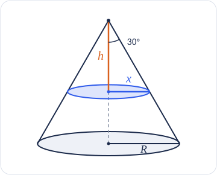

# Math Material — Cone Cross-Section: Radius and Area

A cone has a circular base with a fixed radius $R$. The angle between the cone's vertical axis and its sloping side is $30^\circ$.

A horizontal cut at distance $h$ below the apex makes a smaller circle with radius $x$.

## 1. Radius of the smaller circle

Express the radius $x$ of the smaller circle as a function of $h$.

<b>Working</b>

The axis, the radius $x$ and the sloping side form a right triangle with a $30^\circ$ angle at the apex:

$$
\tan30^\circ=\frac{x}{h}
$$

$$
x(h)=h\tan30^\circ=\boxed{\frac{h}{\sqrt3}}
$$

## 2. Area of the smaller circle

Write the area of the smaller circle, $A_c(h)$, as a function of $h$.

<b>Working</b>

The smaller circle has radius $x(h)$:

$$
A_c=\pi x^2
$$

$$
A_c(h)=\pi\left(\frac{h}{\sqrt3}\right)^2=\boxed{\frac{\pi h^2}{3}}
$$

## 3. Domain in terms of R

Determine the domain of $A_c(h)$ in terms of the fixed base radius $R$.

<b>Working</b>

The smaller circle grows from a point at the apex to the base circle:

$$
0\le A_c(h)\le\pi R^2
$$

$$
0\le\frac{\pi h^2}{3}\le\pi R^2
$$

$$
0\le h^2\le3R^2
$$

Since $h\ge0$:

$$
\boxed{0\le h\le\sqrt3\,R}
$$

Check: at $h=\sqrt3\,R$, $x=\dfrac{\sqrt3\,R}{\sqrt3}=R$, the base circle.

