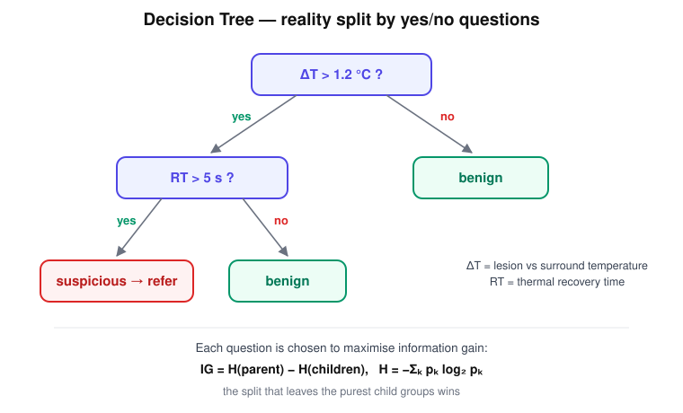

# Decision Tree — "The Question Man"

> He keeps splitting reality with yes/no questions until every answer is (almost) pure.

## Research question

Can a diagnosis be reached through a short chain of interpretable yes/no
questions on measured features — and which question should be asked first?



```text
ΔT > 1.2 ?
   /     \
 YES      NO
 /         \
RT > 5 ?   benign
```

## Core math

The tree measures disorder with entropy:

$$
H=-\sum_k p_k \log_2 p_k ,
$$

and greedily picks the question with the largest information gain:

$$
IG = H(\text{parent}) - H(\text{children}).
$$

## Worked example

Parent node: 4 benign + 4 malignant → $p=(0.5,0.5)$:

$$
H(\text{parent}) = -\left(0.5\log_2 0.5 + 0.5\log_2 0.5\right) = 1 \text{ bit}.
$$

Try the question $\Delta T > 1.2\,^\circ\mathrm{C}$:

- yes-branch: 3 malignant + 1 benign → $H = 0.811$
- no-branch: 3 benign + 1 malignant → $H = 0.811$

Weighted children entropy $=0.811$, so

$$
IG = 1 - 0.811 = 0.189 \text{ bits}.
$$

A useless question (e.g. "image taken on a Monday?") splits 2+2 / 2+2, leaves
$H=1$ in both children, and earns $IG=0$. The Question Man always asks the
question that buys the most bits.

## Hand notes

- Repeated **if/then questions**
- Finds useful splits
- Easy to explain
- One tree can overfit

## Strengths and limits

| Strengths | Limits |
|---|---|
| Fully interpretable — the diagnosis is a readable path | A single deep tree memorises noise (overfits) |
| Handles mixed feature types, no scaling needed | Unstable: small data changes can flip early splits |
| Fast to train and predict | Axis-aligned splits struggle with diagonal boundaries |

## Role in skin-cancer imaging

Clinicians can audit a tree — "flagged because contrast exceeded 1.2 °C and
recovery took longer than 5 s" is an explanation, not a score. That
interpretability is exactly what XAI-oriented pipelines are after; the tree's
weakness (variance) is what its army fixes.

## Family

Part of [the ML family for medical classification](../ml-family-for-medical-classification/content.md).
One tree may be fooled — see the
[Random Forest](../random-forest-tree-army/content.md).
