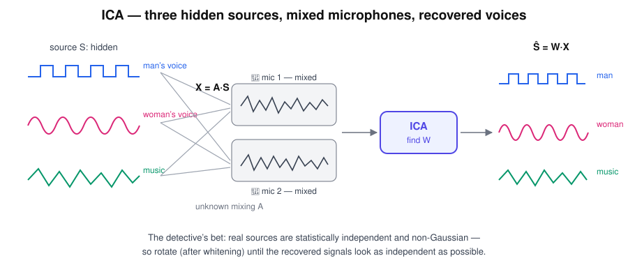

# ICA — "The Source Detective"

> "Who created this mixture?" — he insists there are hidden voices underneath the noise.

## Research question

When every measurement is a blend of underlying signals, can the original
independent sources be recovered without ever observing them directly?



## Core math

The observed data is modelled as an unknown mixing of unknown sources:

$$
X = A\,S ,
$$

and ICA estimates an unmixing matrix that returns the sources:

$$
\hat S = W X .
$$

The detective's assumptions: sources are **statistically independent** and
**non-Gaussian**. In practice PCA/whitening runs first to decorrelate and
normalise, then ICA finds the extra rotation that maximises independence
(e.g. maximising non-Gaussianity).

```text
Voice A ─┐
Voice B ─┼─> 🎤🎤🎤 mixed ─> ICA ─> A | B
Music  ──┘
```

## Worked example

Two independent square-ish sources over four time steps, and a mixing matrix:

```math
S=\begin{bmatrix} 1 & -1 & 1 & -1 \\ 1 & 1 & -1 & -1 \end{bmatrix},
\qquad
A=\begin{bmatrix} 1 & 0.5 \\ 0.5 & 1 \end{bmatrix}.
```

The microphones record only the blend:

```math
X = AS = \begin{bmatrix} 1.5 & -0.5 & 0.5 & -1.5 \\ 1.5 & 0.5 & -0.5 & -1.5 \end{bmatrix}.
```

Neither row of $X$ looks like a clean source — yet $\hat S = WX$ with
$W \approx A^{-1}$ recovers both, up to two unavoidable ambiguities: the
**order** of sources and their **scale/sign**. ICA can say *who* the voices
are, not how loud they originally were.

## Hand notes

- Observed signals = mixtures
- Searches for **independent sources**
- Often PCA/whitening first, then ICA rotation
- "Who created this mixture?"

## PCA vs ICA

$$
\text{PCA: Variance} \qquad \text{ICA: Independence}
$$

PCA finds orthogonal directions of maximal variance; ICA finds (generally
non-orthogonal) directions of maximal independence. Same messy data, two
different stories.

## Strengths and limits

| Strengths | Limits |
|---|---|
| Recovers physically meaningful hidden sources | Fails if more than one source is Gaussian |
| Great for artifact/interference removal | Order, sign, and scale of sources are undetermined |
| Works blind — no labels, no source templates | Needs enough samples; sensitive to preprocessing |

## Role in skin-cancer imaging

A thermal or optical recording of skin is itself a mixture — vascular response,
metabolic activity, ambient drift, sensor artifacts. ICA is the tool for
pulling those overlapping physiological "voices" apart before asking which one
distinguishes a lesion.

## Family

Part of [the ML family for medical classification](../ml-family-for-medical-classification/content.md).
The unsupervised sibling of [PCA](../pca-mr-variance/content.md), which usually
runs first as its whitening step.
