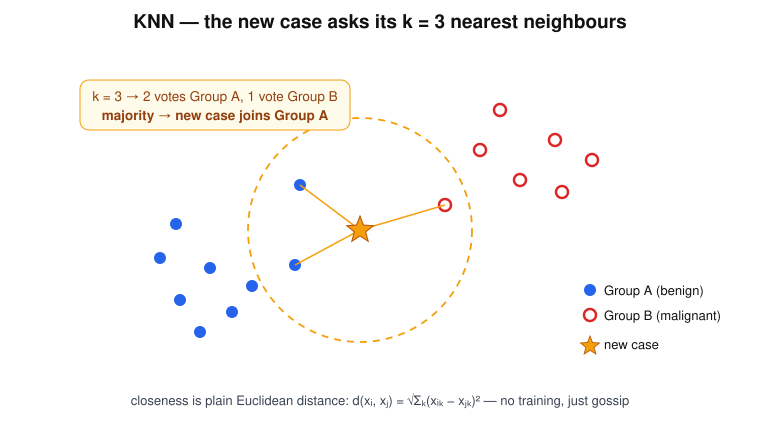

# KNN — "Ask Your Neighbours"

> "Who are my closest friends?" — it classifies by gossip: whatever the neighbours are, you probably are too.

## Research question

Can a new lesion be classified with no model at all — only by measuring which
labelled cases it sits closest to in feature space?

## Core math

Closeness is plain Euclidean distance between feature vectors:

$$
d(x_i,x_j)=\sqrt{\sum_k (x_{ik}-x_{jk})^2},
$$

and the decision is a majority vote among the $k$ nearest neighbours
$N_k(x)$:

$$
\hat y=\operatorname{mode}\{\,y_i : i\in N_k(x)\,\}.
$$

There is no real training phase — the dataset *is* the model.

## Worked example

Features per lesion: $(\Delta T,\ RT)$ — temperature contrast (°C) and
recovery time (s). Training set:

| case | $\Delta T$ | $RT$ | label |
|---|---|---|---|
| a | 0.5 | 3 | benign |
| b | 0.8 | 4 | benign |
| c | 1.0 | 5 | benign |
| d | 2.0 | 8 | malignant |
| e | 2.4 | 9 | malignant |

New case $x=(1.2,\ 6)$. Distances: to c $=1.02$, b $=2.04$, d $=2.15$,
a $=3.08$, e $=3.23$.

With $k=3$ the neighbours are $\{c, b, d\}$ → votes benign, benign,
malignant → **benign (2 of 3)**.

Caveat visible even here: $RT$ spans a larger range than $\Delta T$, so it
dominates the distance — features must be normalised before KNN is allowed to
gossip.

## Hand notes

- "Who are my closest friends?"
- Distance-based
- Simple, no real training

## Strengths and limits

| Strengths | Limits |
|---|---|
| Trivially simple; no training | Prediction is slow — every query scans the dataset |
| Naturally multi-class and nonlinear | Needs feature scaling; distances lose meaning in high dimension |
| One knob ($k$); easy sanity baseline | Sensitive to class imbalance and noisy neighbours |

## Role in skin-cancer imaging

KNN is the honest baseline: if a fancy model cannot beat "find the most
similar past lesions and copy their diagnosis," the features — not the
classifier — are the problem. On compact feature sets (a few thermal or
morphological descriptors) it is often surprisingly competitive.

## Family

Part of [the ML family for medical classification](../ml-family-for-medical-classification/content.md).
For a model that asks *questions* instead of asking friends, see the
[Decision Tree](../decision-tree-question-man/content.md).
