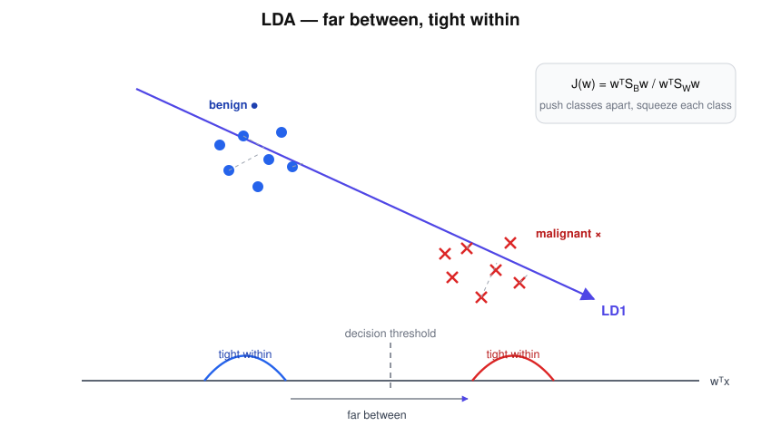

# LDA — "The Class Separator"

> "Find the best separation direction." — politely pushes the tribes apart while keeping each tribe tight.

## Research question

Using the labels, which single direction makes two classes look as separated
as possible when the data is projected onto it?



```text
● ● ● ●              × × × ×
 benign     ---->     malignant
               LD1
```

## Core math

LDA maximises between-class scatter relative to within-class scatter:

$$
J(w)=\frac{w^T S_B\, w}{w^T S_W\, w},
$$

and for two classes the answer is closed-form:

$$
w = S_W^{-1}(\mu_1-\mu_0).
$$

The slogan, worth memorising:

$$
\text{far between, tight within.}
$$

## Worked example

Class means $\mu_0=(1,2)$ (benign) and $\mu_1=(3,4)$ (malignant), so
$\mu_1-\mu_0=(2,2)$.

- If both classes scatter equally in all directions, $S_W=I$ and
  $w\propto(2,2)$ — simply aim from one mean to the other.
- If instead the second feature is noisy within each class,
  $S_W=\mathrm{diag}(1,4)$, then

$$
w = S_W^{-1}(\mu_1-\mu_0) = (2,\ 0.5),
$$

LDA leans the axis toward the *reliable* feature: separation between classes
is only worth what the noise within classes allows.

## Hand notes

- **Within-class:** keep each tribe tight
- **Between-class:** push tribes apart
- Uses labels
- "Find the best separation direction."

## LDA vs PCA

Both produce projection directions — but PCA maximises variance with no
knowledge of labels, while LDA spends its one direction purely on class
separation. The direction of maximum variance and the direction of maximum
separation are often *not* the same one.

## Strengths and limits

| Strengths | Limits |
|---|---|
| Closed-form, fast, no hyperparameters | Assumes Gaussian classes with a shared covariance |
| Supervised dimensionality reduction (C classes → C−1 dims) | Only linear boundaries |
| Doubles as a decent baseline classifier | $S_W$ must be invertible — trouble when features ≫ samples |

## Role in skin-cancer imaging

After PCA compresses thermal recovery curves, LDA is the natural next step:
take the label information and find the one axis along which benign and
malignant recoveries actually separate — a two-step (PCA → LDA) pipeline that
is a classic for exactly this kind of few-samples, many-features clinic data.

## Family

Part of [the ML family for medical classification](../ml-family-for-medical-classification/content.md).
Compare [PCA](../pca-mr-variance/content.md) (variance, no labels) and
[SVM](../svm-margin-master/content.md) (separation by margin, not by scatter).
