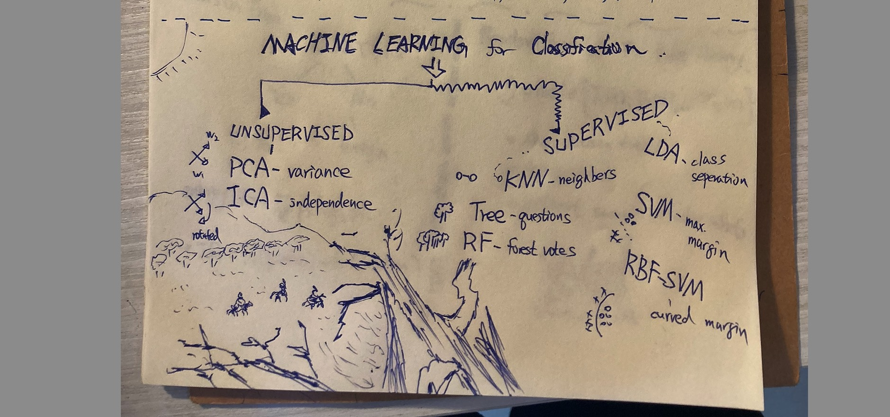
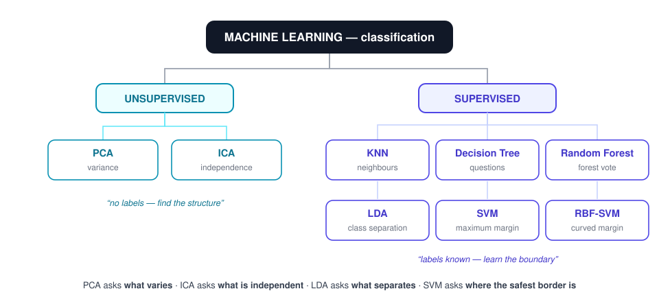
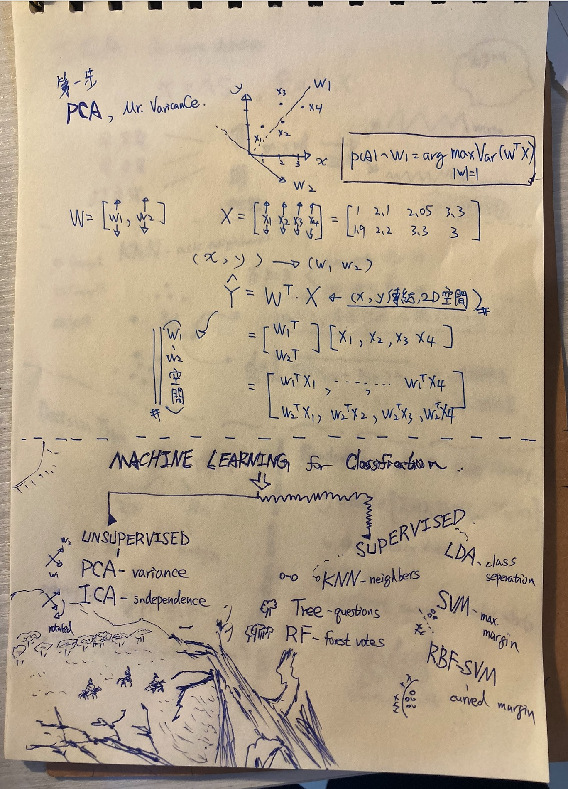
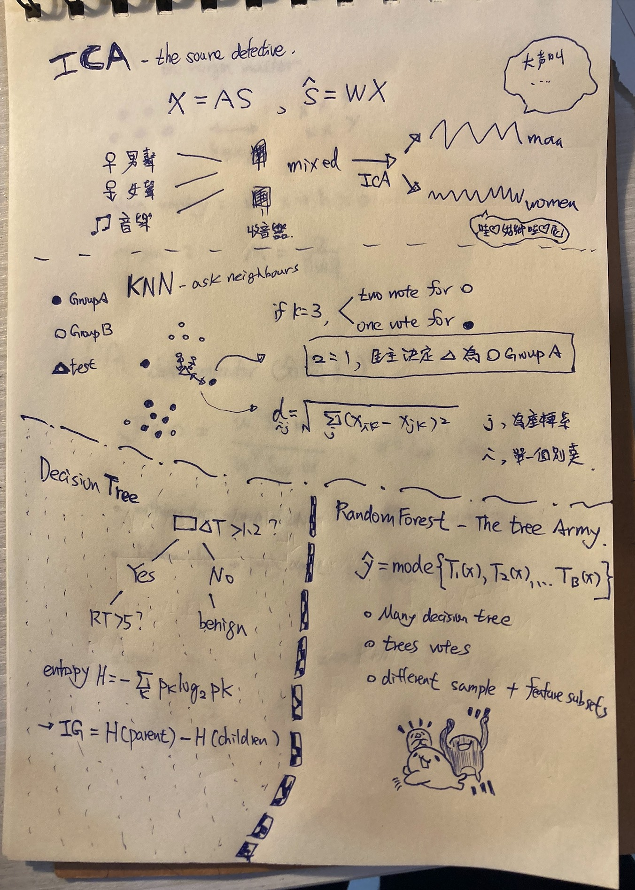
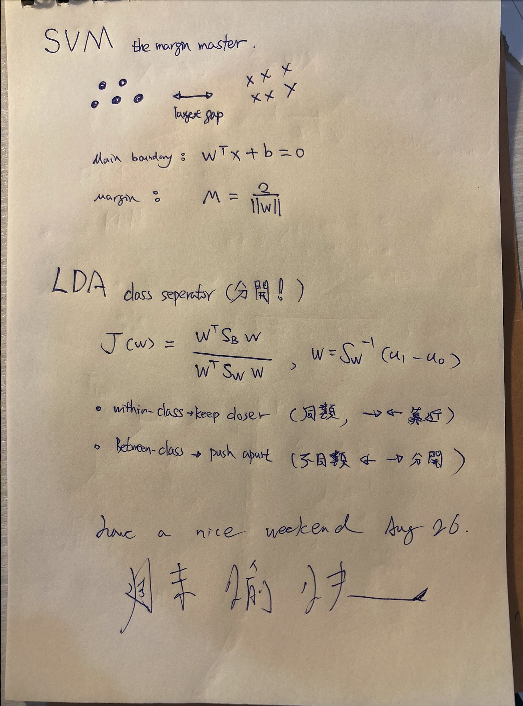

# The Machine Learning Family for Medical Classification

## Research question

Which classical machine learning methods form the working toolkit for skin
cancer classification, and what one question does each of them ask of the data?



## The story (English)

In current medical research, clinical teams classify skin cancer using a wide
range of imaging tools and machine learning methods, from classical statistical
techniques to modern ensemble models. Each algorithm plays a different role in
helping doctors interpret complex visual patterns in medical images.

Unsupervised learning has its characters: PCA asks, "Where is the variance?"
ICA asks, "Where are the independent sources?" It's kind of like they're both
staring at the same messy data and going, "okay… but what *story* are you
trying to tell me?" haha. PCA just calmly rotates the world until things look
simpler, while ICA is more like a detective insisting there are hidden voices
underneath the noise.

Supervised learning brings KNN, Decision Trees, Random Forests, LDA, SVM — and
its nonlinear cousin, RBF-SVM. Honestly, this group feels a bit more
"structured chaos": everyone has a job, everyone has labels, and somehow they
still argue about how to draw the boundary. KNN just asks your neighbours like
it's gossiping, Decision Trees keep splitting reality with yes/no questions,
Random Forests just vote like a committee that never fully agrees, LDA tries to
politely separate everyone into clean groups, and SVM is that strict one
insisting on the biggest possible margin like "nobody crosses this line." Then
RBF-SVM shows up and says, "what if the line… bends?"

Befriend them all, and you've earned your ticket to the ML show. 🎟️ It's a bit
chaotic, a bit funny, but once you see them as characters instead of formulas,
it actually starts to feel like a story you can't unsee.

## 故事（台灣繁體）

在目前的醫學研究中，臨床團隊會使用各種影像工具與機器學習方法來分類皮膚癌，
從傳統統計方法到現代的集成式模型都有。不同的演算法就像不同的助手，一起幫助
醫師從複雜的醫學影像中找出關鍵特徵。

非監督學習也有不同門派：PCA 問「變異在哪裡？」ICA 問「獨立訊號在哪裡？」
有時候看他們處理資料，就像兩個人在同一團混亂裡各自用不同方式理解世界，
PCA 比較像冷靜整理房間的人，把方向轉一轉讓事情變簡單；ICA 則像偵探，
一直覺得雜訊裡一定藏著真正的聲音，怎麼樣都要把它挖出來，哈哈。

監督學習則有 KNN、決策樹、隨機森林、LDA、SVM，以及會拐彎的 RBF-SVM。
這一群就比較像「有規則但還是很熱鬧」的團隊：KNN 直接問鄰居投票，像在問
「大家覺得這是什麼？」；決策樹一直問是或否，把世界切成一格一格；隨機森林
乾脆讓很多棵樹一起投票，避免單一判斷太偏；LDA 很努力想把不同類別分得
乾乾淨淨；SVM 則堅持要畫出最大安全距離的邊界，誰都不能越線；最後 RBF-SVM
出現說：「邊界其實可以彎的啦。」

認識這群朋友，你就拿到機器學習劇場的入場券了。🎟️

## The family portrait



```text
               MACHINE LEARNING
                     |
          ┌──────────┴──────────┐
          |                     |
    UNSUPERVISED            SUPERVISED
          |                     |
      PCA ─ variance          KNN ─ neighbours
      ICA ─ independence      Tree ─ questions
                              RF ─ forest vote
                              LDA ─ class separation
                              SVM ─ maximum margin
                              RBF-SVM ─ curved margin
```

## The four punchlines

$$\text{PCA asks WHAT VARIES}$$

$$\text{ICA asks WHAT IS INDEPENDENT}$$

$$\text{LDA asks WHAT SEPARATES}$$

$$\text{SVM asks WHERE IS THE SAFEST BORDER}$$

## Meet each character

| Character | Method | One question | Note |
|---|---|---|---|
| Mr. Variance | PCA | Where is the variance? | [pca-mr-variance](../pca-mr-variance/content.md) |
| The Source Detective | ICA | Where are the independent sources? | [ica-source-detective](../ica-source-detective/content.md) |
| Ask Your Neighbours | KNN | Who are my closest friends? | [knn-ask-your-neighbours](../knn-ask-your-neighbours/content.md) |
| The Question Man | Decision Tree | Which yes/no question splits best? | [decision-tree-question-man](../decision-tree-question-man/content.md) |
| The Tree Army | Random Forest | What does the committee vote? | [random-forest-tree-army](../random-forest-tree-army/content.md) |
| The Class Separator | LDA | Which direction separates the groups? | [lda-class-separator](../lda-class-separator/content.md) |
| The Margin Master | SVM | Where is the widest safety corridor? | [svm-margin-master](../svm-margin-master/content.md) |
| SVM Learns to Curve | RBF-SVM | What if the line… bends? | [rbf-svm-curved-margin](../rbf-svm-curved-margin/content.md) |

All unsupervised members see only $X$; every supervised member trains on

$$X + y ,$$

i.e. it knows the answer during training.

## The handwritten pages

Signed "have a nice weekend, Aug 26."






