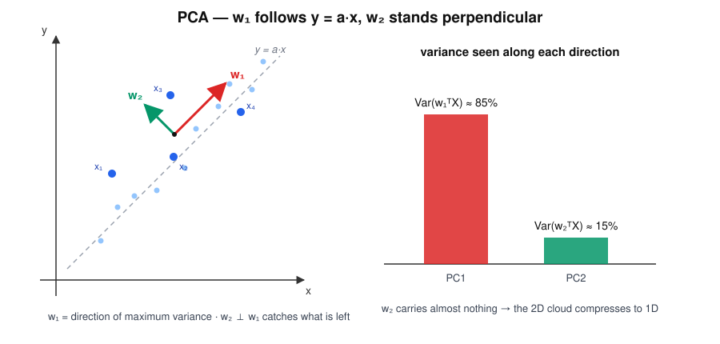

# PCA — "Mr. Variance"

> "Where is the variance?" — he calmly rotates the world until things look simpler.

## Research question

Given unlabeled lesion data, which directions carry most of the variation — and
how many numbers do we really need to describe each sample?

## Core math

The first principal direction is the unit vector that maximises projected
variance:

$$
w_1=\arg\max_{\|w\|=1}\operatorname{Var}(w^T X).
$$

All principal directions are eigenvectors of the covariance matrix $\Sigma$,
and each eigenvalue is the variance captured along its direction:

$$
\Sigma w_i=\lambda_i w_i .
$$

Stacking the directions $W=[w_1, w_2]$ turns projection into one matrix
product — new coordinates in the $(w_1,w_2)$ space:

$$
\hat Y = W^T X =
\begin{bmatrix} w_1^T \\ w_2^T \end{bmatrix}
\begin{bmatrix} x_1, x_2, x_3, x_4 \end{bmatrix}
=
\begin{bmatrix}
w_1^T x_1 & \cdots & w_1^T x_4 \\
w_2^T x_1 & \cdots & w_2^T x_4
\end{bmatrix}.
$$

## Worked example

Four samples in the traditional $(x,y)$ 2D space (from the handwritten page):

$$
X=\begin{bmatrix} 1 & 2.1 & 2.05 & 3.3 \\ 1.9 & 2.2 & 3.3 & 3 \end{bmatrix}.
$$

Center the data (mean $\approx(2.11,\,2.60)$) and form the covariance matrix:

$$
\Sigma \approx
\begin{bmatrix} 0.88 & 0.41 \\ 0.41 & 0.43 \end{bmatrix}
\quad\Rightarrow\quad
\lambda_1\approx 1.12,\;\; \lambda_2\approx 0.20 .
$$

- $w_1 \approx (0.86,\,0.51)$ — the cloud's long axis, a line $y \approx a\cdot x$
- $w_2 \perp w_1$ — whatever variation is left
- PC1 share: $\lambda_1/(\lambda_1+\lambda_2)\approx 85\%$ — the 2D cloud is
  almost a 1D story

$(x,y) \rightarrow (w_1, w_2)$: after the rotation each sample is described by
"how far along the trend" plus "how far off the trend."

## Hand notes

- Finds directions of **maximum variance**
- Components are orthogonal
- Does **not** know class labels
- "What varies most?"

## Strengths and limits

| Strengths | Limits |
|---|---|
| Optimal linear compression of variance | Directions ignore class labels — top PC may not separate classes |
| Denoises: small-$\lambda$ components are mostly noise | Only linear structure; curved manifolds are invisible |
| Fast, deterministic, no tuning | Components can be hard to interpret physically |
| Standard preprocessing before classifiers | Sensitive to feature scaling |

## Role in skin-cancer imaging

Thermal recovery curves are long vectors (hundreds of time samples per pixel);
PCA compresses them to a few components before any classifier sees them. In our
thermal-PCA work the standing sanity check is exactly this eigenvalue story —
PC1 capturing the dominant share of recovery-curve variance.

## Family

Part of [the ML family for medical classification](../ml-family-for-medical-classification/content.md).
Contrast with [ICA](../ica-source-detective/content.md) — PCA asks about
variance, ICA about independence — and with
[LDA](../lda-class-separator/content.md), which uses labels to pick its
direction.
