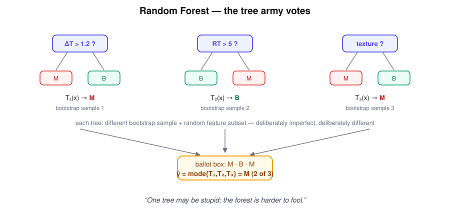

# Random Forest — "The Tree Army"

> A committee that never fully agrees — and is right more often because of it.

## Research question

If one decision tree overfits, can many deliberately different trees vote
their way to a stable diagnosis?

## Core math

Train $B$ trees, each on a bootstrap sample of the data and a random subset of
features at every split. Classification is the committee's mode:

$$
\hat y=\mathrm{mode}\{\,T_1(x),\,T_2(x),\,\ldots,\,T_B(x)\,\}.
$$

Averaging many high-variance, weakly correlated trees slashes variance without
adding much bias — the whole point of the army.

## Worked example

Five trees examine the same lesion:

$$
T_1\to M,\quad T_2\to M,\quad T_3\to B,\quad T_4\to M,\quad T_5\to B
$$

$$
\hat y=\mathrm{mode}\{M,M,B,M,B\}=M \quad (3\text{ of }5).
$$

The vote count doubles as a confidence signal: 3/5 is a much more hesitant
"malignant" than 5/5 — useful when the cost of a miss is a missed melanoma.

Bonus: each tree never saw ~37% of the data (its out-of-bag samples), giving a
free validation estimate without a held-out set.

## Hand notes

- Many Decision Trees
- Different samples + feature subsets
- Trees vote
- "One tree may be stupid; the forest is harder to fool."

## Strengths and limits

| Strengths | Limits |
|---|---|
| Robust to overfitting; little tuning needed | The readable single path is gone — harder to explain than one tree |
| Feature importance for free | Slower and heavier than one tree |
| Handles many features, missing values, imbalance tricks | Struggles to extrapolate beyond the training range |

## Role in skin-cancer imaging

Random forests are the workhorse for tabular lesion features (thermal
descriptors, texture, asymmetry scores): strong accuracy with almost no
tuning, plus a feature-importance ranking that tells the team *which*
measurements carry the diagnosis — guidance for what the next experiment
should measure carefully.

## Family

Part of [the ML family for medical classification](../ml-family-for-medical-classification/content.md).
The army is built from the
[Decision Tree](../decision-tree-question-man/content.md).
