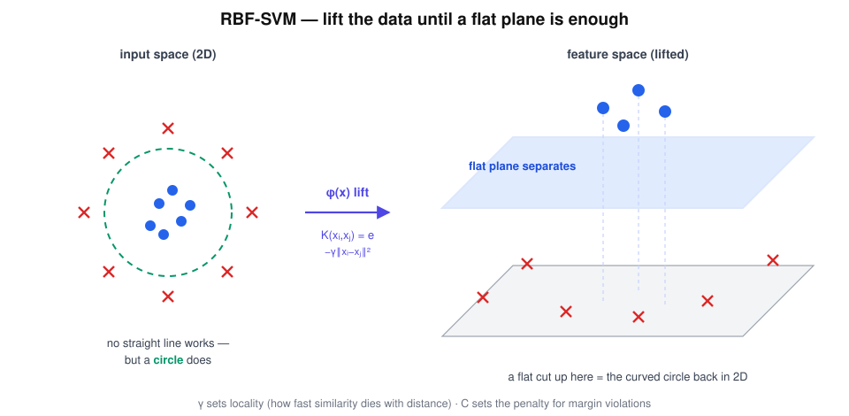

# RBF-SVM — "SVM Learns to Curve"

> "What if the line… bends?" — Linear SVM carries a ruler. RBF-SVM carries a flexible ruler.

## Research question

When benign sits *inside* and malignant sits *around* — no straight boundary
exists — how does SVM keep its maximum-margin philosophy and still separate
the classes?

## Core math

Replace every inner product with the RBF (Gaussian) kernel:

$$
K(x_i,x_j)=e^{-\gamma\|x_i-x_j\|^2},
$$

which implicitly lifts the data into a very high-dimensional feature space
where a *flat* maximum-margin plane exists. Cut flat up there, and the
boundary comes back curved down here. The decision function is built from the
support vectors alone:

$$
f(x)=\operatorname{sign}\!\Big(\sum_i \alpha_i\, y_i\, K(x_i,x)+b\Big).
$$

Two knobs rule everything:

$$
C=\text{penalty}, \qquad \gamma=\text{locality}.
$$

## Worked example

Ring data: benign cluster at the centre, malignant on a ring at radius
$r\approx 2$. Take a centre point $x_c$ and $\gamma=1$:

- another centre point at distance $0.5$: $K=e^{-0.25}\approx 0.78$ — "close friend"
- a ring point at distance $2$: $K=e^{-4}\approx 0.018$ — "stranger"

Similarity dies exponentially with distance, so the lifted centre points
cluster together far away from the ring points — and one flat plane between
them projects back to exactly the circular boundary the eye wanted to draw.

Tuning intuition:

| knob | too small | too large |
|---|---|---|
| $\gamma$ | boundary too smooth — underfits | memorises every point — overfits |
| $C$ | tolerates violations — wide soft corridor | punishes every mistake — jagged hard margin |

## Hand notes

- Same SVM philosophy
- But nonlinear boundary
- Close points → high similarity
- Far points → low similarity

## Strengths and limits

| Strengths | Limits |
|---|---|
| Curved boundaries with no manual feature engineering | Two coupled hyperparameters ($C,\gamma$) to tune |
| Still max-margin, still convex, still support-vector sparse | Kernel matrix grows as $n^2$ — slow on large datasets |
| Universal: can fit almost any smooth boundary | Feature scaling is mandatory before distances mean anything |

## Role in skin-cancer imaging

Lesion classes are rarely linearly separable in raw thermal or texture
features — malignant cases often *surround* the benign regime rather than sit
beside it. RBF-SVM is the standard non-linear reference model in skin-lesion
studies: the accuracy target that the interpretable models are asked to reach.

## Family

Part of [the ML family for medical classification](../ml-family-for-medical-classification/content.md).
The bendable version of [SVM](../svm-margin-master/content.md) — same margin
religion, flexible ruler.
