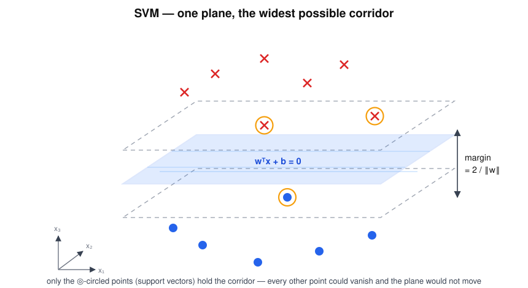

# SVM — "The Margin Master"

> "Nobody crosses my margin." — the strict one, insisting on the biggest possible safety gap.

## Research question

Among all hyperplanes that separate two classes, which one should be trusted —
and why is the widest corridor the right answer?



```text
● ● ●       |       × × ×
 ● ●     |  |  |     × ×
          ↑   ↑
       largest gap
```

## Core math

The decision boundary is a hyperplane:

$$
w^T x + b = 0 ,
$$

with class constraints $y_i\,(w^T x_i + b)\ge 1$ and a corridor width of

$$
\text{Margin}=\frac{2}{\|w\|}.
$$

Maximising the margin means minimising $\|w\|^2$ subject to those
constraints. Only the points that sit exactly on the corridor walls — the
**support vectors** — determine the answer; every other sample could be
deleted and the plane would not move.

## Worked example

One feature, two lesions: $x=1$ labelled $y=-1$ (benign) and $x=3$ labelled
$y=+1$ (malignant). Choose $w=1,\ b=-2$:

- boundary $w x + b = 0$ at $x = 2$ — exactly halfway
- constraints: $(-1)(1-2)=1\ \checkmark$ and $(+1)(3-2)=1\ \checkmark$, both tight
- margin $= 2/\|w\| = 2$ — precisely the gap between the two cases

Any boundary shifted off-centre would need a larger $\|w\|$ to satisfy the
constraints: the centred, widest corridor is the optimum, and both points are
support vectors.

## Hand notes

- Support vectors = points closest to the battle line
- Maximise the safety gap
- Excellent for binary classification

## Strengths and limits

| Strengths | Limits |
|---|---|
| Max-margin ⇒ strong generalisation from few samples | Natively binary; multi-class needs one-vs-rest tricks |
| Solution depends only on support vectors | No direct probabilities (needs calibration) |
| Works in high-dimensional feature spaces | $C$ must be tuned; sensitive to feature scaling |
| Convex problem — one global optimum | Linear version cannot bend (see RBF-SVM) |

## Role in skin-cancer imaging

Benign-vs-malignant is a born-binary problem with expensive labels — exactly
SVM territory. With few annotated lesions and many features, the max-margin
principle is what keeps the classifier from memorising the training clinic.

## Family

Part of [the ML family for medical classification](../ml-family-for-medical-classification/content.md).
When no straight plane works, the same philosophy bends:
[RBF-SVM](../rbf-svm-curved-margin/content.md).
