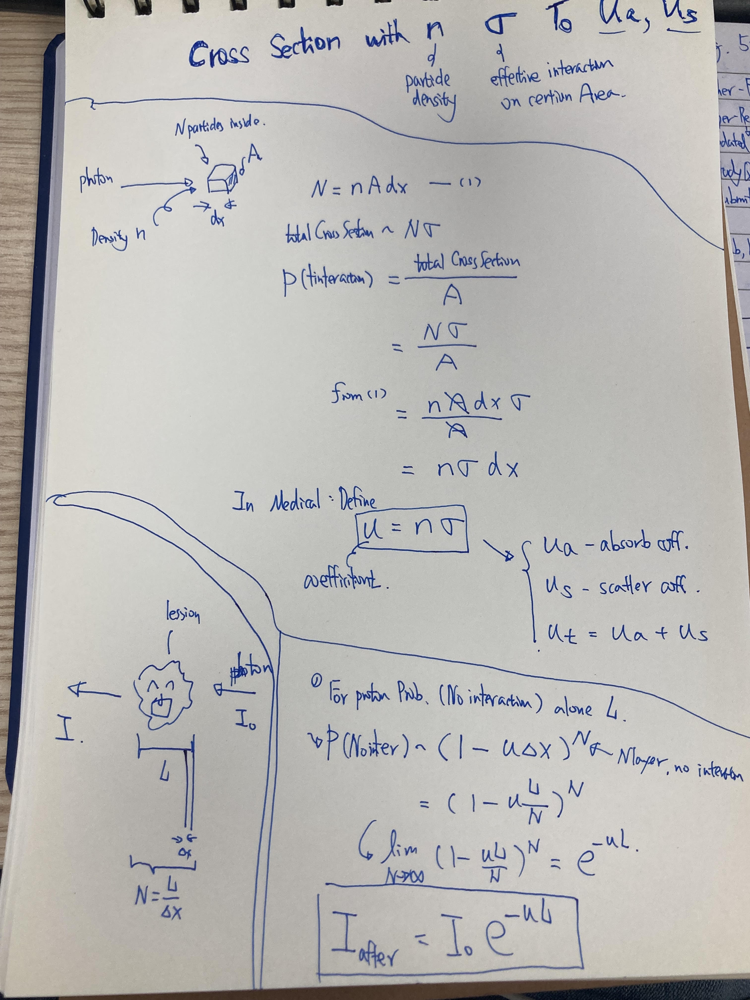

# From Cross Section to Interaction Coefficient

Handwritten derivation

## Microscopic Cross Section

The microscopic cross section $\sigma$ is an effective interaction area for
one particle. If a homogeneous medium contains $n$ particles per unit volume,
then a thin slab of area $A$ and thickness $dx$ contains

$$
N=nA\,dx
$$

particles. When the effective interaction areas do not overlap appreciably,
the probability of an interaction within this infinitesimal slab is

$$
P(\text{interaction in }dx)
\approx\frac{N\sigma}{A}
=n\sigma\,dx.
$$

The macroscopic interaction coefficient is therefore

$$
\boxed{\mu=n\sigma},
$$

with units of inverse length. Thus

$$
P(\text{interaction in }dx)\approx\mu\,dx.
$$

This is a local, infinitesimal approximation. The product $\mu L$ is not, in
general, the probability of an interaction over a finite path $L$.

## Survival over a Finite Path

Divide $L$ into $N$ intervals of width $\Delta x=L/N$. For each small
interval,

$$
P(\text{no interaction in }\Delta x)
\approx 1-\mu\Delta x.
$$

Assuming a homogeneous medium and independent interactions, the probability of
no interaction over the entire path is

$$
P_0(L)
=\lim_{N\to\infty}
\left(1-\frac{\mu L}{N}\right)^N
=e^{-\mu L}.
$$

Equivalently, if $S(x)$ denotes the probability of reaching $x$ without an
interaction, then

$$
S(x+dx)=S(x)(1-\mu\,dx)
$$

leads to

$$
\frac{dS}{dx}=-\mu S,
\qquad
S(0)=1,
$$

whose solution is

$$
\boxed{S(x)=e^{-\mu x}}.
$$

The probability of at least one interaction within $L$ is the complement:

$$
\boxed{
P(N\geq1)=1-e^{-\mu L}=1-e^{-n\sigma L}
}.
$$

## Thin-Slab Approximation

For $\mu L\ll1$, the Taylor expansion

$$
e^{-\mu L}\approx1-\mu L
$$

gives

$$
P(N\geq1)\approx\mu L.
$$

The linear expression is therefore a short-distance approximation. For a
finite path, the exponential is required to keep the probability between zero
and one.

## Poisson Interpretation

Under the same homogeneous, independent-interaction assumptions, the number of
interactions along $L$ is Poisson distributed:

$$
\boxed{
P(N=k)=\frac{(\mu L)^k}{k!}e^{-\mu L}
}.
$$

Its expected value is

$$
\mathbb E[N]=\mu L,
$$

whereas the probability of at least one interaction is
$1-e^{-\mu L}$. These quantities are different.

For example, if $\mu=2\ \mathrm{mm}^{-1}$ and
$L=0.5\ \mathrm{mm}$, then $\mu L=1$, so

$$
P(N=0)=e^{-1}\approx0.368
$$

and

$$
P(N\geq1)=1-e^{-1}\approx0.632.
$$

## Extinction versus Absorption Survival

If

$$
\mu_t=\mu_a+\mu_s,
$$

then

$$
e^{-\mu_tL}
$$

is the probability that a photon travels a straight path $L$ without either
absorption or scattering. It describes the uncollided, or ballistic,
component—not the probability that the photon still exists.

A scattering event changes the photon direction but does not necessarily
destroy it. For a specified total travelled path length $L$, absorption-only
survival is

$$
e^{-\mu_aL}.
$$

In a scattering medium, however, the actual travelled path is generally longer
than the straight source-detector separation and varies from photon to photon.

## Connection to Photon Transport

The coefficients $\mu_a$ and $\mu_s$ used in tissue-optics transport models
are macroscopic interaction coefficients. Their role in radiative transfer,
diffusion, and time-resolved measurement is developed in
[Photon Transport in Scattering Tissue](../photon-transport-in-tissue/content.md).

## Concepts

The microscopic relation $\mu=n\sigma$ connects an individual interaction
cross section to interaction probability per unit path length. Exponential
attenuation follows from applying the same local survival rule continuously
along a finite path.
