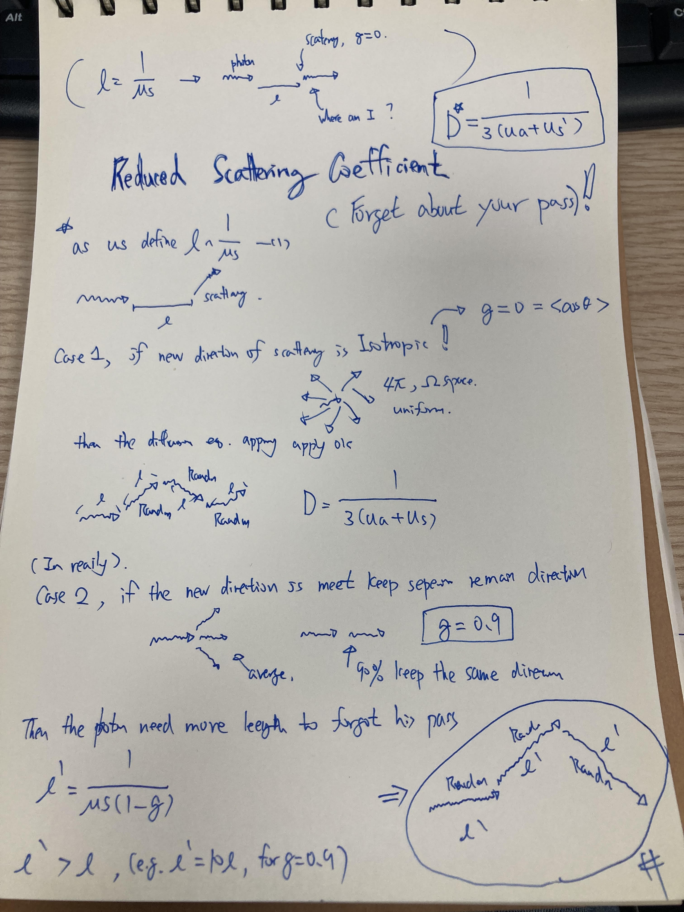

# Reduced Scattering Coefficient in Biomedical Optics

From isotropic scattering to transport scattering

## Scattering Frequency and Direction

Light travelling through biological tissue undergoes many scattering events.
The scattering coefficient $\mu_s$ describes the interaction rate per unit
length. Its reciprocal,

$$
\ell_s=\frac{1}{\mu_s},
$$

is the scattering mean free path: the average distance between consecutive
scattering events in a homogeneous medium.

The coefficient $\mu_s$ does not describe the direction taken after an event.
That information is contained in the normalized scattering phase function
$p(\hat{\mathbf s},\hat{\mathbf s}')$, which gives the probability density for
scattering from incoming direction $\hat{\mathbf s}'$ into outgoing direction
$\hat{\mathbf s}$.

## Anisotropy Factor

The anisotropy factor is the mean cosine of the scattering angle:

$$
\boxed{g=\langle\cos\theta\rangle}.
$$

Its limiting interpretations are:

- $g=1$: perfectly forward scattering;
- $g=0$: zero mean directional bias, as in isotropic scattering; and
- $g=-1$: perfectly backward scattering.

Biological tissue is commonly forward scattering, so $g$ is positive and often
close to one. A photon may therefore scatter many times while retaining
substantial memory of its previous direction.

For independent scattering events described by the same phase function, the
mean directional correlation after $m$ events behaves as

$$
\left\langle
\hat{\mathbf s}_m\cdot\hat{\mathbf s}_0
\right\rangle=g^m.
$$

Thus directional memory disappears immediately in the idealized $g=0$ case,
but decays gradually when $g$ is close to one.

## Reduced Scattering Coefficient

The reduced, or transport, scattering coefficient is

$$
\boxed{\mu_s'=\mu_s(1-g)}.
$$

It combines the scattering frequency with the average loss of forward
direction per event. The associated transport scattering length is

$$
\boxed{
\ell_s'=\frac{1}{\mu_s'}
=\frac{1}{\mu_s(1-g)}
=\frac{\ell_s}{1-g}
}.
$$

This is the characteristic distance over which repeated scattering largely
randomizes the original propagation direction. It is not the distance between
physical collisions.

For example, if

$$
\mu_s=10\ \mathrm{mm}^{-1},
\qquad
g=0.9,
$$

then

$$
\ell_s=\frac{1}{\mu_s}=0.1\ \mathrm{mm},
$$

but

$$
\mu_s'=10(1-0.9)=1\ \mathrm{mm}^{-1}
$$

and

$$
\ell_s'=\frac{1}{\mu_s'}=1\ \mathrm{mm}.
$$

Physical scattering still occurs approximately every $0.1$ mm, but about
$1$ mm of travel is required for effective directional randomization. In this
example, the transport length is ten times the ordinary scattering mean free
path.

## From Isotropic to Forward Scattering

In the isotropic model, $g=0$, so

$$
\mu_s'=\mu_s
$$

and

$$
\ell_s'=\ell_s.
$$

This makes every scattering event an effective direction-randomizing event.
Introducing $g>0$ is a precise upgrade: retain the physical collision rate
$\mu_s$, but replace it with $\mu_s'$ when describing long-range transport.

The common intuition is that many weak forward deflections can be represented,
at transport scales, by fewer effective direction-randomizing events. This is
why two media with different $\mu_s$ and $g$ may produce similar diffuse
behaviour when they have the same $\mu_s'$.

## Diffusion Coefficient

In a standard diffusion approximation for tissue optics,

$$
\boxed{
D=\frac{1}{3(\mu_a+\mu_s')}
}.
$$

Here $\mu_a$ is the absorption coefficient. The corresponding transport mean
free path, including absorption, is

$$
\ell_{\mathrm{tr}}=\frac{1}{\mu_a+\mu_s'},
$$

so

$$
D=\frac{\ell_{\mathrm{tr}}}{3}.
$$

In this convention, $D$ has units of length. When the time-domain diffusion
equation is written with $\partial\Phi/\partial t$ rather than
$(1/c)\partial\Phi/\partial t$, the physical diffusivity is $cD$ and has units
of length squared per unit time.

Absorption and scattering play different roles. Absorption removes photons
from the population. Scattering conserves photons but redistributes their
directions, thereby controlling spatial transport through $D$.

## Similarity and Its Limits

The similarity relation states that multiply scattered diffuse measurements
are often approximately governed by $\mu_s'$ rather than by $\mu_s$ and $g$
separately. It is an approximation, not a universal identity.

The detailed phase function can still matter:

- near the source or tissue boundary;
- before enough scattering events have occurred;
- for early-arriving or quasi-ballistic photons;
- at short source-detector separations;
- for thin samples; and
- when two phase functions share the same $g$ but differ in higher angular
  moments.

Consequently, $\mu_s'$ is highly useful in diffusion-scale modelling, while
radiative-transfer or Monte Carlo models may require the full phase function.

## Wavelength Dependence

Both $\mu_s$ and $g$ can depend on wavelength. Tissue reduced scattering is
often represented empirically by a power law such as

$$
\mu_s'(\lambda)
=\mu_s'(\lambda_0)
\left(\frac{\lambda}{\lambda_0}\right)^{-b},
$$

where $b$ describes the spectral slope and depends on tissue microstructure.
The form is a model fitted over a stated wavelength range, not a fundamental
law valid for every tissue and wavelength.

## Reference Reading

- Steven L. Jacques, “Optical properties of biological tissues: a review,”
  *Physics in Medicine & Biology* 58 (2013), R37–R61. This broad review compiles
  absorption, scattering, anisotropy, and reduced-scattering data across tissue
  types and discusses their spectral behaviour.
  [Review and open data](https://omlc.org/news/dec14/Jacques_PMB2013/index.html)
  ([DOI](https://doi.org/10.1088/0031-9155/58/11/R37)).
- Kanick et al., “Measurement of the reduced scattering coefficient of turbid
  media using single fiber reflectance spectroscopy: fiber diameter and phase
  function dependence,” *Biomedical Optics Express* 2 (2011), 1687–1702. This
  paper directly defines $g$ and $\mu_s'$ and shows why measurement geometry
  and the phase function matter when estimating reduced scattering.
  [Open full text](https://pmc.ncbi.nlm.nih.gov/articles/PMC3114234/)
  ([DOI](https://doi.org/10.1364/BOE.2.001687)).
- Dehghani et al., “Near infrared optical tomography using NIRFAST: Algorithm
  for numerical model and image reconstruction,” *Communications in Numerical
  Methods in Engineering* 25 (2009), 711–732. This connects $\mu_a$ and
  $\mu_s'$ to the diffusion forward model used in optical tomography.
  [Open full text](https://pmc.ncbi.nlm.nih.gov/articles/PMC2826796/)
  ([DOI](https://doi.org/10.1002/cnm.1162)).
- Naglič et al., “Limitations of the commonly used simplified laterally uniform
  optical fiber probe-tissue interface in Monte Carlo simulations of diffuse
  reflectance,” *Biomedical Optics Express* 6 (2015), 3973–3988. This provides
  an applied discussion of the similarity relation and shows why realistic
  probe-tissue modelling can still matter.
  [Open full text](https://pmc.ncbi.nlm.nih.gov/articles/PMC4605056/)
  ([DOI](https://doi.org/10.1364/BOE.6.003973)).

## Connection to Photon Transport

The roles of $\mu_a$, $\mu_s'$, and $D$ in the diffusion equation are developed
in [Photon Transport in Scattering Tissue](../photon-transport-in-tissue/content.md).
The microscopic origin of a macroscopic interaction coefficient is developed
in [From Cross Section to Interaction Coefficient](../cross-section-to-interaction-coefficient/content.md).

## Concepts

The three quantities answer different questions:

- $\mu_s$ describes how often physical scattering occurs;
- $g$ describes how much average directional memory remains after one event;
  and
- $\mu_s'$ describes how efficiently repeated scattering randomizes transport.

Reduced scattering is therefore a transport-scale description of anisotropic
multiple scattering, not a reduced count of the physical collisions.
