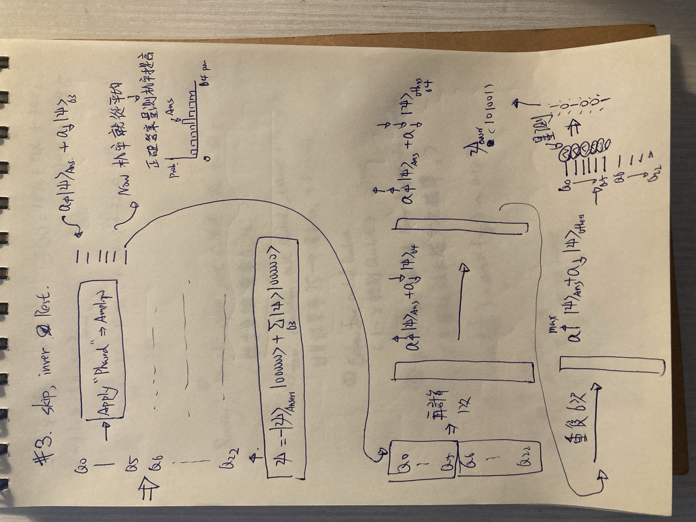
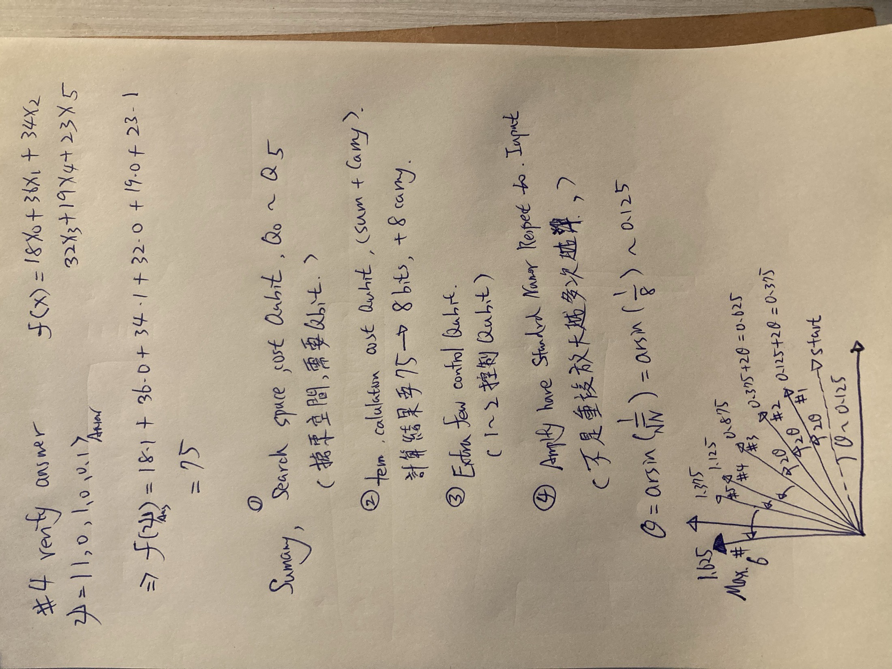
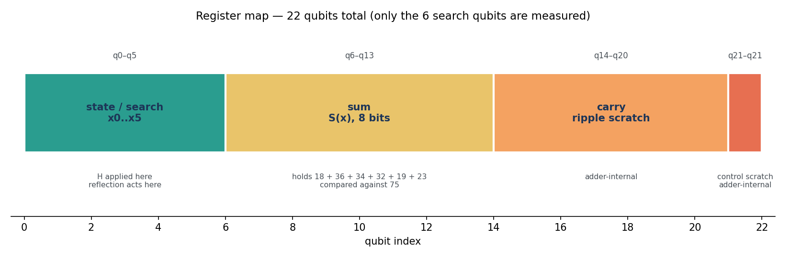
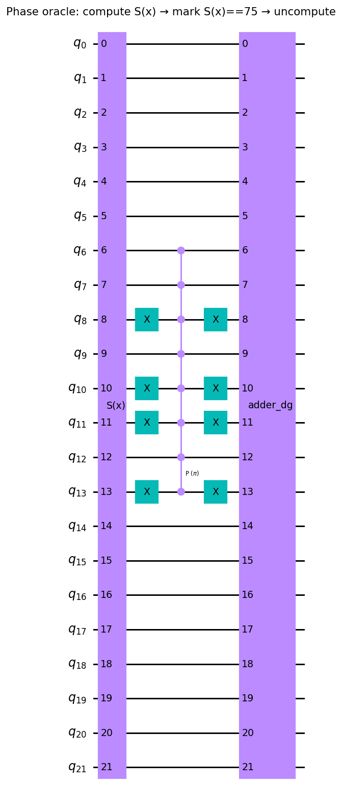
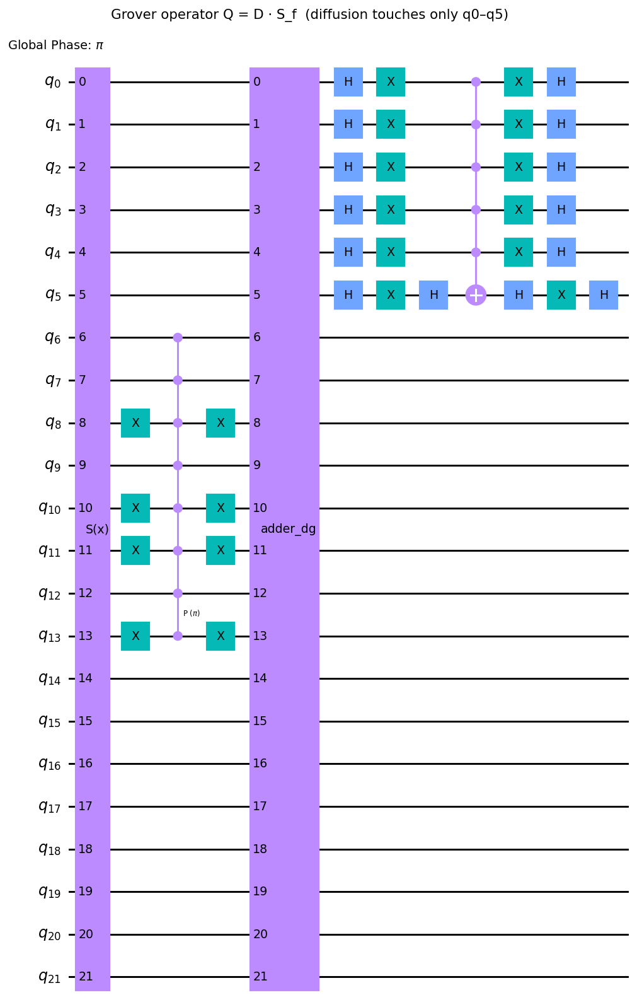
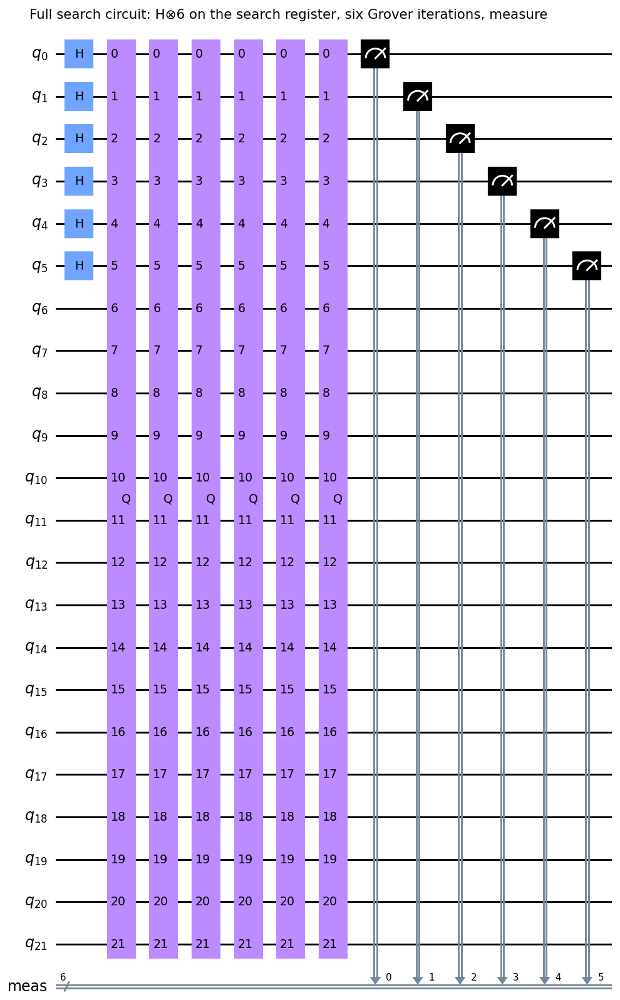
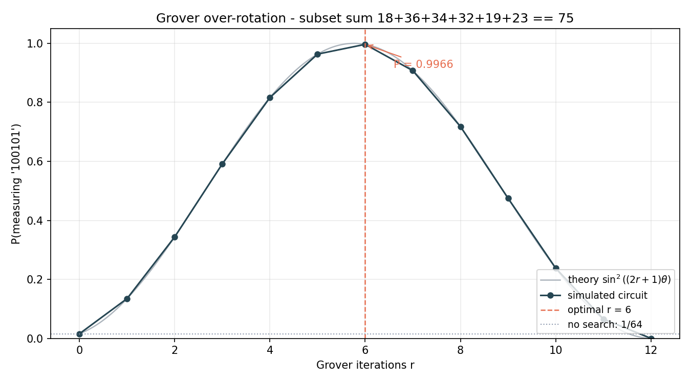
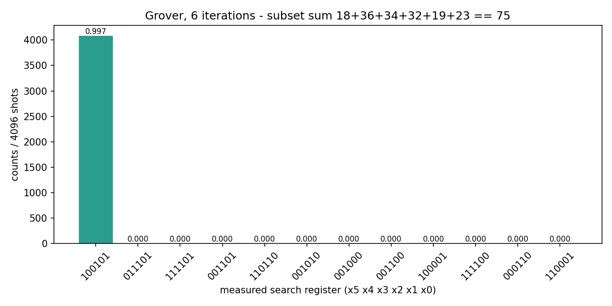

# Grover Search for a Subset-Sum Problem

## Working Notes

1 / 4 — the problem, and why classical costs N while quantum costs about √N

2 / 4 — superposition over all 64 candidates, and the joint search ⊗ workspace state

3 / 4 — phase marking, inversion about the mean, and why the loop runs six times

4 / 4 — verifying the answer, the qubit budget, and the rotation angle

These are the working notes this article is built from. They set out the whole
argument before any code: state the rule and the classical cost of checking all
64 candidates one at a time, put six qubits into superposition so the candidates
are considered together, carry a separate workspace register for the arithmetic,
mark the satisfying state with a phase, amplify, and repeat a number of times
fixed by $\theta=\arcsin(1/\sqrt{N})$ rather than by taste. The sections below
formalize each of those steps and check them against simulation.

## Research Question

Given a set of weights and a target value, which subset of the weights sums
exactly to the target? Concretely, for six binary variables
$x_0,\dots,x_5\in\{0,1\}$ with weights $w=(18,36,34,32,19,23)$ and target
$T=75$, find $x$ satisfying

$$
S(x)=\sum_{i=0}^{5}w_i x_i = T .
$$

The search space contains $N=2^6=64$ candidates. The question is not merely
how to find the answer, but how a *verification rule* becomes something a
quantum computer can search over. That transformation, rather than the
amplification itself, is where applications of Grover's algorithm succeed or
fail.

## Classical Reference

An unstructured classical search evaluates the rule on each candidate in turn:

$$
\text{cost} = O(N).
$$

Exhaustive enumeration of all 64 combinations finds exactly one satisfying
assignment,

$$
\boxed{x^{\star}=(1,0,1,0,0,1)},
\qquad
18+34+23=75 .
$$

Written as an integer with $x_i$ weighting $2^i$, this is $x^\star = 37$. That
value serves only as an independent reference for the quantum result. It is
never supplied to the quantum construction, which is given the weights and the
target and nothing else.

## Encoding the Candidates

Six qubits hold the candidate. Applying a Hadamard to each produces a uniform
superposition over the whole search space,

$$
H^{\otimes 6}\,|0\rangle^{\otimes 6}
=\frac{1}{\sqrt{N}}\sum_{x=0}^{N-1}|x\rangle
=\frac{1}{8}\sum_{x=0}^{63}|x\rangle .
$$

Every candidate now carries equal probability $1/64\approx1.56\%$. The
remaining registers are arithmetic workspace and must stay in $|0\rangle$;
placing them in superposition would destroy the correspondence between a
candidate and its evaluated sum.

Register allocation for the reversible evaluation of the rule

| Register | Qubits | Role |
|---|---|---|
| search | 6 | the candidate $x_0,\dots,x_5$; the only measured register |
| sum | 8 | the value $S(x)$ in binary, little-endian |
| carry | 7 | ripple carries generated while adding each weight |
| control | 1 | ancilla for the multi-controlled gates in the carry logic |

The sum register width follows from the largest attainable value,
$\sum_i w_i = 162$, so that $2^7<162<2^8$ and eight bits are required. The
carry register always holds one fewer qubit than the sum register.

## Reversible Evaluation of the Rule

Quantum gates are unitary, so $S(x)$ cannot simply be computed and discarded;
the evaluation must be reversible and must act on all candidates
simultaneously. A weighted adder $A$ performs

$$
A\,|x\rangle|0\rangle_{s}|0\rangle_{a}
=|x\rangle\,|S(x)\rangle_{s}\,|0\rangle_{a},
$$

where $s$ denotes the sum register and $a$ the carry and control ancillas. The
weights are not stored in any register. They are encoded in the circuit
structure: the adder walks the binary expansion of each $w_i$ and emits
additions controlled on $x_i$.

Two properties of this stage matter for what follows. The ancillas $a$ are
borrowed and returned within the addition, so they leave the adder in
$|0\rangle$. The sum register does not: after $A$, the state is entangled,

$$
A\left(\frac{1}{8}\sum_{x}|x\rangle\right)|0\rangle_s
=\frac{1}{8}\sum_{x}|x\rangle|S(x)\rangle_s ,
$$

and measuring $s$ at this point would collapse the candidate superposition.

## The Phase Oracle

Grover's algorithm requires the rule as a *phase*,

$$
\boxed{
|x\rangle \longmapsto (-1)^{f(x)}|x\rangle,
\qquad
f(x)=
\begin{cases}
1, & S(x)=T\\
0, & S(x)\neq T
\end{cases}}
$$

with the workspace returned to $|0\rangle$. This is achieved by conjugation:
compute the sum, mark the target value, then undo the computation,

$$
\boxed{S_f = A^{\dagger}\, M_T\, A }.
$$

Phase oracle structure: compute, mark, uncompute

### Marking a value with a multi-controlled gate

A multi-controlled phase gate fires only when *every* control qubit is
$|1\rangle$. Equality against an arbitrary constant is therefore converted into
that all-ones pattern. Writing the target in the sum-register bit order,

$$
T = 75 = 64+8+2+1 = 01001011_2 ,
$$

an $X$ gate is applied to each sum qubit whose target bit is $0$, the
multi-controlled phase $P(\pi)$ is applied, and the $X$ gates are undone:

$$
M_T = X^{\bar T}\,\bigl(C^{n-1}Z\bigr)\,X^{\bar T},
\qquad
X^{\bar T}=\bigotimes_{j\,:\,T_j=0} X_j .
$$

For $T=75$ the four zero-valued bits are those of place value $4,16,32$ and
$128$, so exactly four $X$ gates appear on each side of the phase gate in the
figure above.

### Why the uncompute step is mandatory

After $M_T$ the sum register is still entangled with the search register.
Applying $A^{\dagger}$ disentangles it, leaving

$$
S_f\left(\frac{1}{8}\sum_{x}|x\rangle\right)|0\rangle_s
=\left(\frac{1}{8}\sum_{x}(-1)^{f(x)}|x\rangle\right)|0\rangle_s .
$$

Only then is the search register in a pure state that the diffusion operator
can reflect. Omitting the uncompute leaves the workspace correlated with the
candidates, and the interference that drives the algorithm does not occur.
Direct simulation of the full oracle confirms the requirement quantitatively:
the probability leaking outside the all-ancillas-zero subspace is
$5.7\times10^{-14}$, and the phase $-1$ appears on exactly one basis state.

## Amplitude Amplification

One Grover iteration combines the oracle with a reflection about the mean,

$$
\boxed{Q = D\,S_f},
\qquad
D = 2|\psi\rangle\langle\psi| - I,
\qquad
|\psi\rangle = H^{\otimes 6}|0\rangle^{\otimes 6}.
$$

The operator $S_f$ acts on all twenty-two qubits, because the arithmetic needs
them. The diffusion $D$ must not. It is defined only on the six search qubits,

$$
D = P\bigl(2|0\rangle\langle0| - I\bigr)P^{\dagger}\otimes I_{a},
\qquad
P = H^{\otimes 6}\otimes I_{a},
$$

so the workspace passes through untouched.

One Grover iteration: a phase oracle over all qubits, a reflection over the search register only

The circuit shows the restriction directly: the oracle spans all twenty-two
wires, while the diffusion block spans only the top six and the workspace wires
run flat through it. Reflecting over all twenty-two qubits would reflect about a
$2^{22}$-dimensional uniform state rather than the $64$-candidate one, and the
algorithm would fail.

Complete search circuit: state preparation, six iterations, measurement

## Choosing the Number of Iterations

Grover's operator is a rotation in the two-dimensional plane spanned by the
marked and unmarked subspaces. With $M$ marked states among $N$ candidates,
define

$$
\theta = \arcsin\sqrt{\frac{M}{N}} .
$$

After $r$ iterations the probability of measuring a marked state is

$$
\boxed{P(r)=\sin^{2}\bigl((2r+1)\theta\bigr)} ,
$$

which is maximized near $(2r+1)\theta=\pi/2$, giving

$$
\boxed{r_{\mathrm{opt}}=\left\lfloor\frac{\pi}{4\theta}\right\rfloor } .
$$

For $N=64$ and $M=1$,

$$
\theta=\arcsin\tfrac{1}{8}=0.125328,
\qquad
\frac{\pi}{4\theta}=6.2667,
\qquad
r_{\mathrm{opt}}=6,
$$

with predicted success $P(6)=\sin^2(13\theta)=99.66\%$.

Because $P(r)$ is periodic, additional iterations are actively harmful: past
the peak the state rotates back out of the marked subspace.

Measured success probability against iteration count, compared with theory

Simulated values follow $\sin^2((2r+1)\theta)$ to within $3.7\times10^{-13}$.
At $r=12$ the success probability has fallen to $7\times10^{-5}$, well below
the $1/64$ obtained without any search at all. Applying Grover's algorithm
therefore requires knowing $M$, or estimating it; when $M$ is unknown, an
exponentially increasing schedule of iteration counts recovers the expected
$O(\sqrt{N})$ behaviour.

## Simulation Results

Measuring the six search qubits after six iterations yields:

Measurement distribution after six Grover iterations

| Quantity | Predicted | Observed |
|---|---|---|
| $P$ after 1 iteration | $0.134827$ | $0.134827$ |
| $P$ after 6 iterations | $0.996586$ | $0.9968$ (4083 of 4096 shots) |
| Optimal iteration count | $6$ | $6$ (empirical peak) |
| Workspace leakage after the oracle | $0$ | $5.7\times10^{-14}$ |

The dominant outcome decodes to $x=(1,0,1,0,0,1)$, matching the classical
reference. Bit ordering deserves care: the measured string is printed
most-significant-bit first, so the displayed `100101` reads
$x_5x_4x_3x_2x_1x_0$ and must be reversed before being interpreted as
$(x_0,\dots,x_5)$.

## Query Complexity and Circuit Cost

The comparison usually quoted is one of *queries*:

$$
\text{classical } O(N)=64
\qquad\text{versus}\qquad
\text{Grover } O(\sqrt{N})=6 .
$$

This is a correct statement about oracle calls and a misleading statement about
practical cost. Each of those six calls contains two applications of the
reversible adder plus a multi-controlled phase gate. Compiled to a
superconducting gate set $\{CX, R_z, \sqrt{X}, X\}$ under the optimistic
assumption of all-to-all connectivity, the complete circuit contains
approximately $4.3\times10^{4}$ gates, of which $1.55\times10^{4}$ are
two-qubit gates.

Treating two-qubit gate errors as independent with per-gate error $\varepsilon$,
the probability of an error-free execution is $(1-\varepsilon)^{n_{CX}}$. A
50% chance of a clean run therefore requires

$$
\varepsilon < 1-2^{-1/n_{CX}} \approx 4.5\times10^{-5},
$$

which is well beyond the roughly $10^{-3}$ error rates of current
superconducting hardware. The qubit count is unremarkable; the depth is not.
Results reported here come from exact state-vector simulation, not from a
quantum processor.

## Reproducing These Results

The complete implementation is in [`lab/`](lab/README.md): a classical reference,
the full Qiskit construction with its five validation checks, the iteration sweep,
and the script that renders the figures on this page. Captured console output for
every run is in [`lab/RESULTS.md`](lab/RESULTS.md).

## Reference Reading

- L. K. Grover, "A fast quantum mechanical algorithm for database search,"
  *Proceedings of the 28th Annual ACM Symposium on Theory of Computing* (1996),
  212–219. The original algorithm and the $O(\sqrt{N})$ query bound.
  [arXiv:quant-ph/9605043](https://arxiv.org/abs/quant-ph/9605043)
- M. Boyer, G. Brassard, P. Høyer, and A. Tapp, "Tight bounds on quantum
  searching," *Fortschritte der Physik* 46 (1998), 493–505. Establishes the
  optimal iteration count and the procedure to follow when the number of
  solutions is unknown.
  [arXiv:quant-ph/9605034](https://arxiv.org/abs/quant-ph/9605034)
- M. A. Nielsen and I. L. Chuang, *Quantum Computation and Quantum
  Information*, Cambridge University Press. Chapter 6 develops the rotation
  picture of the search operator used above.
- IBM Quantum, "Grover's algorithm" tutorial. Reference implementation using
  the current primitive interface.
  [Tutorial](https://quantum.cloud.ibm.com/docs/en/tutorials/grovers-algorithm)
- IBM Quantum, `WeightedAdder` and `grover_operator` API documentation. Defines
  the register layout and the reflection-qubit argument relied on here.
  [WeightedAdder](https://quantum.cloud.ibm.com/docs/en/api/qiskit/qiskit.circuit.library.WeightedAdder),
  [grover_operator](https://quantum.cloud.ibm.com/docs/en/api/qiskit/qiskit.circuit.library.grover_operator)

## Concepts

Three ideas carry over to any application of amplitude amplification.

- A quantum search needs the problem's *verification rule*, expressed as a
  reversible circuit, not its answer. The oracle here knows only the weights
  and the target, and the conjugation $S_f=A^{\dagger}M_TA$ is the general
  pattern for turning any computable predicate into a phase.
- Workspace must be returned to $|0\rangle$ before amplification, and the
  reflection must act only on the register that encodes candidates. Both
  conditions are about preserving the coherence that interference requires.
- The quadratic advantage is a statement about oracle *queries*. Whether it
  translates into a real speedup depends entirely on how expensive one query
  is. For arithmetic constraints such as subset-sum, reversible addition and
  multi-controlled gates dominate the cost, so demonstrating an efficient
  reversible oracle is a precondition for claiming that Grover's algorithm
  helps a given problem.
