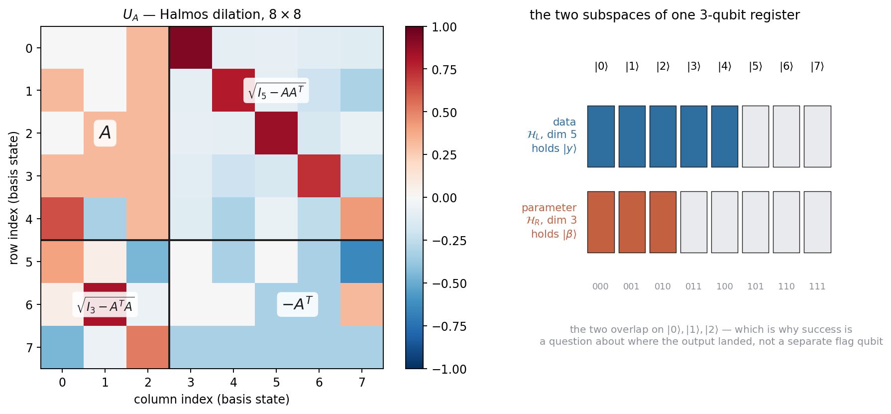
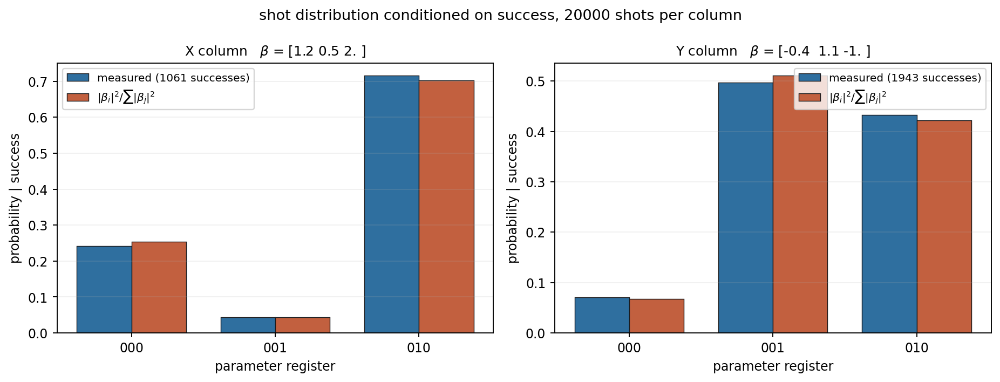
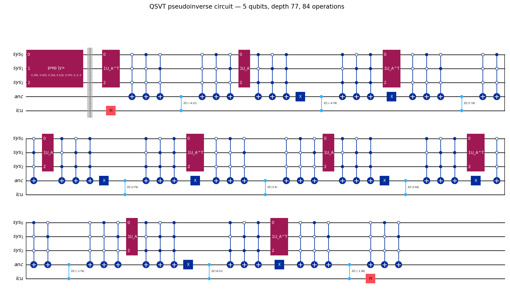
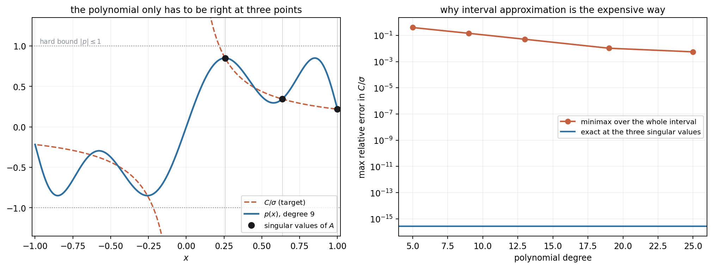
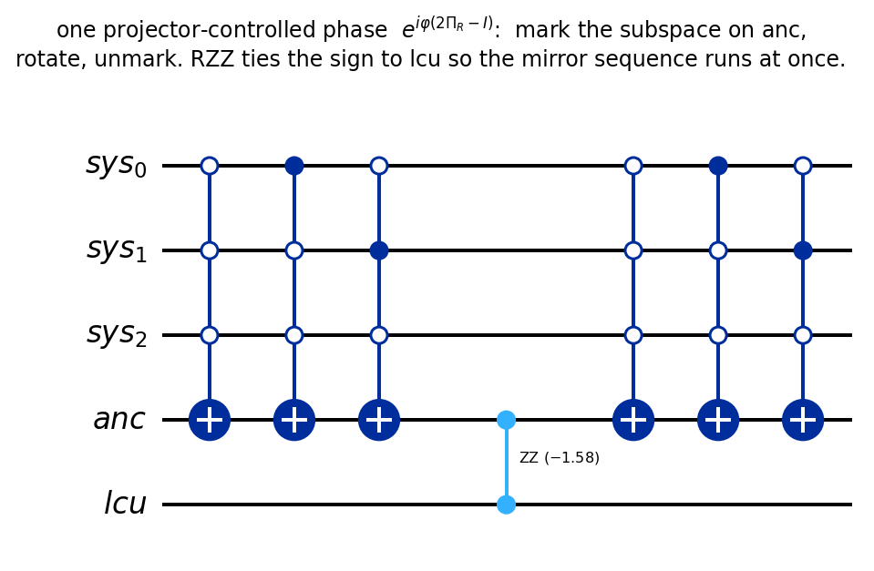
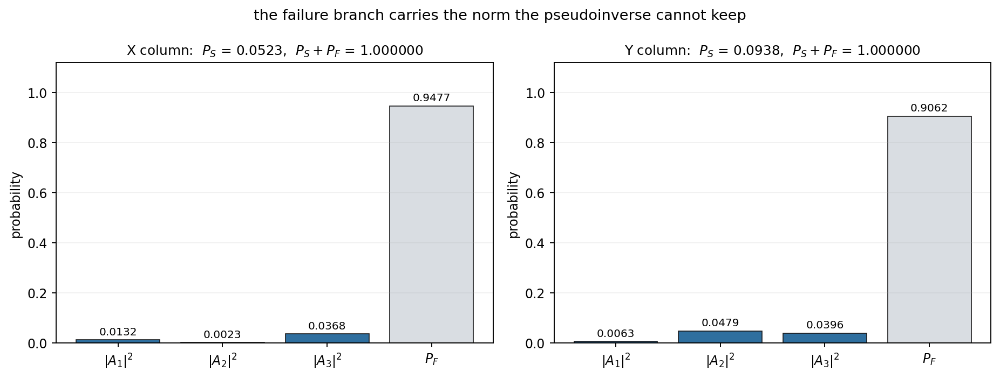

# Reproducible Lab — QSVT Pseudoinverse for a 2D Affine Mapping

Runnable companion to [`../content.md`](../content.md), which develops the ideas. This
file is the engineer's view: how to run it, what each check proves, and what went wrong
while building it.

Recover an unknown affine transform from five point correspondences — once classically by
least squares, and once on a quantum circuit that never forms the normal equations.

As stated in the article, this is a teaching exercise rather than an application
proposal: the block encoding is built by classical SVD of the same matrix being inverted,
so the classical solve is already finished before the circuit exists. Nothing here is
faster than `lstsq`, and no speedup is claimed.

The quantum route builds a rectangular matrix into a unitary by hand, applies a polynomial
to its singular values, and reads the answer out of a postselected branch. The point of
the lab is that none of those steps is hidden behind a library call: the block encoding,
the singular-value polynomial, the phase angles, the success/failure split and the
postselection are all constructed and checked explicitly.

**Result:** the circuit returns $B$ exactly — direction, relative signs, and absolute
scale — matching the classical fit to $3\times10^{-14}$ in statevector simulation, with
every one of 22 validation checks passing.



---

## The problem

Five source points in homogeneous form, an unknown $3\times2$ affine map, five target
points:

```math
Z = \begin{bmatrix} 0&0&1 \\ 1&0&1 \\ 0&1&1 \\ 1&1&1 \\ 2&-1&1 \end{bmatrix}
\qquad
Y = ZB, \qquad B_{\mathrm{true}} = \begin{bmatrix} 1.2&-0.4 \\ 0.5&1.1 \\ 2.0&-1.0 \end{bmatrix}
```

$B_{\mathrm{true}}$ generates $Y$ and is then treated as unknown. Because $Y$ is generated
without noise and $Z$ has full column rank, the least-squares answer is exactly
$B_{\mathrm{true}}$ — which makes it a clean target to check a quantum circuit against.

Split by column and the task is two independent linear solves,
$\beta_x = Z^{+}y_x$ and $\beta_y = Z^{+}y_y$, sharing one block encoding.

## Files

| File | What it does |
|---|---|
| `PRD.md` | The spec, plus an audit of the seven places the implementation departs from it |
| `classical_affine.py` | The dataset and the least-squares baseline |
| `block_encoding.py` | `RectangularBlockEncoding` — the Halmos dilation and its two projectors |
| `qsvt_polynomial.py` | `SingularValuePolynomial` (LP fit) and `QSPPhases` (phase-angle solver) |
| `quantum_solver.py` | `QuantumPseudoInverse` — the circuit, the statevector path, the shot path |
| `sign_recovery.py` | Shot-based recovery of the relative signs of $\beta$ |
| `validation.py` | All 22 checks |
| `run_experiment.py` | The full diagnostic report and the final reconstruction |
| `make_figures.py` | Renders every figure into `../media/` |
| `RESULTS.md` | Captured output of a complete run |

## How to run

```bash
# the full lab: both columns, sign recovery, reconstruction  (~3s)
python3 run_experiment.py

# the above plus every validation layer
python3 run_experiment.py --all

# validations only
python3 validation.py

# individual stages, each runnable on its own
python3 classical_affine.py
python3 block_encoding.py
python3 qsvt_polynomial.py     # includes the degree-vs-error sweep
python3 quantum_solver.py

# knobs worth turning
python3 run_experiment.py --scale 0.5     # C as a fraction of sigma_min
python3 run_experiment.py --degree 13     # polynomial degree
python3 run_experiment.py --shots 50000

# re-render the figures in this README
python3 make_figures.py
```

Requires `qiskit 2.2.3`, `qiskit-aer 0.17.2`, `scipy`, `numpy`, `matplotlib` and
`pylatexenc`. `make_figures.py` forces the headless `Agg` backend, so no display is needed.

## Results

| Quantity | X column | Y column |
|---|---|---|
| $\|y\|$ | 7.0278 | 3.3867 |
| Success probability $P_S$ | 0.05231 | 0.09382 |
| State fidelity vs classical $\beta$ | 1.000000000000 | 1.000000000000 |
| $\|\beta\|$ recovered from $P_S$ | 2.3853700 (true 2.3853700) | 1.5394804 (true 1.5394804) |
| Recovered $\beta$ | $(1.2,\ 0.5,\ 2.0)$ | $(-0.4,\ 1.1,\ -1.0)$ |

```math
B_{\mathrm{quantum}} = \begin{bmatrix} 1.2&-0.4 \\ 0.5&1.1 \\ 2.0&-1.0 \end{bmatrix},
\qquad \|B_{\mathrm{quantum}} - B_{\mathrm{true}}\|_F = 2.9\times10^{-14}
```

Circuit: 5 qubits, depth 77, 84 operations. Full run 2.8 s.



The whole circuit, folded across three rows — nine alternating $U_A^T$ / $U_A$ blocks
separated by nine projector-controlled phases, with `lcu` touched only by the `RZZ`
couplings and the two Hadamards:



---

## The mental model

### 1. A rectangular matrix becomes a unitary

Quantum evolution is unitary; $Z$ is $5\times3$ and not even square. The fix is a
**dilation**: embed $A = Z/\alpha$ in the corner of a larger unitary, padding with
whatever makes the columns orthonormal. For $\|A\|_2 \le 1$ the Halmos construction

```math
U_A = \begin{bmatrix} A & \sqrt{I_5 - AA^T} \\ \sqrt{I_3 - A^TA} & -A^T \end{bmatrix}
```

does it, and unitarity follows from the intertwining identity
$A^T f(AA^T) = f(A^TA)A^T$: the two column blocks have Gram matrices $I_3$ and $I_5$, and
the cross term cancels. Here $5 + 3 = 8 = 2^3$, so the whole thing is one 3-qubit register.

Normalizing by $\alpha = \|Z\|_2 = 3.0875$ is not cosmetic. The dilation needs
$I - AA^T \succeq 0$, which is exactly the statement that no singular value exceeds 1.

### 2. Two subspaces, not one

This is a rectangular problem, so the 5-dimensional and 3-dimensional spaces are genuinely
different objects living in the same register:

```
basis state  |0> |1> |2> |3> |4> | |5> |6> |7>
data   H_L    *   *   *   *   *              dimension 5, holds |y>
param  H_R    *   *   *                      dimension 3, holds |beta>
```

They **overlap** on $|0\rangle,|1\rangle,|2\rangle$. That is why "success" is a question
about *where in the register* the output landed, rather than a separate flag qubit.

### 3. The pseudoinverse is a function of the singular values

If $A = W\Sigma V^T$ then $A^{+} = V\Sigma^{-1}W^T$ — the same singular vectors, with
each singular value replaced by its reciprocal. QSVT is exactly the machinery for applying
a polynomial to the singular values of a block-encoded matrix, without ever building $W$
or $V$. So the pseudoinverse is a polynomial problem:

$$\text{find } p \text{ with } p(\sigma) \approx C/\sigma .$$

$1/\sigma$ itself is impossible: it exceeds 1 and blows up at 0, while any amplitude
transformation is bounded by 1. Hence the constant $C$, which buys headroom at the cost of
shrinking the output — and therefore the success probability, which scales as $C^2$.

**The direction matters, and it is easy to get backwards.** QSVT driven by $U_A$ with the
pair $(\Pi_L, \Pi_R)$ gives $W p(\Sigma) V^T$ — the same direction as $A$. The
pseudoinverse needs the adjoint direction $V p(\Sigma) W^T$. So the sequence is driven by
$U_A^T$ with the projectors swapped, using $\Pi_R U_A^T \Pi_L = A^T$.

### 4. Only three points matter

The textbook framing asks for a minimax approximation of $C/x$ across the whole interval
$[\sigma_{\min}, 1]$. That is expensive: at $\kappa = 3.89$, degree 19 still leaves about
1% relative error.

But $Z$ has exactly three singular values. Nothing $p$ does anywhere else can touch
$\beta$. So the default fit pins $p(\sigma_i) = C/\sigma_i$ as hard equality constraints
and spends the remaining freedom keeping $\sup|p|$ small. Degree 9 gives an *exact*
singular-value transform with $\sup|p| = 0.85$.



This is a deliberate simplification, and worth being honest about: it works because the
spectrum is known and tiny. A real instance would need the interval approximation, and
would pay the degree. `mode="interval"` implements that version for comparison.

### 5. The phase angles have to be solved for

QSVT applies $p$ by interleaving $U_A$ with projector-controlled phase rotations
$e^{i\varphi_k(2\Pi - I)}$. Finding the angles $\varphi_k$ that produce a given $p$ is its
own problem, with no library available here.

The route used is the standard one: by the singular-value decomposition theorem, phases
that work on the scalar $1\times1$ case work unchanged on the full block encoding. So the
fit is done on $2\times2$ matrices — evaluate $\langle 0|V(\Phi)|0\rangle$ across
Chebyshev nodes, least-squares the angles against $p$ — and then reused verbatim in 8
dimensions. From a zero initial guess it converges to $6.7\times10^{-16}$.

This is the one step that can genuinely fail, so it is a **gate**: the scalar fit is
verified in pure numpy before any circuit is built.

### 6. The output is complex, and that would ruin it

A QSP sequence gives a *complex* polynomial in the block; only its real part is the $p$ we
designed. Here the imaginary parts at the three singular values are $(-0.976, +0.871,
-0.103)$ — large, and different for each. A complex $p(\sigma_i)$ rotates each singular
component by a different phase, which scrambles $\beta$ into nonsense.

Since $U_A$ is real, $V(-\Phi) = \overline{V(\Phi)}$, so a Hadamard sandwich on one extra
qubit with postselection on $|0\rangle$ picks out
$\tfrac{1}{2}(V(\Phi) + \overline{V(\Phi)}) = \mathrm{Re}V(\Phi)$.

The cheap part: only the *phase angles* need to know about that qubit. A single
`RZZ(anc, lcu)` flips their sign, so $U_A$ is never controlled.



### 7. The failure branch is the physics, not an error

$M = V p(\Sigma) W^T$ stretches small singular values and shrinks large ones, so it is not
unitary and cannot be all of a quantum evolution. The full output is

$$|\Psi_{\mathrm{out}}\rangle = |S\rangle M|y\rangle + |F\rangle|\phi_F\rangle,$$

and the failure branch exists precisely to carry the norm that $M|y\rangle$ cannot. For
the X column, $P_S = 0.0523$ — about one shot in twenty is kept.



Raising $C$ raises $P_S$ as $C^2$ and pushes $\sup|p|$ toward the hard bound of 1. At
$C = 0.85\sigma_{\min}$, $\sup|p| = 0.85$: a deliberate margin.

### 8. The scale is not lost

A quantum state has no absolute magnitude, so the postselected register gives only the
*direction* of $\beta$. It is tempting to stop there and say the scale needs extra
information. It does not — the success probability is the missing number:

$$P_S = \left(\frac{C\,\alpha\,\|\beta\|}{\|y\|}\right)^2
\qquad\Longrightarrow\qquad
\|\beta\| = \frac{\sqrt{P_S}\,\|y\|}{C\,\alpha}$$

and $C$, $\alpha$ and $\|y\|$ are all known. This reproduces $\|\beta_x\| = 2.3853700$ and
$\|\beta_y\| = 1.5394804$ exactly, which is what turns a recovered *direction* into the
actual affine parameters.

### 9. Signs need interference

Measuring the parameter register gives $|\beta_i|^2$. For $\beta_x = (1.2, 0.5, 2.0)$ that
is harmless. For $\beta_y = (-0.4, 1.1, -1.0)$ it collapses to $0.16 : 1.21 : 1$, equally
consistent with all-positive — so a histogram alone would report the wrong transform.

Insert, before measuring, the unitary that Hadamard-mixes one pair of basis states:

$$G_{ij}: |i\rangle \mapsto \tfrac{1}{\sqrt2}(|i\rangle + |j\rangle), \qquad
|j\rangle \mapsto \tfrac{1}{\sqrt2}(|i\rangle - |j\rangle)$$

Then $P(i) - P(j) = 2\beta_i\beta_j$, whose sign is the sign of the product. Two pairs,
$(0,1)$ and $(0,2)$, fix every relative sign. Measured at $z = 34$ and $z = 33$ for the Y
column. Because $i$ and $j$ both lie in the parameter subspace, this only redistributes
amplitude inside the success branch — $P_S$ is untouched.

The global sign genuinely is not observable: $|\beta\rangle$ and $-|\beta\rangle$ are the
same physical state.

---

## Validation checks (all 22 pass)

```
PASS  A  classical affine fit                 8.546e-16            < 1e-12
PASS  B  block unitary U^T U = I              3.003e-15            < 1e-12
PASS  B  adjoint block = A^T                  0.000e+00            < 1e-12
PASS  C  p(sigma_i) = C/sigma_i               2.776e-16            < 1e-10
PASS  C  sup|p| <= 1 on [-1,1]                0.849999             <= 1
PASS     QSP phase fit (2x2, pre-circuit)     6.661e-16            < 1e-10
PASS  index convention (Qiskit LE == numpy)   1.332e-15            < 1e-12
PASS     QSVT block = C*alpha*pinv(Z)         4.180e-15            < 1e-10
PASS     circuit == numpy (X)                 2.483e-15            < 1e-10
PASS     phase ancilla uncomputes (X)         6.441e-31            < 1e-12
PASS  D  fidelity vs classical beta (X)       1.000000000000       > 0.999
PASS     |A1|^2+|A2|^2+|A3|^2 + P_F = 1 (X)   0.000e+00            < 1e-12
PASS     ||beta|| scale recovery (X)          1.776e-14            < 1e-6
PASS     shot histogram chi2 (X, n=1061)      chi2=0.82 p=0.663    p > 0.001
PASS     sign recovery from shots (X)         [1 1 1] vs [1 1 1]   exact
...and the same six for the Y column
```

The PRD asks for four validations (A–D). Six more are here because four does not catch the
ways this lab can be quietly wrong:

- **the QSP gate**, run in $2\times2$ arithmetic before any circuit exists — the only step
  that can fail to converge, so it fails loudly and early;
- **circuit vs numpy**, amplitude by amplitude — catches gate-ordering and qubit-ordering
  mistakes that leave the mathematics correct and the circuit wrong;
- **the index convention**, asserted at runtime rather than trusted to a comment;
- **the phase ancilla uncomputing** — if it stayed entangled the postselection would be
  measuring something else;
- **the full normalization identity** of PRD §11;
- **the scale recovery** of PRD §19.

## Bit ordering (the thing that trips everyone)

Qiskit is little-endian. Appending a gate to `[sys[0], sys[1], sys[2]]` makes `sys[0]` the
least significant bit, so the Qiskit statevector index equals the numpy matrix index —
basis state $|j\rangle$ means the same thing in both. Every 8×8 matrix in this lab is
indexed that way, and `validation.py::check_index_convention` asserts it against both
basis states and a random non-symmetric unitary rather than leaving it to a comment.

For the full 5-qubit register the global index is

```
index = sys + 8*anc + 16*lcu
```

so the success branch — `sys` in {0,1,2}, `anc` = 0, `lcu` = 0 — is statevector indices
**0, 1, 2**. Convenient, and worth stating explicitly because it makes the postselection
in `solve_statevector` look suspiciously simple.

## Gotchas found while building this

1. **`sqrtm` on an exactly singular matrix.** Because $\alpha = \|Z\|_2$ exactly, $A$ has
   a singular value of exactly 1, so $I_5 - AA^T$ is exactly singular. Rounding puts that
   eigenvalue at $\pm10^{-17}$, and $\sqrt{10^{-17}} = 3\times10^{-9}$ — nine orders of
   magnitude larger than the dust it came from. It showed up as a $10^{-10}$ unitarity
   error in $U_A$. Fix: snap eigenvalues below a relative floor to exactly zero before
   taking the square root. Error dropped to $3\times10^{-15}$.

2. **Matrix order versus circuit order.** The factor list is built leftmost-factor-first,
   the way the product is written on paper. A circuit applies the *rightmost* factor to
   the state first, so it is consumed in reverse. Both the numpy reference and the circuit
   read the same `sequence_factors` list — deliberately, so they cannot drift apart — and
   the circuit-vs-numpy check exists to catch exactly this.

3. **The imaginary part is not small.** It is tempting to assume the QSP polynomial comes
   out real enough to ignore. It does not; see §6 above.

4. **Success is not "the ancilla measured 0".** The phase ancilla is uncomputed and always
   ends in $|0\rangle$; it carries no information. Success is `lcu = 0` *and* the system
   register landing in the parameter subspace.

## What this lab does and does not claim

**Does:** demonstrate the full chain — rectangular block encoding, singular-value
polynomial, QSP phase angles, success/failure normalization, postselection, and recovery
of the affine parameters including scale and relative signs — with every step verified
numerically and no high-level QSVT solver anywhere.

**Does not:** demonstrate a speedup. This is a $5\times3$ problem; the classical solve is
instant, the block encoding is built by classical SVD, and the simulation is a $32\times32$
matrix product. Nothing here is faster than `lstsq`, and it is not meant to be.

Two honest caveats:

- **The block encoding is constructed, not queried.** PRD §5 forbids $Z^TZ$ in the quantum
  path. The *algorithm* honors that — it never solves $(Z^TZ)\beta = Z^Ty$ — but building
  the dilation does need $\sqrt{I_3 - A^TA}$, and $\alpha$ needs an SVD. That is
  construction-time preprocessing of the encoding. A real application would obtain $U_A$
  from a data-structure oracle, and the distinction matters for what any speedup claim
  would rest on.
- **The polynomial exploits knowing the spectrum.** Exact interpolation at three singular
  values is only available because there are three and they are known. See §4.

## Next steps

- Add noise and see how far $P_S$ and the fidelity degrade before the fit is unusable.
- Swap the exact-interpolation polynomial for the interval approximation and watch the
  required degree, and the circuit depth, grow with $\kappa$.
- Amplitude-amplify the success branch: $P_S \approx 0.05$ should need $O(1/\sqrt{P_S})$
  rounds rather than $O(1/P_S)$ repetitions.
- Try a genuinely overdetermined, noisy $Z$ where least squares is not exact, and check
  that the quantum path tracks the classical residual.

## References

- Gilyén, Su, Low, Wiebe, *Quantum singular value transformation and beyond* (STOC 2019) —
  the QSVT theorem and the alternating-phase construction.
- Low, Chuang, *Optimal Hamiltonian simulation by quantum signal processing* (PRL 2017).
- Halmos, *Normal dilations and extensions of operators* (1950) — the rectangular dilation.
- Dong, Meng, Whaley, Lin, *Efficient phase-factor evaluation in quantum signal processing*
  (PRA 2021) — the optimization approach used in `QSPPhases`.
- Childs, Kothari, Somma (2017) — polynomial approximations of $1/x$, the interval route.
