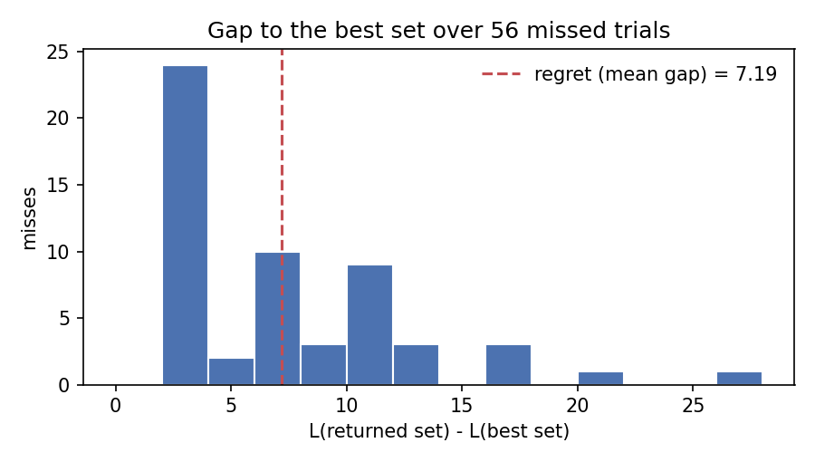

# Quantum Search and Regret

## Working Notes

<details open>
<summary>1 / 1 — checkpoints, the search space, the probability of finding the best set, and the regret of the misses</summary>

![Handwritten note: a row of checkpoints 1, 2, …, M, one of them zoomed into a column of candidate sets set 1 to set N with the best choice shaded, labelled quantum search space N, find best set; a four-step procedure on the right — set up 1000 trials, check the result, probability of finding the best, and if the search finds others, how far they differ from the best, called regrets; the probability written as the number of successes over the number of trials, for example 999 over 1000; the regret written as a sum over the missed sets of score of the set minus score of the best, divided by the count of missed sets, with the example 100 minus 97 plus 100 minus 96 plus 100 minus 77 over 3 equal to 10](media/quantum-search-and-regret-note-1-checkpoints-probability-regret.jpg)

</details>

The page sets the whole idea out before any formula. A search runs at a
sequence of checkpoints. At each checkpoint there is a space of $N$ candidate
sets and exactly one of them is the best. The search is repeated many times,
and two questions follow: how often does it return the best set, and when it
does not, how far off is what it returned? The sections below write the two
answers as formulas, keep the page's worked numbers, and check them with a
small simulation.

## Research Question

A quantum search over $N$ candidates is probabilistic. A single run can return
the best set or a different one, so a single run says little. Repeating the
run $T$ times gives an empirical picture, and that picture has two parts. The
first is the fraction of runs that return the best set. The second is the
quality of the runs that do not: a search that misses by a little is not the
same as a search that misses by a lot, even if both miss equally often.

The question of this note is how to turn those two parts into two numbers
that can be reported side by side.

## Setting

- A sequence of checkpoints $1, 2, \dots, M$. At each checkpoint the search is
  set up afresh, so everything below is stated for one checkpoint.
- At that checkpoint, a search space of $N$ candidate sets,
  $S_1, S_2, \dots, S_N$.
- A loss $L(S)$ attached to every set. The best set is the one with the
  smallest loss,

```math
S_{\mathrm{best}} = \arg\min_{S} L(S) .
```

- $T$ independent trials of the search. Trial $i$ returns one set, written
  $S_i$.

The page scores the candidates with a *score*, where the best set has the
highest value. This note uses a *loss* instead, where the best set has the
lowest value. The two are the same idea with the sign flipped, and loss is the
form in which the difference to the best set comes out non-negative without
any extra convention. Nothing else on the page changes.

## Probability of Finding the Best Set

The first number counts the trials that returned the best set and divides by
the number of trials:

```math
P_{\mathrm{quantum}} = \frac{\#\{\text{trials that found } S_{\mathrm{best}}\}}{\#\{\text{trials}\}} .
```

With $T = 1000$ trials and $999$ of them returning the best set,

```math
P_{\mathrm{quantum}} = \frac{999}{1000} = 0.999 .
```

This is an estimate of the success probability of a single run, and its
precision depends on $T$. A report of $P_{\mathrm{quantum}}$ should therefore
always carry the trial count next to it.

## Regret of the Misses

The second number looks only at the trials that did **not** return the best
set. For each of those, the gap between the loss of what was returned and the
loss of the best set is the regret of that trial. Averaging over the missed
trials gives

```math
\mathrm{Regret} = \frac{\displaystyle\sum_{S_i} \big( L(S_i) - L(S_{\mathrm{best}}) \big)}{\displaystyle\sum_{S_i} 1},
\qquad S_i \in \{\text{trials that did not find } S_{\mathrm{best}}\} .
```

The denominator is written as a sum of ones on purpose: it counts the missed
trials, and it makes explicit that the average runs over the same index set as
the numerator. Because $S_{\mathrm{best}}$ minimises $L$, every term in the
numerator satisfies $L(S_i) - L(S_{\mathrm{best}}) \geq 0$, so the regret is
never negative and equals zero only when every trial found the best set.

The page's example has three misses. In score form the best set scores $100$
and the misses score $97$, $96$ and $77$. In loss form the same three gaps are
$3$, $4$ and $23$ above the best loss:

```math
\mathrm{Regret} = \frac{(100-97) + (100-96) + (100-77)}{3} = \frac{3 + 4 + 23}{3} = 10 .
```

The number $10$ reads as: *when this search misses, it returns a set that is
on average ten loss units worse than the best one.*

## Two Numbers, One Story

$P_{\mathrm{quantum}}$ and $\mathrm{Regret}$ answer different questions and are
meant to be read together.

- A high $P_{\mathrm{quantum}}$ with a small regret is the comfortable case:
  the search almost always finds the best set, and when it does not, it lands
  close.
- A high $P_{\mathrm{quantum}}$ with a large regret is the case that a
  success rate alone hides: the search rarely misses, but a miss is expensive.
  In the example above, two of the three misses were near misses and one was
  far off, and that one miss moved the average from about $3.5$ to $10$.
- Regret is a *conditional* average. It says nothing about how often a miss
  happens; that is what $P_{\mathrm{quantum}}$ is for. Multiplying the two,
  $(1 - P_{\mathrm{quantum}}) \times \mathrm{Regret}$, gives the expected loss
  gap per trial, which is a third number and a different question again.

The distribution behind the regret matters as much as its mean. The figure
below comes from the toy search in `lab/`: $N = 64$ sets, $T = 1000$ trials,
$944$ of them returning the best set. The $56$ misses have a median gap of
about $6$ but a tail reaching past $26$, and the mean of $7.19$ sits to the
right of the median because of that tail.



## Reproducing These Results

The calculation is in [`lab/`](lab/README.md): a short script that reproduces
the two hand-worked examples exactly and then runs a seeded toy search to
produce the histogram. The printed output is in
[`lab/RESULTS.md`](lab/RESULTS.md).

## Concepts

Three ideas carry over to any repeated probabilistic search.

- A success rate is a count of hits over trials. It says how often the search
  finds the target and nothing about what it returns when it fails.
- Regret closes that gap: it is the average distance to the best answer,
  taken only over the failures. Defining it through a loss makes every term
  non-negative and gives the average a direct reading in loss units.
- Both numbers are estimates from a finite set of trials. The trial count is
  part of the result, and the distribution of the individual gaps, not only
  the mean, is what shows whether the misses are near or far.
