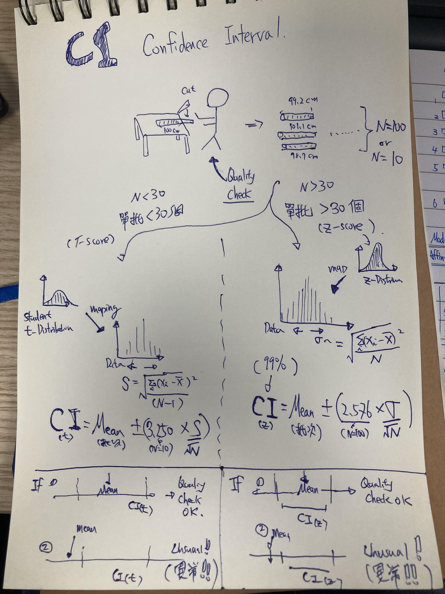

# Confidence Intervals for a Process Mean

## Confidence Interval

Confidence interval for process-mean quality assessment

The figure summarizes a statistical quality-control question: estimate the
process mean from sampled tube lengths, construct an appropriate confidence
interval using its standard error, and compare the interval with the intended
100 cm target. The sections below formalize the assumptions, calculations, and
limits of that interpretation.

## Research Question

A worker intends to cut iron tubes to a target length of 100 cm. The observed
lengths vary because of ordinary measurement and production variation. From a
sample of finished tubes, what range of process-mean values is compatible with
the data, and is 100 cm inside that range?

This example introduces confidence intervals for a population mean. It is a
check of the **average cutting process**, not a complete decision rule for the
quality of every individual tube.

## Context

Suppose a supervisor measures a random sample of tube lengths such as 99.2 cm,
101.1 cm, and 98.7 cm. Let

- \(n\) be the number of measured tubes;
- \(\bar{x}\) be their sample mean;
- \(s\) be their sample standard deviation; and
- \(\mu\) be the unknown long-run process mean.

The sample standard deviation is

\[
s = \sqrt{\frac{\sum_{i=1}^{n}(x_i-\bar{x})^2}{n-1}}.
\]

The uncertainty of the estimated mean depends on the standard error

\[
\operatorname{SE}(\bar{x}) = \frac{s}{\sqrt{n}},
\]

not on \(s\) alone.

## Choosing the Interval

### Population standard deviation unknown

When the population standard deviation is unknown and estimated using \(s\), a
two-sided \(100(1-\alpha)\%\) Student t confidence interval is

\[
\bar{x} \pm t_{1-\alpha/2,\,n-1}\frac{s}{\sqrt{n}}.
\]

For example, with \(n=10\) and 99% confidence, there are 9 degrees of freedom
and the critical value is approximately \(t_{0.995,9}=3.250\).

### Population standard deviation known

If a trustworthy population standard deviation \(\sigma\) is known from prior
process evidence, the corresponding z interval is

\[
\bar{x} \pm z_{1-\alpha/2}\frac{\sigma}{\sqrt{n}}.
\]

At 99% confidence, \(z_{0.995}\approx2.576\).

For a large sample, a z-style normal approximation using \(s\) is often close
to the t interval. However, **30 is not a universal switch** between t and z.
The choice depends on whether \(\sigma\) is known, whether the observations are
independent and representative, and whether the sampling distribution of the
mean is sufficiently well approximated.

## Interpreting the 100 cm Target

If 100 cm lies outside the confidence interval, the data indicate that the
process mean differs from the target at the corresponding two-sided
significance level. This is evidence of a possible systematic shift that should
be investigated.

If 100 cm lies inside the interval, the sample does not provide evidence of a
mean shift at that level. This does **not** prove that the process is correctly
centered or that its output satisfies engineering tolerances. A wide interval
may contain 100 cm simply because the sample is imprecise.

For an actual quality-control decision, the analysis should additionally
specify:

- acceptable lower and upper tube-length limits;
- measurement-system uncertainty;
- sampling design and independence;
- process stability over time; and
- an equivalence, capability, or control-chart criterion appropriate to the
  production question.

## Concepts

A confidence interval describes uncertainty about the process mean. It can flag
a mean that appears inconsistent with the intended target, but it is only one
part of a defensible manufacturing-quality assessment.
