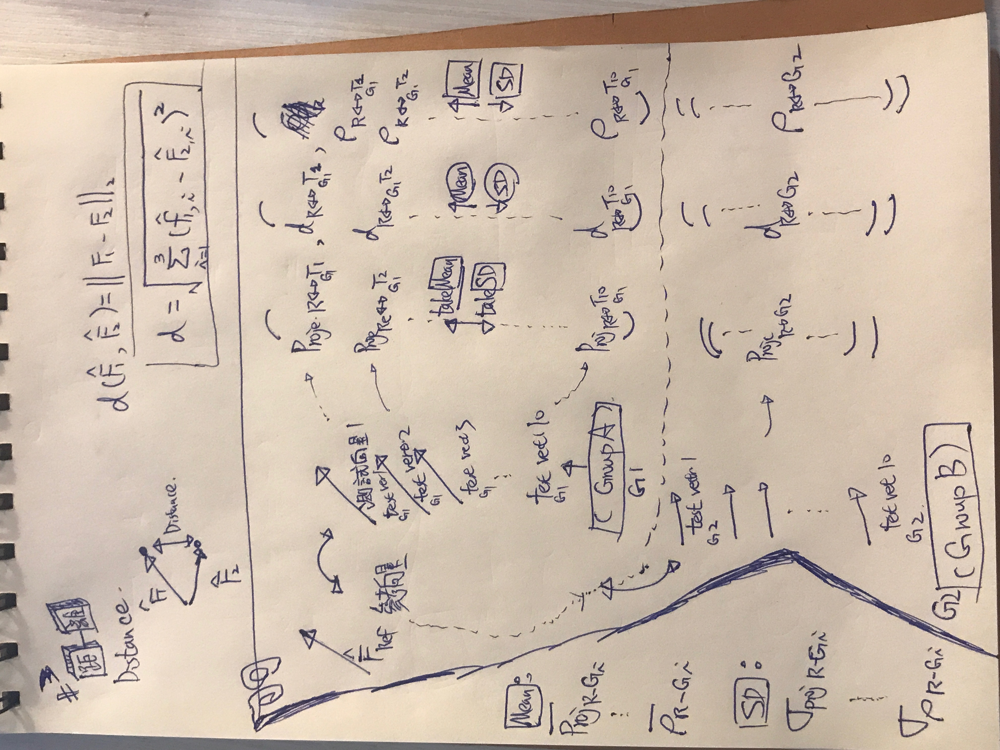

# Reference-to-Group Vector Features with Mean and Standard Deviation

## Research question

How can each group of high-dimensional vectors be represented by features that
describe its projection, correlation, and distance relative to one common
reference vector?

Projection, Pearson correlation, and Euclidean distance are already defined in
[Comparing Two Vectors: Projection, Correlation, and Distance](../comparing-two-vectors/content.md).
This topic starts from those pairwise definitions and develops the group-level
summary.

## Data structure

Let $r\in\mathbb{R}^p$ be a reference vector and let the two groups be

$$
G_1=\{f_{1,1},\ldots,f_{1,n_1}\},
\qquad
G_2=\{f_{2,1},\ldots,f_{2,n_2}\}.
$$

Equivalently, $G_g$ may be stored as a matrix in $\mathbb{R}^{n_g\times p}$:
each of its $n_g$ rows is one vector with the same dimension $p$ as $r$. The
reference-to-group operation first converts the vectors in $G_g$ into three
score vectors,

$$
\begin{aligned}
\mathbf p_{r,G_g} &\in\mathbb{R}^{n_g},\\
\boldsymbol\rho_{r,G_g} &\in\mathbb{R}^{n_g},\\
\mathbf d_{r,G_g} &\in\mathbb{R}^{n_g}.
\end{aligned}
$$

and then reduces each score vector to its mean and standard deviation. This is
the key feature-extraction step; comparing $G_1$ with $G_2$ is a later use of
those extracted features.

## 1. Projection features relative to the reference

For every $f_{g,i}\in G_g$, define its scalar projection onto $r$ by

$$
p_{r,g,i}
=\operatorname{comp}_{r}(f_{g,i})
=\frac{r^T f_{g,i}}{\|r\|_2}.
$$

The projection mean and projection standard deviation extracted from group
$G_g$ are

$$
\mu_{\mathrm{proj}}(r,G_g)
=\frac{1}{n_g}\sum_{i=1}^{n_g}p_{r,g,i},
$$

$$
\sigma_{\mathrm{proj}}(r,G_g)
=\sqrt{\frac{1}{n_g-1}
\sum_{i=1}^{n_g}
\left[p_{r,g,i}-\mu_{\mathrm{proj}}(r,G_g)\right]^2}.
$$

Therefore the four projection features for the two groups are

$$
\begin{aligned}
G_1:&\quad \mu_{\mathrm{proj}}(r,G_1),\quad
\sigma_{\mathrm{proj}}(r,G_1),\\
G_2:&\quad \mu_{\mathrm{proj}}(r,G_2),\quad
\sigma_{\mathrm{proj}}(r,G_2).
\end{aligned}
$$

If only direction is wanted, replace scalar projection by cosine similarity;
the selected definition must be used consistently for every vector.

## 2. Correlation features relative to the reference

For every vector in group $G_g$, compute

$$
\rho_{r,g,i}=\rho(r,f_{g,i}).
$$

The correlation mean and correlation standard deviation are

$$
\mu_{\mathrm{corr}}(r,G_g)
=\frac{1}{n_g}\sum_{i=1}^{n_g}\rho_{r,g,i},
$$

$$
\sigma_{\mathrm{corr}}(r,G_g)
=\sqrt{\frac{1}{n_g-1}
\sum_{i=1}^{n_g}
\left[\rho_{r,g,i}-\mu_{\mathrm{corr}}(r,G_g)\right]^2}.
$$

For $G_1$ and $G_2$, this produces

$$
\begin{aligned}
G_1:&\quad \mu_{\mathrm{corr}}(r,G_1),\quad
\sigma_{\mathrm{corr}}(r,G_1),\\
G_2:&\quad \mu_{\mathrm{corr}}(r,G_2),\quad
\sigma_{\mathrm{corr}}(r,G_2).
\end{aligned}
$$

## 3. Distance features relative to the reference

For every vector in group $G_g$, compute its Euclidean distance from $r$:

$$
d_{r,g,i}=d(r,f_{g,i})=\|r-f_{g,i}\|_2.
$$

The distance mean and distance standard deviation are

$$
\mu_{\mathrm{dist}}(r,G_g)
=\frac{1}{n_g}\sum_{i=1}^{n_g}d_{r,g,i},
$$

$$
\sigma_{\mathrm{dist}}(r,G_g)
=\sqrt{\frac{1}{n_g-1}
\sum_{i=1}^{n_g}
\left[d_{r,g,i}-\mu_{\mathrm{dist}}(r,G_g)\right]^2}.
$$

For the two groups, the resulting features are

$$
\begin{aligned}
G_1:&\quad \mu_{\mathrm{dist}}(r,G_1),\quad
\sigma_{\mathrm{dist}}(r,G_1),\\
G_2:&\quad \mu_{\mathrm{dist}}(r,G_2),\quad
\sigma_{\mathrm{dist}}(r,G_2).
\end{aligned}
$$

## 4. Six-dimensional feature vector for each group

The complete reference-to-group representation is

$$
\Phi(r,G_g)=
\begin{bmatrix}
\mu_{\mathrm{proj}}(r,G_g)\\
\sigma_{\mathrm{proj}}(r,G_g)\\
\mu_{\mathrm{corr}}(r,G_g)\\
\sigma_{\mathrm{corr}}(r,G_g)\\
\mu_{\mathrm{dist}}(r,G_g)\\
\sigma_{\mathrm{dist}}(r,G_g)
\end{bmatrix}
\in\mathbb{R}^{6}.
$$

Thus

$$
\begin{aligned}
(r,G_1)&\longmapsto\Phi(r,G_1)\in\mathbb{R}^{6},\\
(r,G_2)&\longmapsto\Phi(r,G_2)\in\mathbb{R}^{6}.
\end{aligned}
$$

The original inputs contain $p$ components per vector and $n_g$ vectors per
group. Relative to the fixed reference $r$, each entire group is summarized by
six scalar features. Concatenating both group representations gives

$$
\Phi(r,G_1,G_2)
=\begin{bmatrix}
\Phi(r,G_1)\\
\Phi(r,G_2)
\end{bmatrix}
\in\mathbb{R}^{12}.
$$

This dimensional statement is central: the method maps two variable-sized
collections of $p$-dimensional vectors into a fixed 12-dimensional feature
vector, while retaining the mean level and within-group spread for all three
reference-based metrics.

## Interpretation

| Extracted pair | Meaning relative to $r$ |
|---|---|
| $\mu_{\mathrm{proj}},\sigma_{\mathrm{proj}}$ | typical alignment magnitude and its spread |
| $\mu_{\mathrm{corr}},\sigma_{\mathrm{corr}}$ | typical centered-pattern agreement and its spread |
| $\mu_{\mathrm{dist}},\sigma_{\mathrm{dist}}$ | typical numerical separation and its spread |

A larger projection or correlation mean generally indicates stronger agreement
with the reference. A smaller distance mean indicates greater proximity. Each
standard deviation measures heterogeneity within that group relative to the
same reference.

Mean and SD are descriptive features. They are not confidence intervals and do
not by themselves establish a statistically significant difference between
$G_1$ and $G_2$.

A paper-ready analysis should also show the individual $p_{r,g,i}$,
$\rho_{r,g,i}$, and $d_{r,g,i}$ values and their distributions. Any inferential
test must match the sampling design. In particular, all scores share the same
reference $r$, and repeated vectors, paired observations, or clustered subjects
create dependencies that an independent-samples test may not handle correctly.

## Reporting template

For each metric, report:

1. the reference vector and preprocessing steps;
2. the exact projection, correlation, and distance definitions used;
3. $n_g$ and $\Phi(r,G_g)$ for each group;
4. the three individual-score distributions for each group; and
5. an inferential method only when justified by the study design.
