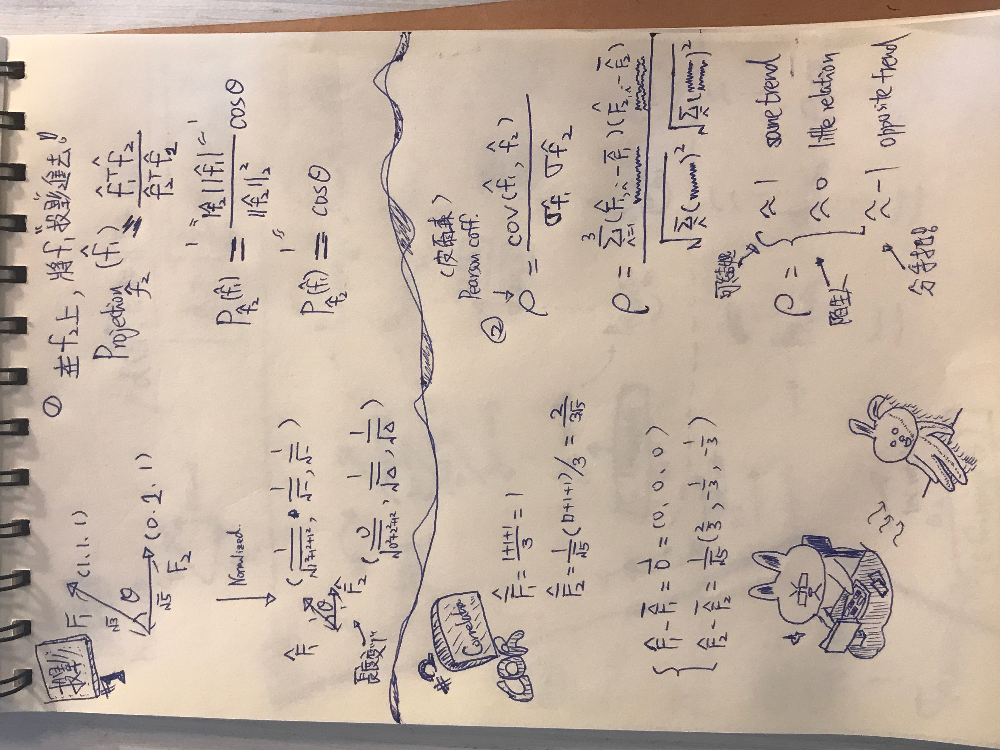

# Comparing Two Vectors: Projection, Correlation, and Distance

## Research question

Given two nonzero vectors $f_1,f_2\in\mathbb{R}^p$, what does it mean to say
that they are similar? Three common comparisons answer different questions:

- projection measures alignment with a chosen direction;
- correlation measures agreement in centered patterns; and
- distance measures numerical separation.

## 1. Projection: how much lies along a direction?

The scalar component of $f_1$ along $f_2$ is

$$
\mathrm{comp}_{f_2}(f_1)
=\frac{f_1^T f_2}{\|f_2\|_2}
=\|f_1\|_2\cos\theta.
$$

The corresponding vector projection is

$$
\mathrm{proj}_{f_2}(f_1)
=\frac{f_1^T f_2}{f_2^T f_2}f_2.
$$

Projection is asymmetric: changing which vector is the reference direction
changes the result. After L2 normalization,

$$
\widehat f_j=\frac{f_j}{\|f_j\|_2}, \qquad j\in\{1,2\},
$$

their dot product is cosine similarity,

$$
\widehat f_1^T\widehat f_2
=\frac{f_1^T f_2}{\|f_1\|_2\|f_2\|_2}
=\cos\theta.
$$

Thus cosine similarity measures direction without retaining vector magnitude.

## 2. Pearson correlation: do the components vary together?

Let

$$
\bar f_j=\frac{1}{p}\sum_{i=1}^{p}f_{j,i},
\qquad
f_j^c=f_j-\bar f_j\mathbf{1}.
$$

Pearson correlation is

$$
\rho(f_1,f_2)
=\frac{(f_1^c)^T f_2^c}
{\|f_1^c\|_2\|f_2^c\|_2}.
$$

Therefore Pearson correlation is cosine similarity applied after each vector is
mean-centered. It is unchanged by adding a constant offset to either vector and,
for positive rescaling, by changing its amplitude. It is undefined if either
centered vector has zero norm.

Interpretation is bounded by $-1\leq\rho\leq1$: values near $1$ indicate the
same centered pattern, values near $0$ indicate little linear association, and
values near $-1$ indicate opposite centered patterns.

## 3. Euclidean distance: how far apart are the values?

The Euclidean distance is

$$
d(f_1,f_2)=\|f_1-f_2\|_2
=\sqrt{\sum_{i=1}^{p}(f_{1,i}-f_{2,i})^2}.
$$

Unlike correlation, distance retains both offsets and scale. Two vectors can
have $\rho=1$ yet have a large distance when they share a pattern but differ in
baseline or magnitude.

For unit vectors, distance and cosine similarity are linked:

$$
\|\widehat f_1-\widehat f_2\|_2^2
=2-2\cos\theta.
$$

They then encode the same directional ordering rather than independent evidence.

## Choosing the comparison

| Scientific question | Quantity |
|---|---|
| How much of $f_1$ lies along the direction $f_2$? | Projection |
| Do the mean-centered component patterns agree? | Pearson correlation |
| How different are the actual component values? | Euclidean distance |

The word *similar* is incomplete until the analysis specifies whether it means
alignment, pattern agreement, or numerical proximity.

## Related topic

To summarize these pairwise measures across two collections of vectors, see
[Reference-to-Group Vector Features with Mean and Standard Deviation](../comparing-two-groups-of-vectors/content.md).
