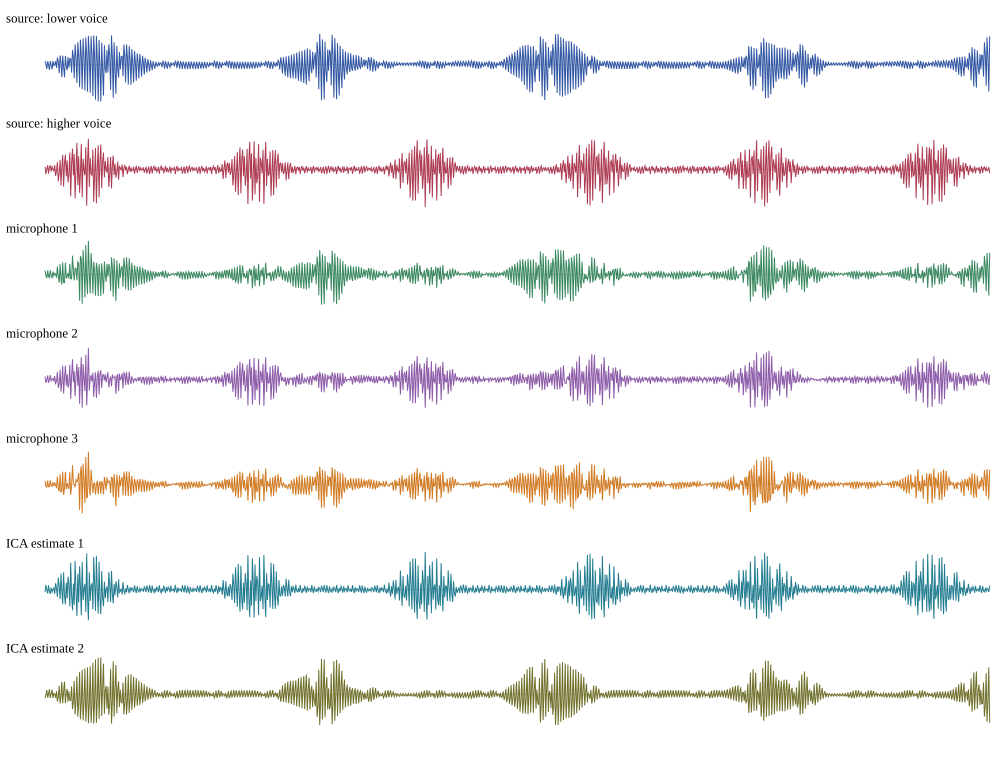
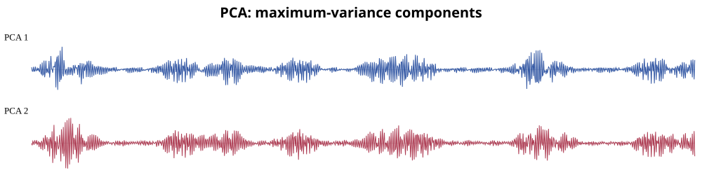
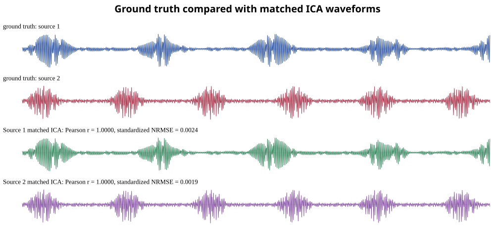
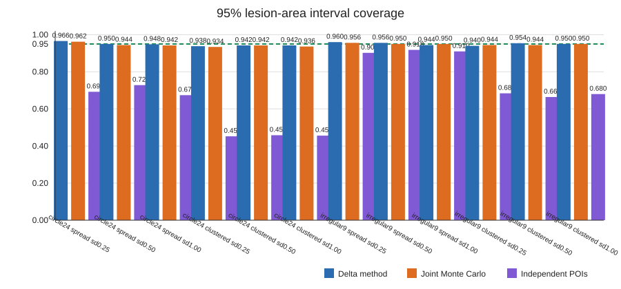

# Thermal Dynamics of Recovery and TRC Geometry

## Motivation

This topic brings together the physics of thermal recovery, the structure of a
thermal recovery curve (TRC), and the geometric comparison framework introduced
in the previous statistics note, [TRC vector geometry: projection, correlation, and distance](../statistics/trc-vector-geometry/content.md).

The overall aim is to build a coherent study idea for a paper or technical note
that links a physically interpretable thermal model to a statistical comparison
method. The central hypothesis is that lesion recovery is not just a scalar
temperature change, but a spatiotemporal thermal process whose dynamics can be
represented as a set of curves, each living in a high-dimensional measurement
space.

## Physical problem

A skin lesion or thermal defect is cooled below the background temperature and then
allowed to recover toward equilibrium. The observed temperature field evolves over
time because of at least three effects:

1. local thermal relaxation of the lesion;
2. heat diffusion from surrounding tissue into the lesion region;
3. global recovery of the broader skin environment.

This means that the recovery signal is not a single isolated value. It is a
multichannel time series in space and time, with each pixel or region following a
recovery trajectory that is coupled to the surrounding thermal field.

## Data object: one curve per region

For a sequence sampled at 10 Hz over 60 seconds, each recovery trace contains 600
samples. A single region or pixel gives a vector

$$
f_n =
\begin{bmatrix}
T_n(0.0)\\
T_n(0.1)\\
\vdots\\
T_n(59.9)
\end{bmatrix}
\in \mathbb{R}^{600}.
$$

This is the same geometric idea as the previous TRC note: a full recovery trace
is a point in a 600-dimensional space. The task is then to compare multiple
curves by asking whether they differ in direction, in temporal shape, or in
absolute thermal separation.

## Conceptual bridge to the paper study

The thermal-dynamics topic operates at two levels:

### Level 1: physics of the process

The recovery trajectory is generated by diffusion, tissue coupling, and thermal
relaxation. A lesion region does not recover independently; it is driven by a
shared thermal environment and by local heat exchange with surrounding tissue.

### Level 2: geometry of comparison

Once each recovery trace is encoded as a vector, we can compare traces using
three complementary descriptors:

- cosine similarity: direction of the full recovery vector;
- Pearson correlation: similarity of temporal shape after mean removal;
- RMSE or Euclidean distance: average thermal separation between curves.

This creates a clean methodological bridge from the physical observation to the
statistical comparison:

$$
\boxed{
\text{thermal recovery field}
\rightarrow
\text{TRC vectors}
\rightarrow
\text{shape/direction/separation metrics}
}
$$

## Scientific structure for the study

A paper or technical study can be organized around the following sequence:

1. Build the thermal recovery field from image data or simulation.
2. Define lesion, boundary, and surrounding-skin regions.
3. Extract one TRC per region or pixel.
4. Compare region dynamics using vector geometry.
5. Relate the most discriminative metrics to physical recovery behavior.
6. Interpret the results in terms of lesion coupling and boundary diffusion.

This is a natural match to the PCA/ICA line of inquiry in the thermal recovery
analysis literature, but it is more physically grounded because it treats the
recovery signal as coupled thermal dynamics rather than as an artificially
independent latent source.

## Figure set

The following figures provide a visual backbone for the concept. They are meant
as supporting material for a thermal-recovery paper narrative, not as a final
publication-ready figure set.

### 1. Thermal recovery signal traces

Example recovery signals

This figure illustrates the idea that each spatial region produces a recovery
trajectory. Recovery curves can be compared as entire vectors rather than as
single scalar numbers.

### 2. PCA decomposition of the thermal time series

PCA components

A global PCA view is useful because it decomposes the dominant modes of thermal
variation. The first component often captures global recovery, while later
components may reveal structured residual dynamics associated with the lesion or
its boundary.

### 3. ICA-style source patterns

Potential independent patterns

This exploratory figure shows how source-like patterns may emerge after
projecting the thermal data into a latent basis. However, the methodological
caution remains important: these are not automatically distinct physiological
sources; they can represent coupled thermal behavior or preprocessing artifacts.

### 4. Coverage and lesion-region uncertainty

Lesion coverage and uncertainty map

This supports the spatial interpretation of lesion boundaries and confidence in
region assignment. Thermal recovery is strongly sensitive to the region selected
for analysis, so a robust study must report how the area and boundary are defined.

## Methodological position

The proposed study sits between three related viewpoints:

- physical thermal diffusion modeling;
- multivariate statistical decomposition (PCA/ICA);
- geometric comparison of TRC vectors.

This is useful because it keeps the analysis honest:

- the diffusion model explains why recovery curves are coupled;
- PCA identifies dominant variance patterns;
- Pearson and cosine metrics quantify how similar or different the recovery
  traces are after removing offset or considering direction;
- RMSE gives physical error or displacement in temperature units.

## Data-preparation and comparison pipeline

A useful educational paper structure is to spell out the full processing chain in
clear order, from raw thermal time series to interpretable latent thermal modes.

### 1. Curve extraction and alignment

For each spatial region or pixel, extract the 60-second recovery trace and store
it as a vector in $\mathbb{R}^{600}$.

$$
f_n = [T_n(0.0), T_n(0.1), \ldots, T_n(59.9)]^T.
$$

This gives one curve per region, allowing the later operations to be performed on
vectors rather than on isolated scalar summaries.

### 2. Projection and correction operations

Before fitting or comparing curves, apply the following transformations:

- L2 normalization for directional comparison:

  $$
  \tilde f_n = \frac{f_n}{\|f_n\|_2};
  $$

- mean-centering for shape comparison:

  $$
  f_n^c = f_n - \bar f_n \mathbf{1};
  $$

- optional baseline correction for removing global offset or drift;
- optional smoothing or windowing if high-frequency noise is present.

These steps separate three different questions:

- direction in the raw vector space;
- temporal shape after mean removal;
- actual magnitude of difference in temperature units.

### 3. Distance and similarity features

For two curves $f_n$ and $f_m$, retain the following metrics:

$$
\rho(f_n,f_m) = \frac{(f_n-\bar f_n)^T(f_m-\bar f_m)}{\|f_n-\bar f_n\|_2\|f_m-\bar f_m\|_2},
$$

$$
\mathrm{RMSE}(f_n,f_m)=\sqrt{\frac{1}{600}\sum_{i=1}^{600}(f_{n,i}-f_{m,i})^2},
$$

and sometimes

$$
\cos\theta = \frac{f_n^T f_m}{\|f_n\|_2\|f_m\|_2}.
$$

The logic is:

- Pearson detects whether the curves share the same temporal shape;
- RMSE measures how different the curves are in absolute temperature;
- cosine similarity captures directional agreement in the full vector space.

This makes the analysis physically interpretable and statistically disciplined.

### 4. Model-fit parameters as physically meaningful summaries

In addition to geometric comparisons, each recovery trace can be summarized by a
small set of physically motivated scalar parameters, such as

$$
\theta_n =
\begin{bmatrix}
\Delta T_n \\
\tau_n \\\n\alpha_n \\\n\text{slope}_n \\\n\text{recovery-rate}_n
\end{bmatrix},
$$

where $\Delta T_n$ is the total recovery change, $\tau_n$ is a characteristic
recovery time, $\alpha_n$ is a fitted diffusion or relaxation parameter, and the
remaining entries are slope-based or model-based descriptors.

These model-fit parameters are important because they anchor the statistical
analysis in physical dynamics rather than only in correlation scores. In other
words, the algorithm is not just saying that two curves are similar; it is also
asking what physical property made them similar or different.

### 5. PCA reduction from a 5-parameter descriptor to a 3-mode summary

The parameter vector for each region can be assembled as a 5-dimensional feature
vector

$$
\theta_n \in \mathbb{R}^{5}.
$$

This creates a compact matrix

$$
\Theta = [\theta_1, \theta_2, \ldots, \theta_M]^T \in \mathbb{R}^{M\times5},
$$

where $M$ is the number of regions or samples.

A standard PCA step can then reduce the 5-dimensional descriptor to a smaller
interpretive basis:

$$
\Theta \approx U_r V_r^T,
$$

where the retained low-rank components define 3 dominant thermal modes instead of
5 raw descriptors.

This gives a paper-friendly story:

- begin with 5 interpretable thermal parameters;
- compress them into 3 principal thermal axes;
- interpret those axes as dominant recovery patterns, such as depth, speed, and
  thermal severity.

This is especially attractive for an educational paper because it shows the full
pipeline clearly:

$$
\boxed{
\text{raw TRCs}
\rightarrow
\text{projection and correction}
\rightarrow
\text{model-fit parameter extraction}
\rightarrow
\text{PCA reduction from }\theta \in \mathbb{R}^{5}\text{ to 3 thermal modes}
}
$$

## Go / plan

The next steps for this topic are:

1. define a clean paper-ready research question around lesion recovery and TRC
   geometry;
2. choose a compact study design: lesion, boundary, and normal skin regions;
3. formalize the vector representation and metrics;
4. connect the statistical results to thermal-diffusion intuition;
5. decide whether to present this as a physics-centered method note or a full
   computational paper blueprint.

## Short working statement

A thermal recovery curve is more than a time series; it is a vector in a
600-dimensional measurement space. When multiple lesion and normal-skin regions
are compared in that space, one can separate direction, waveform shape, and
thermal magnitude. This provides a strong methodological bridge between thermal
physics and statistical analysis for lesion-recovery studies.

## Summary

This topic creates a paper-ready conceptual bridge between the thermal recovery
problem and the TRC geometry framework. It aims to combine the lesion-recovery
physics, the PCA/ICA interpretation, and the vector-based comparison metrics into
one coherent technical narrative. The educational direction is especially strong
because the workflow is explicit: raw curves are turned into projection-based
comparisons, corrected for baseline effects, summarized by physically meaningful
parameters, and compressed by PCA into a small set of interpretable thermal modes.
